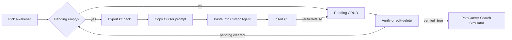

# AI Kit Reader (SKeyDB → Cursor prompt → insert pending → verify)

## AI runtime (locked)

**Cursor-assisted only for v1.** No MotherTree in-app LLM call. No provider / Cursor SDK API keys in the app. Cursor subscription runs the model in the IDE.

## Write path (locked — one path only)

**Cursor Agent inserts pending rows into Supabase** via a **validated insert CLI**. No admin JSON import UI in v1.

Admin’s job after picking an awakener is **export the kit pack** and **give you a paste-ready Cursor Agent prompt** — not to call AI.

```text
Export kit pack + Copy Cursor prompt
  → paste into Cursor Agent
  → Agent proposes + insert CLI (verified=false)
  → admin CRUD → Verify
```

## Operator workflow

1. **Admin → Kit Reader:** select **one** awakener.
2. If that awakener still has **pending** ATMs (`verified = false`, not soft-deleted): finish them first (**Verify** or soft-delete). No new batch until the queue is empty.
3. **Export kit pack** — on local admin only: deterministic SKeyDB fetch → write `sample-data/kit-reader/{slug}.kit.json` on the repo filesystem.
4. **Copy Cursor prompt** — clipboard text filled with awakener name, pack path, `SKEYDB_COMMIT`, ignore rules, and “run insert CLI” steps. (May be one combined “Export & copy prompt” control.)
5. Paste into **Cursor Agent** mode.
6. Agent reads the pack, proposes ATM (+ locals), runs **insert CLI** — every row **`verified = false`**.
7. Back in admin: **CRUD** pending → **Verify** (or soft-delete) until none remain → live loaders for verified rows.



## Locked product rules

- One awakener per run.
- `verified` boolean on ATM only; locals follow parent.
- **Insert CLI always sets `verified = false`.** Manual admin creates / backfill default `true`.
- Edits to verified rows **stay verified**.
- Soft-delete orthogonal.
- **Pending must be cleared before a new Kit Reader batch** for that awakener: every pending ATM is either verified or soft-deleted. No append/replace of an open pending queue in v1.
- **`replaces_manifestation_id` (locked):** two-pass insert — (1) insert all `ok` ATMs that are bases (`replacesClientKey == null`) and build `clientKey → new id`; (2) insert remaining `ok` ATMs and set `replaces_manifestation_id` from that map; then insert locals under each new ATM. Proposals use `replacesClientKey` only (never raw DB ids).
- Kit text from pinned SKeyDB via [`SKEYDB_COMMIT`](src/lib/assets/skeydb-base.ts).
- Scope v1: ATM + local interactions only.
- **Local-only (locked):** Kit Reader is part of the local admin surface only — same gate as [`isAdminRuntimeEnabled()`](src/lib/admin-runtime.ts) (`ADMIN_ENABLED=true` and **not** on Vercel). Production / Vercel never exposes Kit Reader UI, export, or insert actions. No download fallback, Blob, or production pack path.
- **Pack write path (locked):** export writes the repo filesystem file `sample-data/kit-reader/{slug}.kit.json` on the local machine (admin Server Action and/or export CLI). Cursor prompt points at that repo-relative path so Agent and workspace share the same file. No browser download in v1.
- **Out of v1:** JSON import button, in-app “call AI” button.

## Copy Cursor prompt (admin-generated)

After export, admin builds a fixed template (string or small helper module), e.g.:

```text
Use the MotherTree Kit Reader skill and docs/admin/kit-reader.md
plus docs/admin/atm-and-local-interaction-inputs.md.

Awakener: {name}
Kit pack: sample-data/kit-reader/{slug}.kit.json
SKeyDB commit: {SKEYDB_COMMIT}

1. Read the kit pack (skill layers, atmEligible talents, ignore list,
   lexicon.tags + lexicon.flavorTagSynonyms).
2. Propose ATM + local rows for Path Carver (enlighten replace-vs-add;
   Soulforge kit-specific only). Resolve tagName via pack
   lexicon.flavorTagSynonyms; prefer .Fixed except Attacker.Active Damage
   (rarely fixed — only Fixed Damage / Max HP when kit says so); never invent tags.
3. Never create ATMs for Gnostic Potential, Madness Omen, Dimensional Image,
   or Soulforge Astral Reign / CON·ATK·DEF% / first-Rouse Keyflare.
4. Run the insert CLI to write pending rows with verified=false only.
5. Summarize inserted vs skipped/unsupported.
```

UI: **Copy** button (and show the prompt in a readonly textarea for edit/preview). No model call.

## SKeyDB kit pack (deterministic load)

Align investment with [`scripts/generate-awakener-primary-stats-datapatch.ts`](scripts/generate-awakener-primary-stats-datapatch.ts), plus skill level for kit args.

### Assumptions (always written into the pack)

| Field | Value |
| --- | --- |
| Awakener level | **60** |
| Soulforge Aptitude | **10** (clamp to talent `maxLevel`; 0 if absent) |
| Gnostic Potential | **0**, except SKeyDB `defaultMaxed` → **lv5** (limited) |
| Skill level | **lv6** — last index of `scaling.values` (length 6) |

Pack field `assumptions` + `limitedGnosticLv5` boolean.

### Skills — base + upgrade layers (Skills-tab markers)

Do **not** flatten to a single final description. For each skill emit:

- **Base** layer: template + args at skill lv6; `required_enlightenment = 0`.
- **`upgrades[]`:**
  - `upgraderType: "enlighten"` + `upgraderSlot: "E1" | "E2"` → [`enlightenment-options.ts`](src/lib/enlightenment-options.ts) **1** / **2**.
  - `upgraderType: "talent"` → talent-gated link (often `link_only` + empty `patch`).
  - `operation: "mixed"` + `patch` → patched template/args.

Cursor chooses `required_enlightenment` and whether higher-E **replaces** vs **adds** (`replaces_manifestation_id`). Export supplies layers; replace-vs-add is AI judgment.

### Slot / section → `source_type` map (locked)

MotherTree enum: `"command card" | "exalt" | "rouse" | "talent"`.

Export sets `sourceTypeHint` (and OE default enlightenment) from SKeyDB `public-v3` **`slot`** on skills, plus talents and derived cards:

| SKeyDB source | MotherTree `source_type` | Notes |
| --- | --- | --- |
| `slot: Strike` | `command card` | Command Cards section |
| `slot: Defense` | `command card` | Command Cards section |
| `slot: Skill1` | `command card` | Command Cards section |
| `slot: Skill2` | `command card` | Command Cards section |
| `slot: Rouse` | **`rouse`** | Shown under Command Cards on SKeyDB UI; **exception** — use `rouse`, not `command card` |
| `slot: Exalt` | `exalt` | Exalts section |
| `slot: OverExalt` (Over Exalt) | `exalt` | Same `source_type` as Exalt; default **`required_enlightenment = 7`** (admin **OE**) |
| Derived Cards / derived skills | `command card` | Same as Command Cards |
| Talents (incl. Soulforge, Happy Little Fairy, passives) | `talent` | Ignore-list talents still `atmEligible: false` |

Do **not** invent a fifth `source_type`. Tentacle damage is a tag (`Attacker.Tentacle`), not a leaf source.

Enlighten upgrade layers still set `required_enlightenment` to **1 / 2 / 3** for E1/E2/E3 when that layer is the source of the ATM; Over Exalt base uses **7**.

### ATM ignore list (never propose / never insert)

Export marks `atmEligible: false`. Cursor + insert CLI must not create ATMs for:

| Source | Rule |
| --- | --- |
| **Gnostic Potential** | Assumed in primary stats |
| **Madness Omen** | Exploration Aliemus — not Path Carver tags |
| **Dimensional Image** | Out of ATM scope (often SKeyDB relic) |

### Soulforge Aptitude — partial ignore

Include full Soulforge text at lv10. No `skill.upgrades[]` markers — Cursor infers kit-specific ATMs from talent prose.

**Never ATM:** Astral Reign-only line; CON/ATK/DEF +N%; Keyflare on first Rouse.

**Do ATM:** remaining kit-specific Soulforge lines.

### Pack shape (contract)

```text
assumptions: { level: 60, soulforge: 10, gnostic: 0|5, skillLevel: 6, limitedGnosticLv5 }
awakener: { motherTreeId, name, skeydbId, slug, skeydbCommit }
skills[]: { id, name, slot, sourceTypeHint, defaultRequiredEnlightenment?, base, upgrades[] }
derivedCards[]: { … same shape as skills; sourceTypeHint: "command card" … }
talents[]: { … atmEligible, sourceTypeHint: "talent", soulforgeIgnoreBoilerplate? … }
ignoreList: [gnostic_potential, madness_omen, dimensional_image, soulforge_boilerplate]
lexicon: { tags[], enums…, flavorTagSynonyms[] }
```

Write to `sample-data/kit-reader/{slug}.kit.json` on the **local** repo filesystem only (gated by `assertAdminRuntime()` / `isAdminRuntimeEnabled()`). Not available on Vercel.

Export builds `flavorTagSynonyms` from checked-in [`src/lib/kit-reader/flavor-tag-synonyms.ts`](src/lib/kit-reader/flavor-tag-synonyms.ts) so every pack carries the map. Cursor skill + [`docs/admin/kit-reader.md`](docs/admin/kit-reader.md) point at the pack lexicon (no second divergent map).

## Flavor → tag synonym map (locked)

Resolve SKeyDB kit wording / brace overlays to existing MotherTree `tag_name`s only.

### Resolution rules

1. Never invent `tag_name` — only names present in `lexicon.tags`.
2. Prefer longest / most specific synonym key (case-insensitive).
3. **`.Fixed` is the default** when MotherTree has both a parent and a `*.Fixed` (or Fixed child) for the same effect. Most in-game effects are fixed. Use non-Fixed only when kit text clearly means percentage / non-fixed (or explicitly says “increase gain” → `Support.Increase Gain.*`). **Exception:** do **not** apply Fixed-preferred to the `Attacker.Active Damage` tree — Active Damage is rarely fixed. Default “Deal DMG / Active Damage” → `Attacker.Active Damage` (or Strike child when typed); use `Attacker.Active Damage.Fixed Damage` / `.Max HP` only when kit text explicitly means Fixed / Max HP DMG.
4. Ambiguous or unmapped flavor → proposal `status: needs_review` (or `unsupported` if ignore-list), never guess a new string.
5. Stat wording that is a **dependency** (e.g. Aliemus Regen Level, Realm Mastery as scaling input) maps to `dependency_stat`, not a Support tag, when that is the ATM/local pattern.

Resolver fails closed if a Fixed child is missing from the live lexicon — fall back to parent only when lexicon has no Fixed child.

### High-confidence defaults (Fixed preferred where both exist; **not** for Active Damage)

| SKeyDB flavor / brace | MotherTree `tag_name` (default) |
| --- | --- |
| Tentacle DMG / Tentacle Damage | `Support.Tentacle Damage Up.Fixed` |
| Unique Tentacle Damage Up | `Support.Unique Tentacle Damage Up` |
| Multiply Tentacle Damage | `Support.Multiply Tentacle Damage` |
| Damage AMP / DMG Amplification / Temporary DMG Amplification | `Support.Damage AMP` |
| STR / STR Up / Strength Up | `Support.STR Up.Fixed` |
| Unique STR Up | `Support.Unique STR Up` |
| STR Down / Strength Down | `Defender.STR Down` |
| Crit Rate / Crit. Rate | `Support.Crit Rate` |
| Crit DMG / Crit. DMG / Crit Damage | `Support.Crit Damage` |
| Vulnerable / Vulnerability | `Support.Debuff.Vulnerability` |
| Unique Vulnerability | `Support.Debuff.Unique Vulnerability` |
| Tentacle Vulnerability | `Support.Debuff.Tentacle Vulnerability` |
| Weakness / Weak | `Defender.Debuff.Weakness` |
| Unique Weakness | `Defender.Debuff.Unique Weakness` |
| Shield | `Defender.Shield.Fixed` |
| Heal / Healing | `Defender.Heal.Fixed` |
| Poison | `Attacker.Poison` |
| Bleed | `Attacker.Bleed` |
| Counter | `Attacker.Counter` |
| Final Verdict | `Attacker.Final Verdict` |
| Alert | `Defender.Alert` |
| Stun / Petrify / Fainted | `Defender.Stun` |
| Death Resistance / Death Resist | `Defender.Base Death Resist` |
| Aliemus (flat amount) | `Support.Aliemus` |
| Keyflare | `Support.Keyflare` |
| Realm Mastery (as granted amount) | `Support.Realm Mastery` |
| Embryo Fusion | `Support.Embryo Fusion` |
| Arithmetica | `Support.Arithmetica` |
| Draw | `Support.Draw` |
| Discard | `Support.Discard` |
| Discover | `Support.Discover` |
| Hand Size / Hand Limit | `Support.Hand Size` |
| Crimson Furnace | `Support.Crimson Furnace` |
| Fiamma | `Support.Fiamma` |
| Additional Instance | `Support.Additional Instance` |
| Final Damage | `Support.Final Damage` |
| Base Damage | `Support.Base Damage` |
| Strike Damage Up | `Support.Strike Damage Up` |
| Pursuit Damage Up | `Support.Pursuit Damage Up` |
| Corrosion | `Special.Corrosion` |
| Ancient Embers | `Special.Ancient Embers` |
| Self-Damage / Self-Harm | `Special.Self Damage` |
| Creativity | `Special.Creativity` |
| Generate Temporary Tentacle | `Support.Generate Temporary Tentacle` |
| Generate Permanent Tentacle | `Support.Generate Permanent Tentacle` |
| Active Damage / Deal DMG (damage base) | `Attacker.Active Damage` (not Fixed — exception) |
| Strike (damage type) | `Attacker.Active Damage.Strike` |
| Fixed DMG / Fixed Damage | `Attacker.Active Damage.Fixed Damage` (only when kit says Fixed) |
| Max HP DMG | `Attacker.Active Damage.Fixed Damage.Max HP` |
| Tentacle (count / have N) | `Attacker.Tentacle` |

### Contextual (review heuristics — not blind auto-map)

- “Increase gain” / amplify existing → `Support.Increase Gain.*` (not the base Fixed tag).
- Pierce DMG / Aftershock → often keyword-only; no dedicated tag → `needs_review` unless clearly Active Damage.
- Rouse → `source_type: rouse`, not a Support tag.
- Aliemus Regen Level / Crit Rate as scaling input → `dependency_stat`, not the Support tag.
- Do not coerce generic Active Damage / Deal DMG into `Attacker.Active Damage.Fixed Damage` via the Fixed-preferred rule.

Source basis: SKeyDB `search-tags.json` + brace overlays; targets must match live MotherTree `tags.tag_name` at export time.

## Proposal JSON schema (Zod)

Implement as [`src/lib/kit-reader/proposal-schema.ts`](src/lib/kit-reader/proposal-schema.ts). Agent writes an ephemeral proposal file; insert CLI validates with this schema. **`verified` is not a field** — CLI always inserts `false`.

### Status semantics

| Status | Meaning | Insert? |
| --- | --- | --- |
| `ok` | Ready as pending ATM | Yes |
| `needs_review` | Ambiguous; human clarifies in chat or hand-enters | No |
| `unsupported` | Skip by design (ignore list / unmodelable) | No |

### Schema sketch

```ts
import { z } from "zod";

const allStats = z.enum([
  "con", "atk", "def", "keyflare_regen", "damage_amp", "crit_rate",
  "crit_dmg", "realm_mastery", "aliemus_regen", "sigil_yield",
  "death_resist", "team_max_hp", "enemy_max_hp", "base_aliemus",
]);

const sourceType = z.enum([
  "command card", "exalt", "rouse", "talent",
]);

const targetType = z.enum(["self", "single", "aoe"]);
const layer = z.enum(["pre_add", "add", "post_add"]);
const mathOperation = z.enum([
  "presence_multiply", "add_scaled", "multiply_one_plus", "multiply",
]);
const localMode = z.enum(["unique_scaling", "aftereffect"]);
const proposalStatus = z.enum(["ok", "needs_review", "unsupported"]);

export const kitLocalProposalSchema = z
  .object({
    mode: localMode,
    modifierTagName: z.string().min(1).nullable(),
    targetTagName: z.string().min(1).nullable(),
    dependencyStat: allStats.nullable(),
    mathOperation: mathOperation,
    valueScalar: z.number(),
    targetType: targetType.default("aoe"),
    layer: layer.nullable(),
    isDisabled: z.boolean().default(false),
  })
  .superRefine((row, ctx) => {
    if (row.mode === "unique_scaling") {
      if (row.targetTagName != null) {
        ctx.addIssue({
          code: z.ZodIssueCode.custom,
          message: "unique_scaling: targetTagName must be null",
          path: ["targetTagName"],
        });
      }
      if (row.modifierTagName == null && row.dependencyStat == null) {
        ctx.addIssue({
          code: z.ZodIssueCode.custom,
          message: "unique_scaling: need modifierTagName or dependencyStat",
          path: ["dependencyStat"],
        });
      }
    }
    if (row.mode === "aftereffect") {
      if (row.targetTagName == null) {
        ctx.addIssue({
          code: z.ZodIssueCode.custom,
          message: "aftereffect: targetTagName required",
          path: ["targetTagName"],
        });
      }
      if (row.modifierTagName != null) {
        ctx.addIssue({
          code: z.ZodIssueCode.custom,
          message: "aftereffect: modifierTagName must be null",
          path: ["modifierTagName"],
        });
      }
      if (
        row.mathOperation !== "multiply" &&
        row.mathOperation !== "add_scaled"
      ) {
        ctx.addIssue({
          code: z.ZodIssueCode.custom,
          message: "aftereffect: only multiply | add_scaled",
          path: ["mathOperation"],
        });
      }
    }
  });

export const kitAtmProposalSchema = z.object({
  clientKey: z.string().min(1),
  status: proposalStatus,
  rationale: z.string().optional(),
  unsupportedReason: z.string().optional(),
  sourceKitId: z.string().min(1),
  sourceQuote: z.string().min(1),
  sourceLayer: z
    .enum(["base", "enlighten", "talent", "soulforge_kit"])
    .optional(),
  tagName: z.string().min(1),
  valueScalar: z.number().nullable(),
  dependencyStat: allStats.nullable().default(null),
  instanceCount: z.number().int().default(1),
  baseCopies: z.number().int().default(1),
  copyProviderGroupName: z.string().min(1).nullable().default(null),
  requiredEnlightenment: z.number().int().default(0),
  requiredRealmName: z.string().min(1).nullable().default(null),
  sourceType: sourceType.nullable(),
  targetType: targetType.nullable().default("aoe"),
  triggerConditionTagName: z.string().min(1).nullable().default(null),
  isAccumulating: z.boolean().default(false),
  isPermanent: z.boolean().default(false),
  buffTargetTypeRestriction: sourceType.nullable().default(null),
  metadata: z.string().nullable().default(null),
  replacesClientKey: z.string().min(1).nullable().default(null),
  locals: z.array(kitLocalProposalSchema).default([]),
});

export const kitProposalFileSchema = z.object({
  schemaVersion: z.literal(1),
  skeydbCommit: z.string().min(1),
  awakenerName: z.string().min(1),
  awakenerId: z.number().int().positive().optional(),
  kitPackPath: z.string().min(1),
  proposals: z.array(kitAtmProposalSchema),
});

export type KitProposalFile = z.infer<typeof kitProposalFileSchema>;
```

Tags / realms / copy-provider groups are **names**; CLI resolves to ids. `replacesClientKey` links within the same file (not DB ids).

## Insert CLI (only write path for Kit Reader)

e.g. `scripts/insert-kit-pending.ts` (service role via `.env.local`):

1. Resolve awakener; **abort if any alive pending ATM exists** for that awakener (`verified = false` and `deleted_at IS NULL`). Message: resolve pending (verify or soft-delete) before a new batch. No `--force` in v1.
2. Parse + Zod-validate proposal file (`kitProposalFileSchema`).
3. Insert only `status === "ok"`; skip `needs_review` / `unsupported` (report them).
4. Resolve tag / realm / copy-provider names → ids; enforce [`admin-local-interaction.ts`](src/lib/admin-local-interaction.ts) rules.
5. Reject ignore-list sources if they slip through as `ok`.
6. **`replaces_manifestation_id` — two-pass (locked):**
   - **Pass 1:** Insert all `ok` ATMs with `replacesClientKey == null` (bases). Record `clientKey → inserted id`.
   - **Pass 2:** Insert remaining `ok` ATMs; set `replaces_manifestation_id` to the Pass-1 (or already-inserted) id for `replacesClientKey`. Abort that row if the key is missing from the map.
   - Then insert nested locals under each new ATM id.
7. Every ATM **`verified = false`**.
8. Report inserted ids + skipped reasons.

Cursor skill: after proposing, **run this CLI** — do not hand the user a JSON to paste into admin.

## Schema / live filters / admin UI

- ATM `verified boolean not null default true`; backfill true.
- Live loaders: `deleted_at IS NULL` **and** `verified = true` ([`load-team-data.ts`](src/lib/team-data/load-team-data.ts), simulator, public search).
- **Admin Kit Reader:** local-only (`isAdminRuntimeEnabled()`); awakener picker; pending count; **block Export / Copy prompt** (banner) while that awakener has pending; pending queue CRUD + **Verify** / soft-delete. No Import JSON. No call-AI button. Export writes `sample-data/kit-reader/{slug}.kit.json` — no download / production path.

## Cursor skill

- Load [`docs/admin/atm-and-local-interaction-inputs.md`](docs/admin/atm-and-local-interaction-inputs.md) + few-shots.
- Resolve `tagName` via pack `lexicon.flavorTagSynonyms`; prefer `.Fixed` except the `Attacker.Active Damage` tree (rarely fixed); never invent tags (only `lexicon.tags`).
- Enlighten replace-vs-add; Soulforge kit-specific only; hard ignore list.
- End by invoking insert CLI with `verified` forced false (CLI aborts if pending remain).
- Prompt text from admin is the primary operator entry; skill still applies when Agent is invoked that way.

## Docs

[`docs/admin/kit-reader.md`](docs/admin/kit-reader.md): **local admin only** (`ADMIN_ENABLED`, not Vercel); assumptions, ignore list, flavor→tag resolution (point at pack `lexicon.flavorTagSynonyms` + Fixed-default; no duplicate table), pack path `sample-data/kit-reader/`, **clear pending before next batch**, export → **copy prompt** → paste Agent → insert CLI → CRUD → verify; pin + CC BY-NC-SA.

## Later (not v1)

- Admin JSON import
- In-app LLM / Cursor SDK button
- Batch multi-awakener
- Golden regression packs
- Forced re-run / replace-open-pending

## Open follow-ups (non-blocking)

- Expand `flavorTagSynonyms` as kit runs hit misses (character-unique overlays)
- E3 / AbsoluteAxiom enlighten layer mapping beyond E1/E2 (when those patches appear)