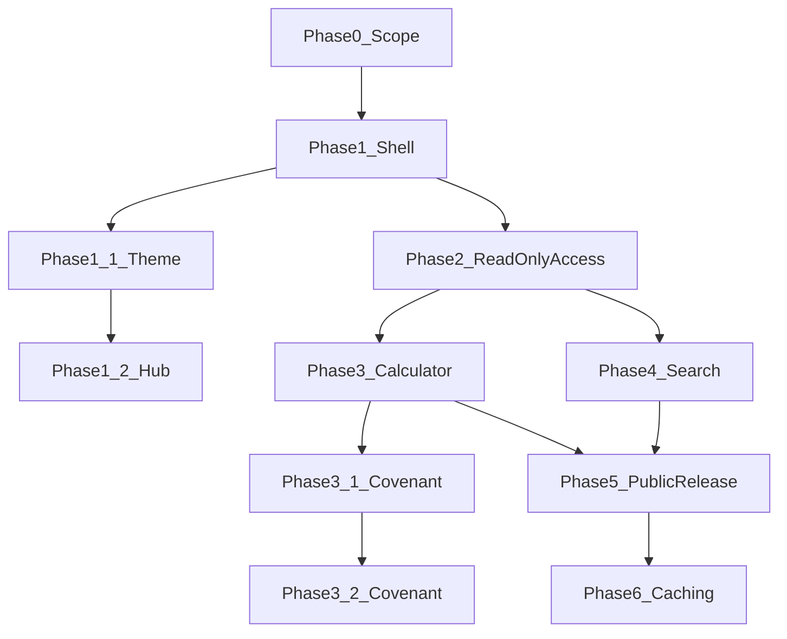

# Public Site — Phased Plan

## Strategic locks

| Decision             | Locked choice                                                                                                                         |
| -------------------- | ------------------------------------------------------------------------------------------------------------------------------------- |
| Repo                 | Same MotherTree Next.js app ([README.md](README.md)) — not a separate site                                                            |
| Public vs private    | **Homepage tree is public** (`/`, `/search`, `/calculators`, `/manual` + `/manual/*`, `/about`); **everything else is private admin** |
| Admin home           | **`/admin`** — private dashboard (table hub); replaces today’s `/` admin welcome                                                      |
| Public brand         | Top-left **Mother Tree** with subtitle **root version**                                                                               |
| Public chrome        | No “Admin Dashboard” label; **no** admin side nav to private pages                                                                    |
| Calculator vs search | **Calculator before search** (easier; reuses pure libs)                                                                               |
| Public writes        | Never — SELECT-only / server-mediated reads                                                                                           |
| Public product names | **Search** and **Calculator** (not “Explore” as a product name)                                                                       |
| Math source of truth | [`src/lib/path-carver/*`](src/lib/path-carver/) — calculator imports only; no duplicated formulas                                     |
| Calculator inputs    | Persist user-entered numbers in **localStorage** (client-only; not the DB)                                                            |
| Hosting              | Vercel hobby; production URL **`mothertree.vercel.app`** (project name **mothertree** — no “admin” in the slug)                       |
| Admin runtime        | **Local-only.** Live site never runs admin. No production login. Service role never on Vercel.                                        |
| README live link     | After deploy, add a **Live site** link in [README.md](README.md) pointing at that URL                                                 |

Recommendation / Path Carver full flow / simulator remain **admin-only** and out of public scope. Public pages are **read-only** and must not expose recommendation features.

---

## Dependency order

Phase 3 and 4 both need Phase 2. Prefer finishing **calculator (3)** before deep search work; search can start after Phase 2 if you want parallel work later. Phase 1.1 / 1.2 (theme + hub) do not block Phase 2+. Phase 3.1 (Covenant placeholder) and Phase 3.2 (Covenant calculator body) follow Phase 3 and do not block Phase 5 release.

---

## Phase 0 — Scope (locked)

_Product boundaries. Detail below is decided; UX specifics for Search remain for Phase 4._

### Public pages

- **Homepage** (`/`) — public hub with four rows: Search, Calculator, Manual, About Me
- **Search** (`/search`) — one page
- **Calculators** (`/calculators`) — hub with **sub-pages** per calculator tool (`/calculators/...`)
- **Manual** (`/manual` + `/manual/*`) — finished public docs (hub + Calculators / Search sections)
- **About Me** (`/about`) — finished; ship current copy

### Non-goals (confirmed)

- No CRUD / no public DB writes
- No full Path Carver multi-step flow
- No recommendation engine / simulator features on public pages
- No service-role key in the browser

### Calculator catalog (factors)

Each factor is a calculator tool (own sub-route under `/calculators/{group}/{slug}` — shipped in Phase 3). Source of truth remains Path Carver libs.

| Factor                              | Notes / starting lib                                                                                                |
| ----------------------------------- | ------------------------------------------------------------------------------------------------------------------- |
| Base Keyflare                       | Path Carver keyflare-related logic (e.g. harmony / Support.Keyflare paths)                                          |
| Death Resist                        | [`death-resist-trigger.ts`](src/lib/path-carver/death-resist-trigger.ts)                                            |
| Base Aliemus                        | Path Carver base-stat / aliemus paths                                                                               |
| Team max HP                         | [`team-max-hp.ts`](src/lib/path-carver/team-max-hp.ts)                                                              |
| Base Tentacle Damage                | [`base-tentacle-damage.ts`](src/lib/path-carver/base-tentacle-damage.ts) — **benthos aequor** and **aequor** realms |
| Realm Mastery + Realm Manifestation | Realm mastery total + realm manifestation apply (see `sumTeamRealmMastery` / realm rows in Path Carver apply path)  |

**Persistence:** Store the numbers users enter in calculators in **localStorage** so inputs survive refresh (client-side only; never written to Supabase).

### Public read allowlist (tables)

Public SELECT (via Phase 2 RLS / allowlisted server reads) is limited to:

- `realm`
- `realm_tag_manifestation`
- `covenant`
- `covenant_tag_manifestation`
- `awakener`
- `awakener_tag_manifestation`
- `awakener_local_manifestation_interaction`
- `posse`
- `posse_tag_manifestation`
- `wheel`
- `wheel_tag_manifestation`
- `tag`
- `tag_default_interaction` (added Phase 4 for Search filter graph; timestamps trimmed)

No other tables are public-readable unless this plan is amended. Soft-deleted rows (`deleted_at` where present) stay hidden from public reads by default. Column-level trimming is locked in Phase 2 (hide `created_at`, `updated_at`, `deleted_at`). Allowlist confirmed final in Phase 2; **`tag_default_interaction` amended in Phase 4**.

### Success criteria (baseline)

- Calculator: each catalog factor runnable on its own; inputs restore from localStorage; results match Path Carver for the same inputs
- Search: query/browse allowlisted tables only; read-only; no recommend UI
- Public: no path to mutate DB or open admin tools

**Exit:** Scope locked (this section); proceed to Phase 1.

---

## Phase 1 — App shell (public vs admin) — decisions locked

_Homepage tree = public. All other existing tool/table routes = private admin._

### Routing

| Area        | Routes                                              | Access                                                       |
| ----------- | --------------------------------------------------- | ------------------------------------------------------------ |
| Public hub  | `/`                                                 | Public — four-row hub (Search, Calculator, Manual, About Me) |
| Search      | `/search`                                           | Public                                                       |
| Calculators | `/calculators` (hub) + `/calculators/...` sub-pages | Public                                                       |
| Manual      | `/manual` + `/manual/*`                             | Public                                                       |
| About Me    | `/about`                                            | Public                                                       |
| Admin home  | `/admin`                                            | **Private** — admin dashboard (table hub / welcome)          |
| Admin tools | `/tables/*`, `/path-carver`, `/simulator`           | **Private admin only**                                       |

Public allowlist for access control (Phase 5): `/`, `/search`, `/calculators` and `/calculators/*`, `/manual` and `/manual/*`, `/about` only. All other routes (including `/admin`) stay private.

### Public chrome (not admin)

- Top-left site name: **Mother Tree**
- Subtitle under the name: **root version**
- Do **not** show “Admin Dashboard”
- Do **not** include the admin [sidebar](src/components/admin/sidebar.tsx) or links to private pages
- Public layout only: brand + navigation among public pages (Home / Search / Calculator / Manual / About Me)

### Private admin home (`/admin`)

- Move the current admin welcome + table grid from [`src/app/page.tsx`](src/app/page.tsx) to **`/admin`** (e.g. `src/app/admin/page.tsx`)
- Keep “Admin Dashboard” branding and the existing sidebar on `/admin` and all other admin routes
- Sidebar brand link currently points at `/` ([`sidebar.tsx`](src/components/admin/sidebar.tsx)); retarget it to **`/admin`**
- Do not expose `/admin` on public chrome or the public homepage

### Admin chrome (elsewhere)

- `/tables/*`, `/path-carver`, `/simulator` keep the sidebar unchanged (aside from brand → `/admin`)
- No requirement to link public Search/Calculator from the admin sidebar (public entry remains `/`)

### Phase 1 deliverables (placeholders)

- Placeholder **public homepage hub** at `/` with links + brief descriptions covering Search and Calculator
- Placeholder **Calculators hub** at `/calculators`
- Placeholder **Search** at `/search`
- Wire public layout so those routes use Mother Tree / root version chrome without the admin side nav
- **Relocate admin home** to `/admin` (current dashboard content); update sidebar home link to `/admin`

**Exit:** Public placeholders at `/`, `/search`, `/calculators`; admin home at `/admin` with sidebar; no admin chrome on public pages.

---

## Phase 1.1 — Public desert dusk theme (done)

_Visual polish on the public shell. Inspired by Ch7 Mother Tree desert mood; no game art assets shipped._

### What was done

- **Inspired theme only** — CSS gradients and grain overlay on `.public-theme`; no Ch7 reference PNGs and no tree silhouette asset in the repo
- **Atmosphere:** Desert dusk / sand haze page ground (public layout only; admin unchanged); haze drift + brand ember pulse motions
- **Brand mark:** Public product name locked as **Mother Tree** (two words, with space); crimson-ember gradient/glow on the header wordmark only. Admin/repo identifier remains **MotherTree**
- **Display font:** Cormorant Garamond for brand / public headings; body stays Geist
- **Homepage:** Simple hub — Search and Calculator as two linked titles with short descriptions; no oversized brand, no hero CTAs, no full-viewport stage. Visible brand stays in the header (visually hidden `h1` for a11y)
- **Public copy:** Do not mention Path Carver on public pages; describe tools in plain product terms
- **Surfaces touched:** [`src/app/(public)/layout.tsx`](<src/app/(public)/layout.tsx>), [`site-header.tsx`](src/components/public/site-header.tsx), [`site-footer.tsx`](src/components/public/site-footer.tsx), [`mother-tree-mark.tsx`](src/components/public/mother-tree-mark.tsx), [`/`](<src/app/(public)/page.tsx>), [`/search`](<src/app/(public)/search/page.tsx>), [`/calculators`](<src/app/(public)/calculators/page.tsx>), plus [`globals.css`](src/app/globals.css) `.public-theme` tokens

**Exit:** Public pages share the desert dusk theme; homepage is a two-link hub; brand reads as Mother Tree with crimson glow in chrome only.

---

## Phase 1.2 — Four-row homepage hub + Manual / About (done)

_Replace the two-link hub with locked product copy; add Manual and About placeholders._

### What was done

- **Homepage hub:** Four horizontal rows in order — Search, Calculator, Manual, About Me. Title on the left; bullet descriptions on the right (stack on small screens). Copy locked verbatim; no extra hub marketing text
- **Search Learn more:** Trailing `[Learn more about search features, methodology, and recording assumptions]` links to `/manual`
- **Ember hover:** Hub titles use `.mt-hub-title` — crimson-ember gradient/glow on hover / focus-visible (same tokens as `.mt-brand-mark`); bullets stay muted
- **Routes:** Placeholder pages at [`/manual`](<src/app/(public)/manual/page.tsx>) and [`/about`](<src/app/(public)/about/page.tsx>)
- **Nav:** Public header includes Home, Search, Calculator, Manual, About Me
- **Surfaces touched:** [`src/app/(public)/page.tsx`](<src/app/(public)/page.tsx>), [`site-header.tsx`](src/components/public/site-header.tsx), [`globals.css`](src/app/globals.css), new manual/about pages

**Exit:** Four-row hub live; `/manual` and `/about` placeholders; nav updated; ember hover on hub titles.

---

## Phase 2 — Read-only data access (done)

_Public read path via anon key + SELECT-only RLS. Decisions below are locked before implementation._

### Allowlist (final)

Phase 0 table allowlist is **confirmed final** — no additions without amending this plan:

- `realm`, `realm_tag_manifestation`
- `covenant`, `covenant_tag_manifestation`
- `awakener`, `awakener_tag_manifestation`, `awakener_local_manifestation_interaction`
- `posse`, `posse_tag_manifestation`
- `wheel`, `wheel_tag_manifestation`
- `tag`
- `tag_default_interaction` (**Phase 4 amendment** — Search Attacker/Defender reachability graph; timestamps omitted in projection)

Do not grant SELECT on non-allowlisted tables (including desires, paths, demands, etc.).

### Column-level trimming (locked)

Public responses must **omit** audit/soft-delete timestamps (even though soft-deleted rows are already filtered out):

- Hide: `created_at`, `updated_at`, `deleted_at`
- Apply in the server read layer (explicit column selects / projection), not by exposing full rows then stripping in the UI

### Caps (locked)

Sized to current data (~1.1k allowlisted rows; largest table ~336) and Free-tier reality (**unlimited API requests**; real pressure is egress / shared CPU, not a request meter):

| Cap                 | Value                            | Notes                                                                                                          |
| ------------------- | -------------------------------- | -------------------------------------------------------------------------------------------------------------- |
| Per-query row limit | **500**                          | Covers a full read of the largest allowlisted table with headroom; do not set below ~400 or option lists break |
| Rate limit          | **~60 requests / minute / IP**   | In-memory per process (Phase 2); **keep in-memory for Phase 5** — do not add Redis/WAF                         |
| SQL surface         | No arbitrary SQL from the client | Guided / allowlisted server entrypoints only                                                                   |

### What was done

- **RLS migration** ([`20260807120000_public_readonly_select_rls.sql`](supabase/migrations/20260807120000_public_readonly_select_rls.sql)): `GRANT SELECT` + `anon_select_alive` (`deleted_at IS NULL`) on the 12 allowlisted tables; applied to the linked remote project
- **Anon client** ([`src/lib/supabase/anon.ts`](src/lib/supabase/anon.ts)); admin [`createAdminClient`](src/lib/supabase/admin.ts) / service role unchanged
- **Server read layer**: allowlist + projections ([`src/lib/public-read/`](src/lib/public-read/)), `listPublicTable` Server Action ([`src/lib/actions/public-read.ts`](src/lib/actions/public-read.ts)) with 500-row cap and ~60 req/min/IP
- **Env**: document `NEXT_PUBLIC_SUPABASE_ANON_KEY` in [`.env.example`](.env.example)
- **Smoke**: [`scripts/smoke-public-read.ts`](scripts/smoke-public-read.ts) — allowlisted SELECTs succeed without timestamps; desire SELECT / writes fail for anon; caps verified

**Exit:** Safe read path exists; admin writes unchanged; caps + trimming enforced.

---

## Phase 3 — Calculator (before search) (done)

_Extract Path Carver functions into standalone public tools; hub + nested routes._

### What was done

- **Catalog tools shipped** under public chrome (math from [`src/lib/path-carver/*`](src/lib/path-carver/), no forked formulas, no desire load/save, no DB writes):
  - **Core Mechanics:** Keyflare (DR), Keyflare Harmony, Aliemus (DR), Death Resist, Team Max HP
  - **Realms:** Chaos Realm; Aequor / Benthos Aequor (tentacle damage + related); Caro / Propagation Caro; Ultra / Singularity Ultra
- **IA:** [`/calculators`](<src/app/(public)/calculators/page.tsx>) two-entry hub (Core Mechanics / Realms) → URL-synced Link tabs at `/calculators/{group}/{slug}`; group index redirects to the first tool in that group
- **Catalog source of truth:** [`src/lib/public/calculator-catalog.ts`](src/lib/public/calculator-catalog.ts) (titles, blurbs, related links, href helpers); tool chrome in [`calculator-tool-shell.tsx`](src/components/public/calculator-tool-shell.tsx) + [`calculator-by-slug.tsx`](src/components/public/calculator-by-slug.tsx)
- **Persistence:** per-tool `localStorage` keys (`mt.calculators.*`); restore on load; UI deferred until restore (`CalculatorPendingHydration`) so realm mode toggles do not flash defaults
- **Redirects:** flat `/calculators/:slug` → nested `/calculators/{group}/:slug`; legacy `/calculator` → `/calculators` ([`next.config.ts`](next.config.ts))
- **Defaults / overrides:** account and awakener levels default to 60 where tools expose them; parity aimed at matching Path Carver for the same inputs

**Exit:** Catalog tools live on `/calculators/*`; math not forked; localStorage inputs persist without selection flicker.

---

## Phase 3.1 — Covenant hub + placeholder (done)

_Expand the Calculators hub with a Covenant entry. Placeholder only; body replaced in Phase 3.2._

### Locked product copy

| Surface   | Copy                       |
| --------- | -------------------------- |
| Hub label | **Covenant**               |
| Hub blurb | **Main Stat and Sub Stat** |

### Route

- **`/calculators/covenant`** under public chrome (Mother Tree / root version)
- Static page at [`src/app/(public)/calculators/covenant/page.tsx`](<src/app/(public)/calculators/covenant/page.tsx>) — takes precedence over the dynamic `[group]` redirect
- Not a catalog slug tool (`/calculators/{group}/{slug}`); no tool shell / related tabs

### Catalog rules

- Extend `CalculatorGroup` and `CALCULATOR_GROUPS` in [`calculator-catalog.ts`](src/lib/public/calculator-catalog.ts) with `covenant`
- Hub page ([`calculators/page.tsx`](<src/app/(public)/calculators/page.tsx>)) picks up the third row from `CALCULATOR_GROUPS` with no hub UI rewrite
- **Do not** add a `CALCULATOR_CATALOG` entry, `calculator-by-slug` branch, or flat-slug redirect
- Leave `[group]` `generateStaticParams` as `core` / `realms` only (Covenant uses the static route)

### What was done

- Third Calculators hub card: Covenant → `/calculators/covenant`
- Placeholder page with visible **Covenant** heading and muted copy that Main Stat / Sub Stat tools are forthcoming (superseded by Phase 3.2)
- Surfaces touched: [`calculator-catalog.ts`](src/lib/public/calculator-catalog.ts), new [`covenant/page.tsx`](<src/app/(public)/calculators/covenant/page.tsx>)

### Non-goals (Phase 3.1)

- No Path Carver formulas / forked math
- No localStorage persistence (added in Phase 3.2)
- No desire load/save or DB writes
- No Path Carver naming in public copy

**Exit:** Three-row Calculators hub (Core Mechanics / Realms / Covenant); Covenant opens the placeholder; Core and Realms behavior unchanged.

---

## Phase 3.2 — Covenant Main / Sub Stat calculator (done)

_Replace the Phase 3.1 placeholder with the interactive Main / Sub Stat calculator on `/calculators/covenant`._

### Locked rules

- Six roman slots **I–VI**; each has Main Stat select (slot-restricted options), displayed main value, **Bond** (+50% / ×1.5 on that main only)
- Three sub-rows per slot: Sub Stat (all 8 stats), Level **1–8** (default **1**), displayed `perLevel × level`
- Dropdowns default to **“—”**; unset contributes **0**; empty row values display **—** (not `0`)
- Duplicates allowed across slots/subs; totals sum all contributions by stat
- Main Stat options by slot:

| Slot | Main Stat options                                    |
| ---- | ---------------------------------------------------- |
| I    | Crit Damage, Crit Rate, Aliemus Regen, Keyflare      |
| II   | Crit Damage, Crit Rate, Realm Mastery, Sigil Yield   |
| III  | Crit Damage, Crit Rate, Damage AMP, Death Resist     |
| IV   | Aliemus Regen, Realm Mastery, Keyflare, Sigil Yield  |
| V    | Aliemus Regen, Damage AMP, Keyflare, Death Resist    |
| VI   | Realm Mastery, Damage AMP, Sigil Yield, Death Resist |

- Value tables live in [`covenant-stats.ts`](src/lib/public/covenant-stats.ts) (not Path Carver)
- Persist under `mt.calculators.covenant`; sanitize invalid mains against the slot allowlist on restore; `CalculatorPendingHydration` until restore

### What was done

- Pure client tables + helpers: [`src/lib/public/covenant-stats.ts`](src/lib/public/covenant-stats.ts)
- Client UI + totals panel: [`src/components/public/covenant-calculator.tsx`](src/components/public/covenant-calculator.tsx)
- Page mounts the calculator: [`src/app/(public)/calculators/covenant/page.tsx`](<src/app/(public)/calculators/covenant/page.tsx>)
- Still no `CALCULATOR_CATALOG` slug / tool-shell tabs for Covenant

### Non-goals (Phase 3.2)

- No DB / Search / Path Carver integration
- No uniqueness constraints between picks (slot main lists only)
- No catalog nesting under `/calculators/covenant/...`

**Exit:** `/calculators/covenant` runs the Main / Sub Stat calculator with bond, levels, and summed totals; inputs persist in localStorage.

---

## Phase 4 — Search (done)

_Query UI on Phase 2 read layer (product name: Search)._

### Locked filter UX (options pass)

- Guided Search UX — **no public free-form SQL**
- Wire only to allowlisted tables; reuse admin labeling patterns where useful without exposing CRUD
- No recommendation UI or links into simulator/Path Carver flows
- Filter controls are **single-select** (plus Every Turn checkbox)
- Attacker / Defender / Support share **one** tag slot: selecting any of those dropdowns clears the other four
- Attacker `layer IS NULL` buckets into **add**

### Filter rows (options UI)

| Row               | Source                                                                                                                                                              |
| ----------------- | ------------------------------------------------------------------------------------------------------------------------------------------------------------------- |
| Attacker          | Tags that are `Attacker.*` or reach `Attacker.*` via `tag_default_interaction` chains; `is_searchable`; three dropdowns by `layer` (`pre_add` / `add` / `post_add`) |
| Defender          | Same reachability for `Defender.*`; one dropdown                                                                                                                    |
| Support           | `Support.*` + `is_searchable`; one dropdown                                                                                                                         |
| From              | Awakener / Wheel / Posse / Covenant (scopes `*_tag_manifestation` parent; no Realm)                                                                                 |
| Target Type       | `target_type` enum                                                                                                                                                  |
| Dependency Stat   | `all_stats` enum                                                                                                                                                    |
| Buff Restriction  | `source_type` enum (`buff_target_type_restriction`)                                                                                                                 |
| Every Turn        | checkbox → `is_accumulating`                                                                                                                                        |
| Trigger Condition | `Special.When.*` tags                                                                                                                                               |
| Required Realm    | realm ids `1, 2, 4, 6` (chaos / caro / aequor / ultra)                                                                                                              |

### Done (options pass)

- Allowlist + RLS: `tag_default_interaction` public SELECT ([`20260811040123_public_readonly_tag_default_interaction.sql`](supabase/migrations/20260811040123_public_readonly_tag_default_interaction.sql)); projection omits timestamps ([`allowlist.ts`](src/lib/public-read/allowlist.ts)); smoke extended
- Option builders: [`search-filter-options.ts`](src/lib/public/search-filter-options.ts)
- `/search` SSR loads `tag` + `tag_default_interaction` + `realm`; client form [`search-filters.tsx`](src/components/public/search-filters.tsx) with `SearchFilterState` ready for results

### Done (results pass)

- Guided query: [`runPublicSearch`](src/lib/actions/public-search.ts) (one rate-limit hit) + [`buildSearchResults`](src/lib/public/search-results.ts)
- Tag filter matches exact + dotted descendants (`matchesDemandTag`)
- Results table: From, Name, Tag, Target Type, Dependency Stat, Value, Buff Restriction, Every Turn, Trigger Condition, Required Realm
- Awakener Value uses Path Carver `scaleValueScalar`; wheel / posse / covenant show raw `value_scalar`
- Sort by Value desc; 500-row cap; loading / empty / error states; Search button (no shareable URLs yet)

### Deferred (not Phase 6)

- Shareable filter URLs
- Entity pickers beyond the rows above

These stay out of the phased plan until product need is clear. Phase 6 is caching only.

**Exit (full Phase 4):** Useful read-only Search with options **and** results against allowlisted tables.

---

## Phase 5 — Public release gate (done)

_Shipped. Locks below remain the production contract. Phase 6 public-read caching also shipped._

### Public route allowlist (access control)

Unauthenticated public:

- `/`
- `/search`
- `/calculators` and `/calculators/*`
- `/manual` and `/manual/*`
- `/about`

Everything else (including `/admin`, `/tables`, `/path-carver`, `/simulator`) is **local-only admin** — not reachable on Vercel (404, not a login).

### Admin gate (local-only; no production login)

Admin is used only on the developer machine (`npm run dev` + service role in `.env.local`). The live site never uses admin functions or pages.

**Do not** add a production password, Supabase Auth, or Vercel Deployment Protection (the last would hide public pages too).

Layers (all required):

1. **Vercel env — anon only.** Set `NEXT_PUBLIC_SUPABASE_URL` and `NEXT_PUBLIC_SUPABASE_ANON_KEY`. **Never** set `SUPABASE_SERVICE_ROLE_KEY` / `SUPABASE_SECRET_KEY` on Vercel (Production or Preview). Service role stays in `.env.local` only.
2. **`createAdminClient` fail-closed.** Refuse to create the client when `process.env.VERCEL` is set, even if a key is present later by mistake. Optionally also require `ADMIN_ENABLED=true` in `.env.local`. Client-facing errors must be generic (not-found); do not leak “missing service role key.”
3. **Production 404 for admin routes.** `/admin`, `/tables`, `/path-carver`, `/simulator` look like they do not exist on `mothertree.vercel.app`.
4. **Same check in every admin Server Action.** Apply in [`crud.ts`](src/lib/actions/crud.ts), [`path-carver.ts`](src/lib/actions/path-carver.ts), [`simulator.ts`](src/lib/actions/simulator.ts), [`simulator-flow.ts`](src/lib/actions/simulator-flow.ts), [`team-data.ts`](src/lib/actions/team-data.ts). Hiding pages is not enough: this is a public repo and Next still ships `"use server"` modules on Vercel.

| Environment                      | Anon key | Service role | Admin routes / write actions |
| -------------------------------- | -------- | ------------ | ---------------------------- |
| Vercel (`mothertree.vercel.app`) | Yes      | **No**       | 404 / refuse                 |
| Local (`npm run dev`)            | Yes      | `.env.local` | Works                        |

RLS SELECT-only for anon remains the database backstop.

### Content freeze

**Manual** and **About** shipped as frozen public copy.

### Rate limit

Phase 2 **in-memory** ~60 req/min/IP limiter kept. No Redis, Upstash, or WAF.

### Hosting and README

- Vercel Hobby; production hostname **`mothertree.vercel.app`**
- Vercel project / slug name **`mothertree`** — no “admin” in the URL or project name
- [README.md](README.md) **Live site** link points at that URL

### What was done

- Production hard-disable for admin pages **and** write Server Actions (404 / refuse; no login page)
- `createAdminClient` refuses the Vercel runtime; `ADMIN_ENABLED` documented in [`.env.example`](.env.example)
- Public allowlisted routes live with Mother Tree / root version chrome only
- Vercel gets publishable/anon only; service role never on Vercel
- Deployed to Vercel; live URL linked from README

**Exit:** Public Calculator + Search + Manual + About via homepage hub; no public DB writes; admin exists only locally; live URL is `mothertree.vercel.app` and linked from README.

---

## Phase 6 — Public read caching (done)

_Shipped. Reduce repeat Supabase hits and Free-tier egress on public reads. Do not expand Search features, add indexes, WAF, or more calculator tools._

### Goal

Cache allowlisted public catalog/read data used by Search (and any other `fetchPublicTable` / public-read call sites that benefit), so repeat page loads and searches do not re-fetch cold from Supabase every time.

### Locks (implementation)

| Decision | Locked choice |
| --- | --- |
| Mechanism | **In-process TTL cache** around [`fetchPublicTable`](src/lib/public-read/fetch.ts) (module-level Map / equivalent). No Next `"use cache"`, no `unstable_cache`, no Redis, no enabling `cacheComponents` |
| Freshness | **5-minute TTL** (not deploy-only). Stale-until-TTL is accepted after admin data edits |
| Invalidation | **None** — no `revalidateTag`, no admin bust-cache hook; entries expire only by TTL |
| Rate limit | **Count every Server Action call**, including when the underlying table read is a cache hit. Caching does not bypass or soften the Phase 2 ~60 req/min/IP limiter in [`listPublicTable`](src/lib/actions/public-read.ts) / [`runPublicSearch`](src/lib/actions/public-search.ts) |
| Placement | Cache inside / immediately around `fetchPublicTable` so Search options SSR and Search results both benefit |

### What was done

- In-process cache module [`src/lib/public-read/cache.ts`](src/lib/public-read/cache.ts) (`PUBLIC_READ_CACHE_TTL_MS` = 5m; key = table + limit)
- [`fetchPublicTable`](src/lib/public-read/fetch.ts) serves successful reads from cache; errors are not cached
- Rate limit unchanged (still applied in Server Actions before fetch)
- Smoke extended in [`scripts/smoke-public-read.ts`](scripts/smoke-public-read.ts): 2nd identical read within TTL does not call Supabase `.from`; different limit is a miss

### Out of scope (explicit)

- Search v2 (shareable URLs, richer joins, entity pickers)
- New Postgres secondary indexes (current bulk-fetch + JS filter does not need them)
- Extra calculator sub-tools beyond the shipped catalog
- Edge/WAF (Cloudflare), Redis/Upstash
- Next Cache Components / `"use cache"` / `unstable_cache`
- Explicit invalidation after admin writes
- User-facing docs / feedback

### Exit criteria

1. **Smoke:** second `fetchPublicTable` (same table/limit) within TTL does **not** hit Supabase — verified
2. **UX / caps unchanged:** Search options + results behave as today; 500-row cap and ~60 req/min/IP still apply (including on cache hits)

**Exit:** Criteria above met; public reads pay egress only on cold / post-TTL misses.

---

## Remaining detail slots (without reordering phases)

| Slot                                              | Status                                                                          | Where it lands          |
| ------------------------------------------------- | ------------------------------------------------------------------------------- | ----------------------- |
| Calculator factor list                            | Done in Phase 3 (Core Mechanics + Realms catalog)                               | Phase 3                 |
| Public table allowlist                            | Locked in Phase 0; confirmed Phase 2; **+`tag_default_interaction` in Phase 4** | Phase 2 + 4             |
| localStorage for calculator inputs                | Done in Phase 3                                                                 | Phase 3                 |
| Calculators hub IA                                | Done in Phase 3 (two-group + nested tools); **+Covenant third hub row in 3.1**  | Phase 3 + 3.1           |
| Covenant calculator                               | Done: hub in 3.1; Main / Sub Stat body + localStorage in 3.2                    | Phase 3.1 + 3.2         |
| Public routes + Mother Tree / root version chrome | Locked in Phase 1                                                               | Phase 1 implementation  |
| Private admin home `/admin`                       | Locked in Phase 1                                                               | Phase 1 (move from `/`) |
| Public desert dusk theme                          | Done in Phase 1.1                                                               | Public layout + hub     |
| Public brand spelling                             | Locked: Mother Tree (space)                                                     | Phase 1.1               |
| Homepage hub                                      | Done in Phase 1.2 — four rows + locked copy                                     | Phase 1.2               |
| Public `/manual` + `/about`                       | Body finished; freeze for public (Phase 5)                                      | Phase 1.2 + content     |
| Public route allowlist                            | Done: `/`, `/search`, `/calculators/*`, `/manual/*`, `/about`                   | Phase 5                 |
| No Path Carver naming on public pages             | Locked in Phase 1.1                                                             | Public copy             |
| Search UX specifics                               | Done: options + results (tag-tree, columns, Value scaling)                      | Phase 4                 |
| Column-level public trimming                      | Done: hide `created_at`, `updated_at`, `deleted_at`                             | Phase 2                 |
| Public read caps                                  | Done: 500 rows/query; ~60 req/min/IP **in-memory**                              | Phase 2 + 5             |
| Public read caching                               | Done: in-process **5m** TTL around `fetchPublicTable`; no invalidation; rate limit counts hits; smoke 2nd read | Phase 6                 |
| Admin runtime                                     | Done: local-only; prod 404; no service role on Vercel; no login                 | Phase 5                 |
| Vercel production URL                             | Done: **mothertree.vercel.app**; README Live site link                          | Phase 5                 |

---

## Out of scope (unless you later amend this plan)

- Recommendation engine / simulator public access
- Full Path Carver multi-step flow for the public
- Separate Cloudflare-first deploy (Vercel first)
- Production admin login / password / Supabase Auth (admin is local-only)
- Service role key on Vercel (Production or Preview)
- Monetization (conflicts with SKeyDB NC license unless separately cleared)
- Search v2 / shareable URLs / richer joins / entity pickers (deferred; not Phase 6)
- Extra public calculator tools beyond the shipped catalog
- Postgres secondary indexes for public Search (not needed with current bulk-fetch pattern)
- Edge/WAF or Redis rate limiting (only if abuse appears)
- Next Cache Components / `"use cache"` / `unstable_cache` for public reads (Phase 6 uses in-process TTL only)
- Explicit public-read cache invalidation after admin writes (TTL expiry only)
