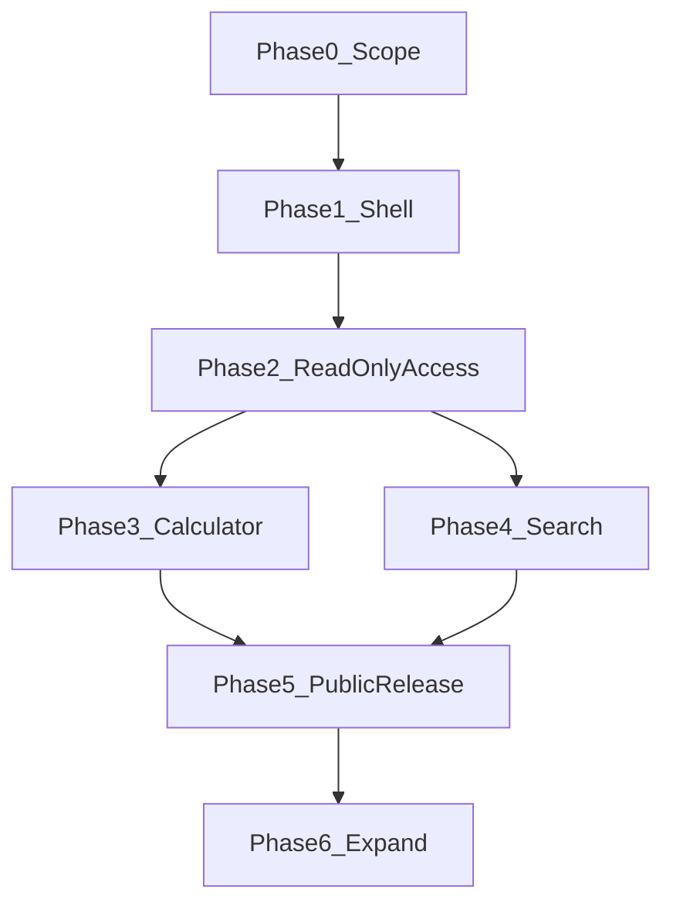

# Public Site — Phased Plan

## Strategic locks

| Decision             | Locked choice                                                                                      |
| -------------------- | -------------------------------------------------------------------------------------------------- |
| Repo                 | Same MotherTree Next.js app ([README.md](README.md)) — not a separate site                         |
| Public vs private    | **Homepage tree is public** (`/`, `/search`, `/calculator`…); **everything else is private admin** |
| Admin home           | **`/admin`** — private dashboard (table hub); replaces today’s `/` admin welcome                   |
| Public brand         | Top-left **Mother Tree** with subtitle **root version**                                            |
| Public chrome        | No “Admin Dashboard” label; **no** admin side nav to private pages                                 |
| Calculator vs search | **Calculator before search** (easier; reuses pure libs)                                            |
| Public writes        | Never — SELECT-only / server-mediated reads                                                        |
| Public product names | **Search** and **Calculator** (not “Explore” as a product name)                                    |
| Math source of truth | [`src/lib/path-carver/*`](src/lib/path-carver/) — calculator imports only; no duplicated formulas  |
| Calculator inputs    | Persist user-entered numbers in **localStorage** (client-only; not the DB)                         |
| Hosting              | Vercel hobby when releasing (Phase 5)                                                              |
| Attribution          | Public chrome includes SKeyDB notice per [DATA-NOTICE.md](DATA-NOTICE.md)                          |

Recommendation / Path Carver full flow / simulator remain **admin-only** and out of public scope. Public pages are **read-only** and must not expose recommendation features.

---

## Dependency order

Phase 3 and 4 both need Phase 2. Prefer finishing **calculator (3)** before deep search work; search can start after Phase 2 if you want parallel work later.

---

## Phase 0 — Scope (locked)

_Product boundaries. Detail below is decided; UX specifics for Search remain for Phase 4._

### Public pages

- **Homepage** (`/`) — public hub with links + short descriptions of Search and Calculator
- **Search** (`/search`) — one page
- **Calculator** (`/calculator`) — hub that may expand into **sub-pages** per calculator tool

### Non-goals (confirmed)

- No CRUD / no public DB writes
- No full Path Carver multi-step flow
- No recommendation engine / simulator features on public pages
- No service-role key in the browser

### Calculator catalog (factors)

Each factor is a calculator tool (likely its own sub-route under `/calculator/...`). Source of truth remains Path Carver libs; map and extract in Phase 3.

| Factor                              | Notes / starting lib                                                                                                |
| ----------------------------------- | ------------------------------------------------------------------------------------------------------------------- |
| Base Keyflare                       | Path Carver keyflare-related logic (e.g. harmony / Support.Keyflare paths)                                          |
| Death Resist                        | [`death-resist-trigger.ts`](src/lib/path-carver/death-resist-trigger.ts)                                            |
| Base Aliemus                        | Path Carver base-stat / aliemus paths                                                                               |
| Team max HP                         | [`team-max-hp.ts`](src/lib/path-carver/team-max-hp.ts)                                                              |
| Base Tentacle Damage                | [`base-tentacle-damage.ts`](src/lib/path-carver/base-tentacle-damage.ts) — **benthos aequor** and **aequor** realms |
| Realm Mastery + Realm Manifestation | Realm mastery total + realm manifestation apply (see `sumTeamRealmMastery` / realm rows in Path Carver apply path)  |

**Persistence:** Store the numbers users enter in calculators in **localStorage** so inputs survive refresh (client-side only; never written to Supabase).

### Public read allowlist (tables)

Public SELECT (via Phase 2 RLS / allowlisted server reads) is limited to:

- `realm`
- `realm_tag_manifestation`
- `covenant`
- `covenant_tag_manifestation`
- `awakener`
- `awakener_tag_manifestation`
- `awakener_local_manifestation_interaction`
- `posse`
- `posse_tag_manifestation`
- `wheel`
- `wheel_tag_manifestation`
- `tag`

No other tables are public-readable unless this plan is amended. Soft-deleted rows (`deleted_at` where present) stay hidden from public reads by default. Column-level trimming (if any) can be specified in Phase 2 without expanding the table list.

### Success criteria (baseline)

- Calculator: each catalog factor runnable on its own; inputs restore from localStorage; results match Path Carver for the same inputs
- Search: query/browse allowlisted tables only; read-only; no recommend UI
- Public: no path to mutate DB or open admin tools

**Exit:** Scope locked (this section); proceed to Phase 1.

---

## Phase 1 — App shell (public vs admin) — decisions locked

_Homepage tree = public. All other existing tool/table routes = private admin._

### Routing

| Area        | Routes                                                               | Access                                                  |
| ----------- | -------------------------------------------------------------------- | ------------------------------------------------------- |
| Public hub  | `/`                                                                  | Public — links + descriptions for Search and Calculator |
| Search      | `/search`                                                            | Public                                                  |
| Calculator  | `/calculator` (hub) + `/calculator/...` sub-pages as tools are added | Public                                                  |
| Admin home  | `/admin`                                                             | **Private** — admin dashboard (table hub / welcome)     |
| Admin tools | `/tables/*`, `/path-carver`, `/simulator`                            | **Private admin only**                                  |

Public allowlist for access control (Phase 5): `/`, `/search`, `/calculator` and `/calculator/*` only. All other routes (including `/admin`) stay private.

### Public chrome (not admin)

- Top-left site name: **Mother Tree**
- Subtitle under the name: **root version**
- Do **not** show “Admin Dashboard”
- Do **not** include the admin [sidebar](src/components/admin/sidebar.tsx) or links to private pages
- Public layout only: brand + navigation among public pages (hub / Search / Calculator)

### Private admin home (`/admin`)

- Move the current admin welcome + table grid from [`src/app/page.tsx`](src/app/page.tsx) to **`/admin`** (e.g. `src/app/admin/page.tsx`)
- Keep “Admin Dashboard” branding and the existing sidebar on `/admin` and all other admin routes
- Sidebar brand link currently points at `/` ([`sidebar.tsx`](src/components/admin/sidebar.tsx)); retarget it to **`/admin`**
- Do not expose `/admin` on public chrome or the public homepage

### Admin chrome (elsewhere)

- `/tables/*`, `/path-carver`, `/simulator` keep the sidebar unchanged (aside from brand → `/admin`)
- No requirement to link public Search/Calculator from the admin sidebar (public entry remains `/`)

### Phase 1 deliverables (placeholders)

- Placeholder **public homepage hub** at `/` with links + brief descriptions covering Search and Calculator
- Placeholder **Calculator hub** at `/calculator`
- Placeholder **Search** at `/search`
- Wire public layout so those routes use Mother Tree / root version chrome without the admin side nav
- **Relocate admin home** to `/admin` (current dashboard content); update sidebar home link to `/admin`

**Exit:** Public placeholders at `/`, `/search`, `/calculator`; admin home at `/admin` with sidebar; no admin chrome on public pages.

---

## Phase 2 — Read-only data access

- Server-only read entrypoints (Server Actions or route handlers) for anything public pages need
- Keep [`createAdminClient`](src/lib/supabase/admin.ts) / service role for admin CRUD only
- Path for public: anon key + **SELECT-only** RLS on the **Phase 0 table allowlist** only
- Caps: result limits, simple rate limiting, no arbitrary SQL from the client
- Exclude soft-deleted rows; do not grant SELECT on non-allowlisted tables (including desires, paths, demands, etc.)
- Smoke: allowlisted SELECTs succeed; writes and non-allowlisted reads fail for anon

**Exit:** Safe read path exists; admin writes unchanged.

---

## Phase 3 — Calculator (before search)

_Extract Path Carver functions into standalone tools per Phase 0 catalog._

- Implement tools for: Base Keyflare, Death Resist, Base Aliemus, Team max HP, Base Tentacle Damage (benthos aequor + aequor), Realm Mastery + Realm Manifestation
- Structure as calculator hub + sub-pages when tools multiply
- UI per tool: inputs → shared Path Carver function → result (no desire load/save)
- Persist inputs in **localStorage**; restore on load
- Defaults: align with Path Carver assumptions (account/awakener level 60, etc.) unless a tool exposes overrides
- Parity: same inputs match Path Carver debug/output for that function
- Ship first tool E2E under admin preview, then remaining catalog items
- No DB writes; option lists from Phase 2 allowlisted tables only when needed

**Exit:** Catalog tools work in preview (or clearly sequenced sub-deliverables); math not forked; localStorage inputs persist.

---

## Phase 4 — Search

_Query UI on Phase 2 read layer (product name: Search)._

- Guided Search UX (filters / entity pickers / results) — **no public free-form SQL**
- Wire only to Phase 0 allowlisted tables; loading / empty / error states
- Reuse admin labeling patterns from schema config where useful ([`schema-config`](src/lib/schema-config.ts), FK comboboxes) without exposing CRUD
- Iterate under admin preview
- No recommendation UI or links into simulator/Path Carver flows

**Exit:** Useful read-only Search in preview against allowlisted tables.

---

## Phase 5 — Public release gate

- Protect admin/write routes (auth or deploy protection) so `/admin`, `/tables`, `/path-carver`, `/simulator`, etc. are not reachable by the public
- Public `/`, `/search`, `/calculator/*` live with Mother Tree / root version chrome only
- Env review: publishable/anon for public path; service role server-only
- Deploy to Vercel; set env vars; confirm soft-delete/RLS behavior in production
- Attribution footer (SKeyDB / CC BY-NC-SA) on public pages
- Basic abuse/error visibility

**Exit:** Public Calculator + Search via homepage hub; no public DB writes; admin tools (including `/admin`) gated.

---

## Phase 6 — Expand (backlog)

- Additional calculator sub-tools beyond the Phase 0 catalog
- Search v2 (shareable URLs, richer joins, indexes/caching)
- Edge/WAF (Cloudflare) only if traffic/abuse needs it
- User-facing docs / feedback

---

## Remaining detail slots (without reordering phases)

| Slot                                              | Status            | Where it lands          |
| ------------------------------------------------- | ----------------- | ----------------------- |
| Calculator factor list                            | Locked in Phase 0 | Phase 3 implementation  |
| Public table allowlist                            | Locked in Phase 0 | Phase 2 + 4             |
| localStorage for calculator inputs                | Locked            | Phase 3                 |
| Public routes + Mother Tree / root version chrome | Locked in Phase 1 | Phase 1 implementation  |
| Private admin home `/admin`                       | Locked in Phase 1 | Phase 1 (move from `/`) |
| Search UX specifics                               | Open              | Phase 4                 |
| Column-level public trimming                      | Open if needed    | Phase 2                 |
| Admin auth mechanism                              | Open              | Phase 5                 |
| Homepage hub copy (link blurbs)                   | Open for polish   | Phase 1 / 5             |

---

## Out of scope (unless you later amend this plan)

- Recommendation engine / simulator public access
- Full Path Carver multi-step flow for the public
- Separate Cloudflare-first deploy (Vercel first)
- Monetization (conflicts with SKeyDB NC license unless separately cleared)
