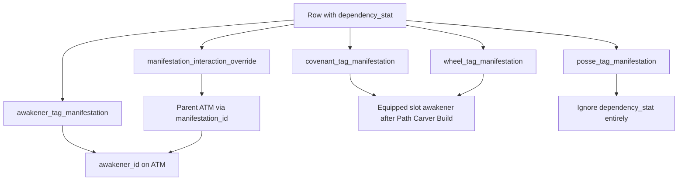

# Recommendation System — Path Carver–First Roadmap

## Strategic shift (locked)

Path Carver’s **Review Tags** page is the primary surface for testing recommendation math. Simulator Start / Recommend / radar / `desire_demand` fulfillment come **after** Path Carver math stabilizes (Phase 3); the simulator will copy Path Carver logic.

| Focus now (2a → 2c)                                                                            | Later (Phase 3+)                      |
| ---------------------------------------------------------------------------------------------- | ------------------------------------- |
| Path Carver Review Tags apply + aggregation + interactions                                     | Simulator radar / fulfillment UI      |
| Attacker.\* requires `is_damage_dealer` (any target_type); `target_type=self` for non-Attacker | Full `desire_demand` scoring / curves |
| Self-scoped interaction application; filtered rows stay in debug as Applied=no                 | Port math into Simulator page         |
| `dependency_stat` scalar scaling + leaf-gated `buff_target_type_restriction` (2b)              | Smart search / recommend optimization |
| Damage layers x/y/z/f (2c)                                                                     | Calculation List layer breakdown      |

---

## Current baseline (as of this rewrite)

### Done

| Area                         | Status                                                                                                                                                                                                                                                                                      |
| ---------------------------- | ------------------------------------------------------------------------------------------------------------------------------------------------------------------------------------------------------------------------------------------------------------------------------------------- |
| Simulator Phase 1 core       | Seed script, `loadTeamData` (+ gear), Start flow, generate/recommend engines, entity bans, fulfillment module exist                                                                                                                                                                         |
| Path Carver shell            | `/path-carver` under TOOLS; Build → Review 1 → Review 2; load/save `desire` + template + anchors + demands                                                                                                                                                                                  |
| Anchors + `is_damage_dealer` | Build-step toggles; persisted on `desire_anchored_awakener`                                                                                                                                                                                                                                 |
| Review Tags                  | `loadTeamData` → realm apply filter → scalar sum by `tag.id`; debug table shows Applied / `target_type` / etc.                                                                                                                                                                              |
| Realm apply                  | [`manifestation-apply.ts`](src/lib/path-carver/manifestation-apply.ts) — `required_realm` / `required_realm2`                                                                                                                                                                               |
| Interaction column rename    | `tag_default_interaction.source_type` → `buff_target_type_restriction` ([migration](supabase/migrations/20260718120000_rename_tag_default_interaction_source_type.sql); reflected in [`schema-config.ts`](src/lib/schema-config.ts) and [`DefaultInteraction`](src/lib/team-data/types.ts)) |

### Not done (next work)

| Area                                       | Status                                                                                                                      |
| ------------------------------------------ | --------------------------------------------------------------------------------------------------------------------------- |
| `target_type` apply rules                  | Loaded and shown in debug; **not applied** in aggregation                                                                   |
| Interaction application                    | `tag_default_interaction` + overrides loaded in `TeamData` but **not applied**                                              |
| `dependency_stat` → `value_scalar`         | **Phase 2b done** — ATM/covenant/wheel/override scaled; posse + team/enemy max HP ignored                                   |
| `buff_target_type_restriction` leaf-gating | **Phase 2b done** — materialize-then-amplify + `creates_base` / `amplifies_subject`; Option B subject `source_type` context |
| Damage layers                              | Deferred to Phase 2c                                                                                                        |
| Calculation List layer breakdown           | Deferred to Phase 3                                                                                                         |
| Simulator using Path Carver math           | Port in Phase 3                                                                                                             |

---

## `tag_default_interaction` domain model (locked)

Global rulebook: when the **modifier** tag is present on the team, change **target** tag values via `math_operation` + `default_factor` (subject to overrides, self-scoping, buff restriction, etc.).

### Matching rules

| Side                        | Rule                                                                                                                                                                                                                             |
| --------------------------- | -------------------------------------------------------------------------------------------------------------------------------------------------------------------------------------------------------------------------------- |
| **Modifier**                | **Exact-only** on modifier tag (`modifier_tag_id` / tag name). Having `Support.Crit Damage.Something` does **not** satisfy a row whose modifier is `Support.Crit Damage`.                                                        |
| **More specific modifiers** | A deeper modifier tag is a separate, more restricted rule. Example: `Support.Final Damage.Strike` only applies via its own rows (e.g. → `Attacker.Active Damage.Strike`), not by inheriting a parent `Support.Final Damage` row. |
| **Target**                  | **Prefix inheritance** — a rule targeting `A.B` applies to `A.B` and descendants `A.B.*`.                                                                                                                                        |
| **`exclusion_suffix`**      | Exclude that tag **and its descendants** from the target match set. Example: target `Attacker.Active Damage`, exclusion `Attacker.Active Damage.Fixed Damage` → Strike/Blast/etc. match; Fixed Damage and its children do not.   |

### Chaining

Interactions **can chain** across **multiple passes** (e.g. Increase Gain → Support buff → Attacker damage). A later pass may use values updated by an earlier pass.

### Existence gate + `creates_base` / `amplifies_subject`

| Flag / target                                                | Rule                                                                                                                                                                                                                                                            |
| ------------------------------------------------------------ | --------------------------------------------------------------------------------------------------------------------------------------------------------------------------------------------------------------------------------------------------------------- |
| **`creates_base = true`** (with `amplifies_subject = false`) | Modifier **materializes** target as a synthetic base (Phase 1). May invent Support **and** Attacker/Defender sinks. Writes into a synthetic channel (`*team*`), never into existing subject owner buckets. Example: Fiamma → Final Damage; Generate → Tentacle. |
| **`amplifies_subject = true`** (with `creates_base = false`) | Apply once per matching **existing** subject (Phase 2). Target must be Layer A or created-base present. Example: STR Up → each Active Damage; Increase Gain must not invent STR Up.                                                                             |

Intended pairs only (XOR). Same polarity is soft-warned in admin. Defaults: `creates_base=false`, `amplifies_subject=true`.

Prefix / exclusion still apply per matched tag (Strike base-present does not create parent Active Damage). Special Corrosion / Embers conversions are outside this rule.

**Examples:**

- `Support.STR Up` → `Attacker.Active Damage` with no Active Damage base → **skip** (no phantom).
- `Support.Fiamma` → `Support.Final Damage` (`creates_base`) → synthetic Final base → `Attacker.Active Damage` (`amplifies_subject`) → **allowed**.
- `Support.Increase Gain.STR Up` → `Support.STR Up` (`amplifies_subject`, no STR Up base) → **skip**.
- `Support.Create.Insight` → `Support.Draw` (`creates_base`) → Draw merged into Review Tags.
- `Support.Generate Permanent Tentacle` → `Attacker.Tentacle` (`creates_base`) → Tentacle subject invented.

### Pipeline (materialize then amplify)

1. **Phase 1 — unrestricted `creates_base`**: run create rows with null restriction; emit synthetic manifestations; Support created bases merge into totals (immune subjects); Attacker/Defender created bases become Phase 2 subjects.
2. **Phase 2 — per subject**: restricted `creates_base` as scoped seed (path-local, not globally merged), then `amplifies_subject` only. `leafContext = subject.sourceType`. Merge only the subject’s `tagId`.
3. **Special conversions** once on merged totals.

Subjects = Layer A applied + created Attacker/Defender synthetics. Cohort excludes same-`tagId` siblings and includes created-base synthetics as modifiers.

### `buff_target_type_restriction` (on the interaction row)

Renamed from the old `source_type` column on `tag_default_interaction` (oversight fix). Distinct from manifestation `source_type`.

**Locked model (Option B — subject context, one path only):**

- Do **not** compute both “restriction met” and “restriction unmet” totals in parallel.
- When calculating for a **subject** manifestation, carry that manifestation’s `source_type` as **leaf context** for the whole interaction chain.
- Restricted `creates_base` rows apply only when `leafContext` matches (scoped seed on that subject path).
- If restriction is **null**, unrestricted creates run in Phase 1; amplify rows apply regardless of leaf `source_type` (subject to other rules).
- Restriction does **not** live on `manifestation_interaction_override` for now (may be added later). Gate using `tag_default_interaction.buff_target_type_restriction` only.
- Example: subject is an `Attacker.Active Damage` contribution with `source_type == command card`. Restricted `Support.Enhance → Support.Final Damage` **applies** as a scoped Final seed on this path; same seed with a tentacle subject **skips**. Downstream `Support.Final Damage → Attacker.Active Damage` (`amplifies_subject`) still applies when its other rules pass.
- Review Tags tag list: still one scalar per tag for the current team calculation (no per-branch columns).
- **Debug — Scalar Sum math:** if a restricted interaction **applied** (restriction met for this subject), show **one extra** calculation line; if skipped due to restriction, **no** extra line for that interaction.

**Phase ownership:** `dependency_stat` → effective `value_scalar`, materialize-then-amplify, `creates_base` / `amplifies_subject`, and leaf-gated buff restriction are **Phase 2b** (redesigned). Phase 2a applied interactions without dependency scaling and without buff-restriction gating (2a ignored non-null restrictions — already implemented).

### Temporary operation order (2a / 2b only)

Assume **`add_scaled` first, then `presence_multiply` / `multiply_one_plus`**. Special conversions run as their own step (see below).

This order is **incorrect long-term**. Phase **2c** replaces it with the real layer x/y/z/f logic.

### `math_operation` formulas (locked)

Enum values (only these three): `presence_multiply`, `add_scaled`, `multiply_one_plus`.

Dropped: `add_to_base_value`, `add_to_multiplier`, `compound_multiplier`, `add_hits`, `subtract`.

| Op                  | Formula                                               | Notes                                                                                                                      |
| ------------------- | ----------------------------------------------------- | -------------------------------------------------------------------------------------------------------------------------- |
| `presence_multiply` | if modifier present (≥1 / exists): `target *= factor` | **Only** `Support.Debuff.Vulnerability → Attacker.Active Damage`. Unique / Tentacle Vulnerability use `multiply_one_plus`. |
| `add_scaled`        | `target += modifier_value * factor`                   | Flat additive scale (e.g. STR Up → Active Damage).                                                                         |
| `multiply_one_plus` | see `tag.is_percent` below                            | Replaces old compound / add_to_multiplier.                                                                                 |

**`multiply_one_plus` with `tag.is_percent`:**

```text
contribution = modifier_value * factor
if target.is_percent:
  target = (1 + target) * (1 + contribution) - 1
else:
  target = target * (1 + contribution)
```

`is_percent` lives on `tag` (fractional bonus where `0` means no bonus). Percent-seeded prefixes include `Support.Final Damage`, `Support.Enhance`, `Support.Increase Gain`, `Support.Crit Damage`, `Support.Crit Rate`, `Support.Damage AMP`, `Support.Base Damage`, plus exact tags `Support.Aliemu`, `Support.Embryo Fusion`, `Support.Fiamma`, `Support.Propagation Fiesta`, `Support.Take Effect Again`.

### Special conversions (locked; not `tag_default_interaction`)

Corrosion / Ancient Embers consume+transfer is **not** driven by interaction rows (those rows are soft-deleted). Engine recognizes Special tags by name and applies hardcoded conversion:

| Special tag                         | Debuff                          | Consume sources                                                  | Transfer                                   |
| ----------------------------------- | ------------------------------- | ---------------------------------------------------------------- | ------------------------------------------ |
| `Special.Corrosion Conversion`      | `Support.Debuff.Corrosion`      | Active Damage ×1, Tentacle ×1, Non-Active Damage ×0.5; clamp ≥ 0 | lost ×3 → `Attacker.Corrosion Damage`      |
| `Special.Ancient Embers Conversion` | `Support.Debuff.Ancient Embers` | same consume rates                                               | lost ×3 → `Attacker.Ancient Embers Damage` |

```text
lost = min(debuff, sum(source_i * rate_i))
debuff -= lost
damage_tag += lost * 3
```

Phase 2a implements these Special conversions alongside interaction ops (interaction rows for this behavior are gone).

### Overrides

`manifestation_interaction_override` can change `value_scalar` / op / `target_type` / `dependency_stat` or disable (`is_disabled`) a synergy link for a specific manifestation. Respect overrides when resolving interactions. Effective `value_scalar` (after `dependency_stat` scaling in Phase 2b) is resolved before interaction ops consume it.

---

## Phase 2a — Review Tags math: Attacker damage-dealer gate + `target_type = self` + interactions (DONE)

### Goal

Extend Path Carver Review Tags so team tag totals and interaction effects respect **`is_damage_dealer` for all Attacker.\* tags**, **`target_type = self` for non-Attacker scoping**, and a first-pass **interaction resolver** (exact modifier, target prefix, exclusion, multi-pass chain, self-scope), with full debug visibility of filtered rows.

Primary files: [`manifestation-apply.ts`](src/lib/path-carver/manifestation-apply.ts), [`aggregate-tag-scalars.ts`](src/lib/path-carver/aggregate-tag-scalars.ts), new `apply-interactions.ts`, [`review-tags-step.tsx`](src/components/path-carver/review-tags-step.tsx), [`review-tags-debug.tsx`](src/components/path-carver/review-tags-debug.tsx).

### Locked decisions

| #   | Decision                                                                                                                            |
| --- | ----------------------------------------------------------------------------------------------------------------------------------- |
| 1   | Work only on Path Carver Review Tags math; simulator copies later (Phase 3)                                                         |
| 2   | For **non-Attacker** tags: implement **`self` scoping** this phase; `single` / `aoe` keep applying if realm rules pass              |
| 3   | Two layers: (A) filter which manifestations enter **team tag totals**; (B) apply **interactions** with self-scoping                 |
| 4   | Attacker gate: tag name **starts with `Attacker.`**                                                                                 |
| 5   | **Attacker.\* never applies unless owner is `is_damage_dealer`** — for **all** `target_type` values (`self`, `single`, `aoe`, null) |
| 6   | No damage dealers marked → **no** Attacker.\* contributions (any target_type)                                                       |
| 7   | **Posse:** skip both `target_type` and damage-dealer gates (realm only); column kept for future behavior                            |
| 8   | All filtered-out manifestations **remain visible** in Review Tags debug with **Applied = no** (+ reason). Never hide filtered rows  |
| 9   | **`dependency_stat` scaling + leaf-gated `buff_target_type_restriction` → Phase 2b** (not in 2a)                                    |
| 10  | Interaction matching: **exact modifier**, **prefix target**, **exclusion = tag + descendants**, **multi-pass chain**                |
| 11  | Temporary op order: `add_scaled` then `presence_multiply` / `multiply_one_plus` (replaced in 2c)                                    |
| 12  | Implement locked `math_operation` formulas + `tag.is_percent` branch; Special Corrosion/Embers conversions by tag name              |

### Apply context extensions

Extend `ManifestationApplyContext` (or sibling types) with:

```ts
damageDealerAwakenerIds: Set<number>; // from Build-step anchors where isDamageDealer === true
// Plus per-manifestation ownership: awakenerId / slotIndex already on Manifestation
```

Pass `anchoredAwakeners` from Path Carver Build state into Review Tags (create and edit) so apply math uses live toggles before Save.

### Layer A — Manifestation filter for team totals

After existing realm rules, for each manifestation:

```
owner = awakener who owns this manifestation
        (awakener row, or wheel/covenant on that slot; null for posse)

if sourceKind === "posse":
  // Posse skips target_type and damage-dealer gates (future TBD)
  include if realm OK

else if tagName starts with "Attacker.":
  // Applies for ANY target_type (self / single / aoe / null)
  include ONLY if owner.id ∈ damageDealerAwakenerIds
  (if damageDealerAwakenerIds is empty → never include Attacker.*)
  reason when excluded: attacker.not_damage_dealer

else if targetType === "self":
  // Support.*, Defender.*, etc. with self — base scalar still counts
  // as that owner's contribution; interaction scoping is Layer B
  include if realm OK

else: // single | aoe | null (non-Attacker)
  include if realm OK
```

**Clarification for Support/Defender self scalars:** Base `value_scalar` on a self-targeted Support/Defender manifestation still counts toward that tag’s team total (it is that awakener’s contribution). What must **not** leak team-wide is **interaction modification** of other awakeners’ tags (Layer B).

**Attacker.\* + non-dealer (any target_type):** exclude from totals entirely; debug row stays listed with Applied = no.

### Layer B — Interaction application (2a MVP)

When resolving `tag_default_interaction` (+ overrides) for Review Tags math:

**Matching (locked):**

1. Load interactions already present on `TeamData`
2. **Modifier match: exact-only** (modifier tag name / id must match exactly)
3. **Target match: prefix inheritance** — reuse / share [`tag-matching.ts`](src/lib/simulator/tag-matching.ts) for targets; apply `exclusion_suffix` as exclude tag **and descendants**
4. Respect overrides + `is_disabled`
5. **Multi-pass chaining** until stable or a fixed pass limit (document limit in code)
6. **Self-scoping:** if the **modifier** manifestation (or effective `target_type` after override) is `self`, the interaction only modifies tags belonging to the **same owner awakener** (their awakener / wheel / covenant manifestations)
7. **Buff restriction:** do **not** implement branching in 2a — ignore non-null `buff_target_type_restriction` or skip those rows until 2b (pick one approach and document in code comments)
8. **Temporary op order:** `add_scaled` first, then `presence_multiply` / `multiply_one_plus` (placeholder until 2c)
9. **Ops:** implement `presence_multiply`, `add_scaled`, `multiply_one_plus` with `tag.is_percent` offset form; only Vulnerability uses `presence_multiply`
10. **Special conversions:** apply Corrosion / Ancient Embers conversion when the corresponding `Special.* Conversion` tag is in play (hardcoded rates above)
11. Output adjusted per-tag totals used by Review Tags list + debug

**Examples:**

- `Support.Increase Gain.Shield` with `self` only increases that awakener’s `Defender.Shield` / `Defender.Shield.*` — not other teammates’.
- `Support.Crit Damage` on self does not raise another awakener’s damage; any resulting Attacker.\* contribution still must pass the Layer A damage-dealer gate.

Defer: dependency_stat scaling + leaf-gated buff restriction (2b), layer x/y/z/f formula and Summary layer breakdown (2c).

### Debug UX

**Requirement:** every manifestation loaded for the team appears in the Review Tags debug section. Filtering only changes Applied / totals — it must **not** remove rows from the debug tables.

Each row shows:

- Applied yes/no
- Reason when no: e.g. `realm`, `attacker.not_damage_dealer`

Optional: show which interactions applied to which target tags (lightweight; full Calculation List in Phase 3).

### Files to touch (Phase 2a)

| File                                                                                                   | Change                                                                                                                                                 |
| ------------------------------------------------------------------------------------------------------ | ------------------------------------------------------------------------------------------------------------------------------------------------------ |
| [`src/lib/path-carver/manifestation-apply.ts`](src/lib/path-carver/manifestation-apply.ts)             | Damage-dealer set; Attacker.\* gate for all target_types; `target_type=self` for non-Attacker scoping; posse exception; apply reasons                  |
| [`src/lib/path-carver/aggregate-tag-scalars.ts`](src/lib/path-carver/aggregate-tag-scalars.ts)         | Use new apply rules; hook interaction-adjusted totals (exclude Applied=no from sums)                                                                   |
| New `src/lib/path-carver/apply-interactions.ts`                                                        | Exact modifier / prefix target / exclusion / multi-pass / self-scope; locked ops + `is_percent`; Special conversions; temp op order; no buff branching |
| [`src/components/path-carver/review-tags-step.tsx`](src/components/path-carver/review-tags-step.tsx)   | Pass anchors / damage dealers into apply context                                                                                                       |
| [`src/components/path-carver/review-tags-debug.tsx`](src/components/path-carver/review-tags-debug.tsx) | Show **all** manifestations (including filtered); Applied + reason columns                                                                             |
| [`src/components/path-carver/path-carver.tsx`](src/components/path-carver/path-carver.tsx)             | Wire `anchoredAwakeners` into Review Tags                                                                                                              |

### Phase 2a acceptance criteria

- [x] Attacker.\* (any `target_type`) only counts when owner awakener is `is_damage_dealer` (including that slot’s wheels/covenant)
- [x] Zero damage dealers → zero Attacker.\* contribution to team totals
- [x] Non–damage-dealer Attacker.\* dropped from totals; **still listed** in debug with Applied = no + reason `attacker.not_damage_dealer`
- [x] All realm-filtered (and other filtered) manifestations remain visible in debug with Applied = no + reason
- [x] Posse manifestations ignore `target_type` and damage-dealer gates (realm rules still apply)
- [x] Non-Attacker `single` / `aoe` unchanged beyond realm filter; non-Attacker `self` base scalars still count for owner
- [x] Interactions: exact modifier match; target prefix + exclusion descendants; multi-pass chaining
- [x] Self-targeted Support (etc.) interactions only modify the owning awakener’s matching target tags
- [x] Ops: `presence_multiply` (Vulnerability only), `add_scaled`, `multiply_one_plus` with `is_percent` offset on percent targets
- [x] Special Corrosion / Ancient Embers conversions applied by Special tag name (hardcoded rates)
- [x] Review Tags scalar list uses only Applied = yes totals (after interactions)
- [x] `dependency_stat` scaling and `buff_target_type_restriction` gating **not** implemented yet (Phase 2b)

---

## Phase 2b — `dependency_stat` scaling + materialize-then-amplify + buff restriction (DONE)

**Depends on:** Phase 2a interaction resolver (done).

### Goal

1. Resolve effective `value_scalar` via `dependency_stat` (manifestations + overrides) before interaction math consumes scalars.
2. **Subject-centric evaluation:** every Layer A base (plus created Attacker/Defender synthetics) is an isolated subject; cohort excludes same-tag siblings; merge only subject tag.
3. **`creates_base` / `amplifies_subject`**: Phase 1 materializes create rows into synthetic bases (may invent Attacker/Defender); Phase 2 amplifies existing subjects only. Restricted creates are path-scoped seeds. Soft-warn when flags are equal.
4. Gate `buff_target_type_restriction` using the **subject manifestation’s `source_type`** as chain context — **one calculation path only** (no dual-branch totals).

---

### Part A — `dependency_stat` → effective `value_scalar` (locked)

#### Purpose

When `dependency_stat` is non-null, the row’s `value_scalar` is **stat-dependent**. For realm manifestations, `dependency_stat` is the **base stat/source quantity**. When `dependency_rate` and `dependency_rate_stat` are both non-null, `dependency_rate_stat` is the stat that scales the conversion rate rather than replacing the base-stat role of `dependency_stat`.

**Scope:** `dependency_rate` / `dependency_rate_stat` / `pure_bonus_target` and the rate-scaled / two-row Fiesta rules apply to **`realm_tag_manifestation` only**. Other tables use `dependency_stat` multiply only (posse ignores it).

| Table                                                                                   | Scalar column  | Notes                                                 |
| --------------------------------------------------------------------------------------- | -------------- | ----------------------------------------------------- |
| `awakener_tag_manifestation` / `covenant_tag_manifestation` / `wheel_tag_manifestation` | `value_scalar` | scale when `dependency_stat` set                      |
| `manifestation_interaction_override`                                                    | `value_scalar` | same formula (renamed from `override_default_factor`) |
| `posse_tag_manifestation`                                                               | `value_scalar` | **ignore** `dependency_stat`                          |

```text
rate_mult   = 2 when pure_bonus_target = dependency_rate and team is pure, else 1
scalar_mult = 2 when pure_bonus_target = value_scalar and team is pure, else 1

# flat (dependency_stat null, no rate pair)
effective = value_scalar * scalar_mult

# multiply-only (dependency_stat set; dependency_rate null OR dependency_rate_stat null)
# non-percent tag → ROUND UP to whole number
effective = ceil(value_scalar * scalar_mult * awakener.<stat>)

# multiply-only
# percent tag → ROUND UP to 2 decimal places
effective = ceil(value_scalar * scalar_mult * awakener.<stat> * 100) / 100

# percent dependency_stat special form (ATM/override; see list below)
effective = ceil(((value_scalar * 100) * (awakener.<stat> * 100)) * 100) / 100
# (apply scalar_mult to value_scalar first when pure_bonus_target = value_scalar)

# realm base-stat conversion with rate scaling
# (dependency_stat + dependency_rate + dependency_rate_stat all set)
# base_stat may be team_max_hp / enemy_max_hp (resolved for realm rows — not ignored)
base_rate = value_scalar * scalar_mult
raw = base_stat * (base_rate + dependency_rate * rate_stat * rate_mult)
# ROUND UP: non-percent tag → whole number; percent tag → 2 dp
effective = ceil(raw) or ceil(raw * 100) / 100
```

**Round up (ceil) is required** after dependency / pure scaling:

- Non-percent tags: ceil to a **whole number** (e.g. Enhance `15 + 0.0075 × 434 × 2 = 21.51 → 22`)
- Percent tags: ceil to **2 decimal places**
- Unscaled flat rows with no pure double stay raw (no ceil)
- ATM/override: `team_max_hp` / `enemy_max_hp` still **ignore** scaling (keep raw `value_scalar`). Realm rows that use those as `dependency_stat` **do** resolve them as `base_stat`.

If `dependency_stat` is null and there is no rate pair → flat branch above.

Do **not** encode Fiesta/Enhance as a single multiplicative row (`base × (1 + rate × RM)`). Use **two additive rows** instead (see row semantics). With `dependency_rate` set but `dependency_rate_stat` null, fall back to multiply-only (rate fields unused).

`tag_default_interaction.default_factor` is **not** a `value_scalar` and is not scaled by `dependency_stat`.

#### Row semantics

- **Flat pure double:** `value_scalar` set, `dependency_stat` null, `pure_bonus_target=value_scalar` → `value_scalar × 2` when pure
- **Current multiply:** `dependency_stat` set, `dependency_rate` null, `dependency_rate_stat` null → `ceil(value_scalar × scalar_mult × stat)`
- **Two-row Fiesta / Enhance** (preferred for `base × (1 + 0.0005 × RM × pureMult)`):
  - Base: flat `value_scalar` (e.g. 15 / 20 / 25 / 40), `pure_bonus_target=none`
  - RM: `value_scalar = base × 0.0005` (e.g. 0.0075 / 0.01 / 0.0125 / 0.02), `dependency_stat=realm_mastery`, `pure_bonus_target=value_scalar`
  - Sum then **round up**: pure RM 434 → `15 + 6.51 = 21.51 → 22`, `25 + 10.85 = 35.85 → 36`
- **Base conversion + scaling stat:** `dependency_stat=team_max_hp`, `value_scalar` base rate (or `0` for RM-only companion), `dependency_rate` + `dependency_rate_stat=realm_mastery`, `pure_bonus_target=dependency_rate` → `ceil(HP × (base_rate + rate × RM × rate_mult))`

#### Percent dependency stats

Treat these `all_stats` values as percent (both operands ×100 before multiply):

- `damage_amp`
- `crit_rate`
- `crit_dmg` (user label “crit_damage”; DB enum / awakener column is `crit_dmg`)
- `sigil_yield`
- `death_resist`

All other mapped awakener stats use the non-percent form.

#### Enum → awakener column map

| `dependency_stat`              | Awakener field on [`Awakener`](src/lib/team-data/types.ts)                                       |
| ------------------------------ | ------------------------------------------------------------------------------------------------ |
| `con` / `atk` / `def`          | `con` / `atk` / `def`                                                                            |
| `damage_amp`                   | `damageAmp`                                                                                      |
| `crit_rate`                    | `critRate`                                                                                       |
| `crit_dmg`                     | `critDmg` (never `crit_damage`)                                                                  |
| `realm_mastery`                | `realmMastery`                                                                                   |
| `keyflare_regen`               | **`keyflareRegen`** (never `skey`)                                                               |
| `aliemus_regen`                | `aliemusRegen`                                                                                   |
| `sigil_yield`                  | `sigilYield`                                                                                     |
| `death_resist`                 | `deathResist`                                                                                    |
| `team_max_hp` / `enemy_max_hp` | ATM/override: **ignore** (raw scalar). Realm rate-scaled / HP conversion: resolve as `base_stat` |

Null awakener stat → treat as `0` (effective becomes 0).

#### Owner resolution (which awakener)



- **ATM:** `awakener_id`
- **Override:** parent ATM’s `awakener_id` (already loaded on `Manifestation.interactionOverrides` in [`load-team-data.ts`](src/lib/team-data/load-team-data.ts))
- **Covenant / wheel:** slot owner after Build (manifestation already carries `awakenerId` / `slotIndex` once equipped)
- **Posse:** ignore `dependency_stat` (always use raw `value_scalar`)

ATM and override each scale their own `value_scalar` independently.

#### Pipeline order inside Phase 2b

1. Resolve effective `value_scalar` via `dependency_stat` (tables above)
2. Run interactions with **leaf-gated** buff restriction (Part B)

Debug: Review Tags debug already shows `dependency_stat`; show **raw vs effective** `value_scalar` (or at least effective) once implemented.

---

### Part B — Leaf-gated `buff_target_type_restriction` (locked — Option B)

#### Semantics

- Interaction row field: `buff_target_type_restriction` (enum `source_type`: command card / exalt / tentacle / rouse / talent), nullable.
- **Leaf context:** when resolving values for a demand / leaf manifestation, set `leafSourceType = that manifestation.source_type` (nullable).
- Carry `leafSourceType` as context for the **entire** multi-pass interaction chain for that calculation.
- If interaction restriction is **null** → apply (subject to other 2a rules).
- If interaction restriction is **set** → apply **only if** `leafSourceType === restriction`; otherwise **skip** this interaction for this leaf (do not compute a parallel unmet branch).
- **Overrides:** do **not** read buff restriction from `manifestation_interaction_override` in 2b (column may be added later).

```
Example leaf: Attacker.Active Damage manifestation with source_type == command card

Support.Enhance → Support.Final Damage   (restriction: command card)
  → APPLIES (leaf context matches)

Support.Final Damage → Attacker.Active Damage   (no restriction)
  → APPLIES when other rules pass

Same chain for a tentacle leaf → Enhance SKIPPED; no dual totals stored
```

#### UI / debug

- Review Tags tag list: **one** scalar per tag (no per-`source_type` columns, no dual-branch aggregates).
- **Debug — Scalar Sum math** ([`review-tags-math-debug.tsx`](src/components/path-carver/review-tags-math-debug.tsx)): when a restricted interaction **applies** (restriction met for this leaf), emit **one extra** calculation line; when skipped due to restriction, **no** extra line. Existing debug layout otherwise unchanged.
- Full Calculation List remains Phase 3.

#### Implementation notes

- Replace Phase 2a stub in [`apply-interactions.ts`](src/lib/path-carver/apply-interactions.ts) that ignores non-null restrictions.
- Thread leaf `source_type` into the interaction engine when computing per-manifestation or per-leaf contributions that feed totals / math debug.
- How to aggregate multiple leaves with different `source_type` into the single Review Tags tag total: use the same overall team aggregation as 2a, but each leaf’s contribution is computed with **its own** leaf context (so command-card leaves get restricted buffs; tentacle leaves do not). Sum those contributions into the tag total — still one number in the UI.
- Part B consumes **already dependency-scaled** effective scalars from Part A.

### Acceptance criteria

**Part A — dependency_stat:**

- [x] ATM / covenant / wheel with non-null `dependency_stat` contribute scaled `value_scalar` (percent form when applicable)
- [x] Override with non-null `dependency_stat` scales its `value_scalar` the same way (owner = parent ATM awakener)
- [x] `team_max_hp` / `enemy_max_hp` leave scalar unchanged
- [x] Posse never applies dependency scaling
- [x] `keyflare_regen` → `awakener.keyflareRegen` (never `skey`); `crit_dmg` not `crit_damage`
- [x] Effective scalars feed leaf-gated interactions and downstream totals
- [x] Debug shows raw vs effective scalar (or effective clearly)

**Part B — buff restriction (Option B):**

- [x] Restricted interactions apply only when leaf manifestation `source_type` matches restriction
- [x] Unrestricted interactions still apply under other 2a rules
- [x] Leaf context is used for the whole chain (Enhance can affect Active Damage via Final Damage when leaf is command card)
- [x] No dual-branch / parallel unmet totals computed or shown in the tag list
- [x] Scalar Sum math: extra line only when restricted interaction applied; silent skip when unmet
- [x] Overrides do not supply buff restriction in 2b

---

## Phase 2b.1 — Awakener total base stats + transfer tags (Path Carver)

**Depends on:** Phase 2b.

### Goal

Replace raw `awakener` table stats for `dependency_stat` with **total base stats**, inject synthetic Support/Defender tags from selected stats, and apply Special.Increase Base Keyflare after keyflare DR.

### Locked calculation order

1. Sum per awakener: table stats + wheel1 + wheel2 + covenant (`stat` / `stat_amount` when set)
2. **keyflare_regen DR:** `Math.ceil(15 + 144 * (x - 15) / (x + 129))`
3. **aliemus_regen DR:** `Math.ceil(x * (1 - (x / 0.2) / (x / 0.2 + 360)))`
4. **Special.Increase Base Keyflare** (tag id **131**):  
   `finalKeyflare = Math.ceil(originalDr * (1 + Σ effective value_scalar))`  
   Multiple sources use the same original (additive scalars). Scale those rows with **pre-boost** totals if they have `dependency_stat`.
5. **dependency_stat** scaling uses these totals — including **post–Special.Increase** `keyflare_regen`
6. Inject synthetic manifestations (absolute `value_scalar`, `dependency_stat` null); they act as modifiers but are **immune as interaction subjects**

### Transfer tag ids

| Base stat       | Tag id | `target_type` |
| --------------- | ------ | ------------- |
| `damage_amp`    | 16     | `aoe`         |
| `crit_rate`     | 18     | `self`        |
| `crit_dmg`      | 17     | `self`        |
| `realm_mastery` | 63     | `aoe`         |
| `aliemus_regen` | 28     | `self`        |
| `death_resist`  | 12     | `aoe`         |

Keyflare is **not** transferred to a tag; it only feeds `dependency_stat` (after DR + Special.Increase).

### Primary files

- [`src/lib/path-carver/awakener-base-stats.ts`](src/lib/path-carver/awakener-base-stats.ts)
- [`src/lib/team-data/load-team-data.ts`](src/lib/team-data/load-team-data.ts) — gear `stat` / `stat_amount`
- [`src/lib/path-carver/aggregate-tag-scalars.ts`](src/lib/path-carver/aggregate-tag-scalars.ts)
- [`src/lib/path-carver/apply-interactions.ts`](src/lib/path-carver/apply-interactions.ts) — skip inbound ops for `isBaseStatTransfer`
- Smoke: `npx tsx scripts/smoke-phase-2b1.ts`

---

## Phase 2b.2 — Team Max HP (`all_stats.team_max_hp`)

**Depends on:** Phase 2b.1.

### Goal

Compute Path Carver **team Max HP** from total base CON × `AcountLevelConfig` HpMultiplier, emit synthetic **Defender.Max HP Up** (tag 130) from Death Resist reduction, and resolve `dependency_stat=team_max_hp` to `finalMaxHp`.

### Locked formula

- Defaults: account level 60, awakener levels 60; average always ÷ 4 slots
- `baselineMaxHp = ceil(sumCON * HpMultiplier[effectiveHpLevel])`
- Full 1–100 multiplier table: [`account-level-hp-multipliers.ts`](src/lib/path-carver/account-level-hp-multipliers.ts)
- DR reduction → tag 130; `bonusMaxHp = ceil(baseline * maxHpUpTotal)` (0.1 = +10%; Max HP Up is not Death Resist)
- `enemy_max_hp` remains ignored

### Primary files

- [`src/lib/path-carver/team-max-hp.ts`](src/lib/path-carver/team-max-hp.ts)
- [`src/lib/path-carver/death-resist-trigger.ts`](src/lib/path-carver/death-resist-trigger.ts)
- [`src/lib/path-carver/aggregate-tag-scalars.ts`](src/lib/path-carver/aggregate-tag-scalars.ts)
- [`src/lib/path-carver/effective-value-scalar.ts`](src/lib/path-carver/effective-value-scalar.ts)
- Smoke: `npx tsx scripts/smoke-team-max-hp.ts`

---

## Phase 2b.3 — Realm tag manifestations (`realm_tag_manifestation`)

**Depends on:** Phase 2b.1 + 2b.2.

### Goal

Load `realm_tag_manifestation` into Path Carver Review Tags as **team-once** Layer A bases (not per awakener), gated by `realm.replace` + `required_realm_mode`, scaled with realm-only dependency/pure/combo rules, and **interaction-immune** as subjects (like transfers)—except scalars still use **team Max HP** / **team Realm Mastery** as dependency inputs.

### Locked decisions

| Topic           | Lock                                                             |
| --------------- | ---------------------------------------------------------------- |
| Apply count     | One contribution per matching RTM row                            |
| Combo           | × `chaosComboStacks` on effective scalar                         |
| Replaced realms | Apply only if `realm_id ∈ effectiveRealmIds`                     |
| Chaos replaced  | Chaos RTM off; `chaosComboStacks === 0` ⇒ all `combo` off        |
| Attacker.\* RTM | Always apply when realm mode gates pass (no damage-dealer check) |
| `realm_mastery` | Σ total-base `awakener.realmMastery`                             |
| Immunity        | `sourceKind === "realm"` skips inbound interaction ops           |

### Primary files

- [`src/lib/team-data/types.ts`](src/lib/team-data/types.ts) / [`load-team-data.ts`](src/lib/team-data/load-team-data.ts)
- [`src/lib/path-carver/manifestation-apply.ts`](src/lib/path-carver/manifestation-apply.ts)
- [`src/lib/path-carver/effective-value-scalar.ts`](src/lib/path-carver/effective-value-scalar.ts)
- [`src/lib/path-carver/aggregate-tag-scalars.ts`](src/lib/path-carver/aggregate-tag-scalars.ts)
- [`src/lib/path-carver/apply-interactions.ts`](src/lib/path-carver/apply-interactions.ts)
- Smoke: `npx tsx scripts/smoke-realm-tags.ts`

---

## Phase 2b.4 — Keyflare → Create.Posse

**Depends on:** Phase 2b.1 + 2b.3.

### Goal

Derive **Support.Create.Posse** from **Support.Keyflare** in Path Carver Review Tags without reducing Keyflare totals. Base cost **1000** Keyflare per Posse; **Special.Increase Posse Keyflare Cost** (155) raises cost. Cap **2** Posse from Keyflare conversion only.

### Tag map

| Id  | Name                                   | Role                                    |
| --- | -------------------------------------- | --------------------------------------- |
| 37  | `Support.Keyflare`                     | Conversion input (unchanged in totals)  |
| 155 | `Special.Increase Posse Keyflare Cost` | Absolute add to cost                    |
| 52  | `Support.Create.Posse`                 | Conversion output; Cause for When.Posse |
| 129 | `Special.When.Posse`                   | Existing Cause→When                     |
| 131 | `Special.Increase Base Keyflare`       | `keyflare_regen` only — not posse cost  |
| 146 | `Support.Keyflare Cap Up`              | Deferred; unused                        |

### Formula

```text
costPerPosse = max(1, 1000 + Σ Special.Increase Posse Keyflare Cost)
posseCreated = min(2, floor(Σ Support.Keyflare / costPerPosse))
# Support.Keyflare not reduced
```

Runs after Death Resist derived synthetics and **before** Cause→When so When.Posse sees created count.

### Primary files

- [`src/lib/path-carver/keyflare-to-posse.ts`](src/lib/path-carver/keyflare-to-posse.ts)
- [`src/lib/path-carver/aggregate-tag-scalars.ts`](src/lib/path-carver/aggregate-tag-scalars.ts)
- Smoke: `npx tsx scripts/smoke-keyflare-to-posse.ts`

---

## Phase 2b.5 — Keyflare Harmony

**Depends on:** Phase 2b.1 + 2b.4.

### Goal

Always-on synthetic **Support.Keyflare** from team-average post–Special.Increase `keyflare_regen` × **8**. Applied to every team (no presence gate). Feeds Keyflare→Posse.

### Formula

```text
sumKeyflare = Σ (awakener.keyflareRegen ?? 0)  // after DR + tag 131
teamAverage = sumKeyflare / 4                  // empty slots = 0
valueScalar = teamAverage * 8
```

Synthetic: `target_type=aoe`, `is_accumulating=true`, `isBaseStatTransfer=true`, `sourceName="Keyflare Harmony"`.

### Primary files

- [`src/lib/path-carver/keyflare-harmony.ts`](src/lib/path-carver/keyflare-harmony.ts)
- [`src/lib/path-carver/aggregate-tag-scalars.ts`](src/lib/path-carver/aggregate-tag-scalars.ts)
- Smoke: `npx tsx scripts/smoke-keyflare-harmony.ts`

---

## Phase 2c — Damage layers

**Depends on:** Phase 2a + 2b (stable Review Tags interaction math with leaf-gated buff restriction).

### Goal

Replace the temporary add-then-multiply order with the real **4-layer damage formula**, and map manifestations → layer terms (on Path Carver Review Tags debug / related panels as appropriate).

### Scope

- Map manifestations → layer terms (**x, y, z, f**) using tag `layer` (and related fields)
- Implement 4-layer damage formula (multiply/add rules per layer — use locked `math_operation` / `is_percent` semantics within layers)
- **Replace** temporary “`add_scaled` first, then multipliers” order from 2a/2b
- Keep Path Carver as the primary validation surface

### Acceptance criteria (outline)

- [ ] Temporary op order removed; layer formula drives adjusted totals
- [ ] Review Tags totals consistent with layer engine output

---

## Phase 3 — desire_demand, radar, simulator port

**Depends on:** Stable Path Carver math (through 2c preferably).

### Goal

Port Path Carver–validated totals into simulator / desire scoring surfaces, and wire **Summary / Calculation List** to a layer-by-layer breakdown.

### Scope

- Wire Path Carver–validated totals into `desire_demand` fulfillment / curves
- Simulator radar fulfillment % (copy math from Path Carver; not raw unfiltered sums)
- Radar fulfillment % uses **simulated output** for demand tags (not raw scalar sums) once layer engine exists
- Wire **Summary / Calculation List** to show **layer-by-layer** breakdown
- Simulator Summary panel against real fulfillment
- Generate / Recommend continue to use shared engine once ported

### Acceptance criteria (outline)

- [ ] Calculation List shows per-layer contributions for a built team

---

## Phase 4 — Smart recommendation (outline, later)

**Goal:** Optimization-driven teams using the simulation engine.

**Depends on:** Phase 3.

**Scope:**

- Search / swap suggestions (beyond greedy)
- Entity ban-aware optimization
- Optional: derive desire suitability (may supersede `path`)
- `desire_demand` tuning if discrimination is poor

---

## Architecture notes retained from Phase 1

### `path` table

Phase 1 shows **all desires**; `path` unused for filtering. Revisit when suitability scoring exists.

### Ban list (simulator)

Entity IDs only (`awakener` / `posse` / `covenant` / `wheel`). Unchanged; not part of Path Carver Review Tags work.

### One template per desire

Path Carver upserts a single `desire_template` per `desire_id`.

---

## Suggested implementation order (from now)

1. **Phase 2c** — layer terms x/y/z/f + 4-layer formula (replace temp op order)
2. **Phase 3** — desire_demand / radar / simulator port + Calculation List layer breakdown
3. **Phase 4** — Smart recommend / search
