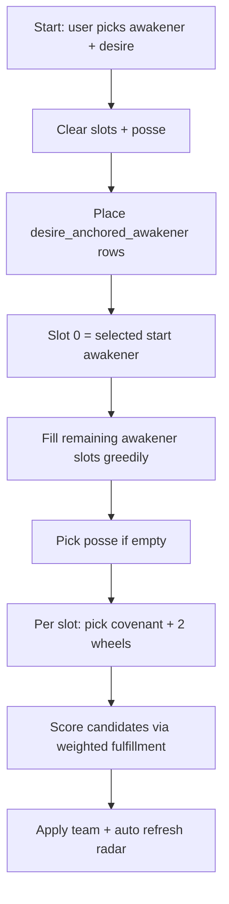
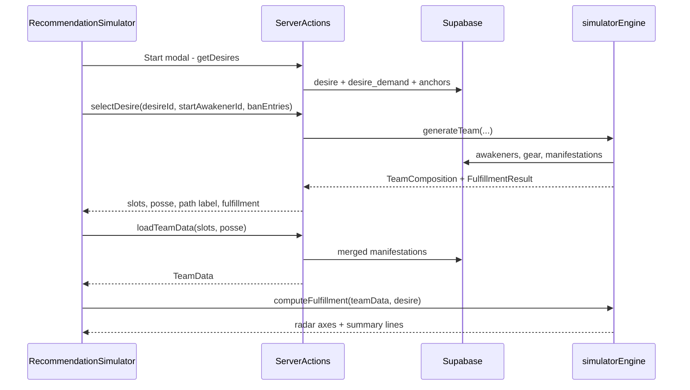

# Recommendation Simulator — Phased Implementation Plan

## Current baseline

The simulator is a **debugger shell** with live awakener dropdowns and `loadTeamData`, but no Start flow, scoring, or real radar axes.

| Area                                                                                    | Status                                                                                                                                                     |
| --------------------------------------------------------------------------------------- | ---------------------------------------------------------------------------------------------------------------------------------------------------------- |
| [`recommendation-simulator.tsx`](src/components/simulator/recommendation-simulator.tsx) | Client state for 4 slots, posse, `BanEntry[]`; Start/Recommend disabled                                                                                    |
| [`load-team-data.ts`](src/lib/team-data/load-team-data.ts)                              | Awakener manifestations + all default interactions only; ignores wheels, covenant, posse                                                                   |
| [`mock-data.ts`](src/components/simulator/mock-data.ts)                                 | Placeholder posse/wheel/covenant enums, stat-based radar axes, static summary lines; `INITIAL_BAN_LIST` uses tag names (will be replaced with entity bans) |
| `desire` / `desire_demand` / `path`                                                     | Schema exists; **local dumps empty** — blocks end-to-end testing                                                                                           |

**Your Phase 1 decisions (locked in):**

- Show **all desires** after awakener pick — **ignore `path` for filtering** in Phase 1
- Add a **checked-in seed script** (2–3 desires + demands + anchors)
- **`desire_anchored_awakener` is a hard constraint** — anchored awakeners must appear in generated teams

---

## Architecture decisions (plan recommendations)

### 1. `path` table vs app-derived desires

| Approach                              | Pros                                                                   | Cons                                                              |
| ------------------------------------- | ---------------------------------------------------------------------- | ----------------------------------------------------------------- |
| **Keep `path` (manual links)**        | Simple query; designer controls which awakener sees which desires      | Does not reflect actual tag fit; stale when manifestations change |
| **Show all desires (Phase 1 choice)** | Fast to ship; validates `desire_demand` + radar regardless of awakener | UX noise if many desires are irrelevant to chosen awakener        |
| **Derive in app (Phase 2/3)**         | Desires surfaced by manifestation overlap / damage sim                 | Requires scoring engine; may deprecate `path`                     |

**Phase 1:** query all non-deleted `desire` rows. Keep `path` in seed data for future use but do not filter on it. **Phase 3:** revisit — either derive suitability scores or repurpose `path` as curated shortcuts.

### 2. Phase 1 scoring: simple tag aggregation (not damage sim)

**Recommendation:** implement a minimal **tag fulfillment engine** that is good enough to validate `desire_demand` curves via the radar chart.

```
teamTagTotals[tagName] = sum(value_scalar) across all team manifestations
                         (awakener + wheel + covenant + posse, after enlightenment/replacement filters)

for each desire_demand row:
  actualValue = rollup(teamTagTotals, demandTag)   // exact + prefix match (see below)
  fulfillmentPct = curve(actualValue, target_value, curve, decay_rate)  // 0–100
  radar axis: label = tag.tag_name, value = fulfillmentPct
```

**Deferred to Phase 2:** synergy interactions, layer x/y/z/f math, indirect tag contribution (e.g. `Support.Strike Damage Up` → `Attacker.Active Damage.Strike`).

**Why this is enough for Phase 1:** radar immediately shows whether `target_value` and curve shapes are sensible; debug panel shows raw `actualValue` vs `target_value` per demand row.

### 3. Tag prefix inheritance — MVP scope

| Scope                                                                    | Phase 1                             | Phase 2                                |
| ------------------------------------------------------------------------ | ----------------------------------- | -------------------------------------- |
| **Demand tag rollup** (demand on `A.B` counts manifestations on `A.B.C`) | **Yes** — longest-prefix match      | Same                                   |
| **`tag_default_interaction` prefix rules**                               | **No** — load data but do not apply | Full resolver with exclusion overrides |

**Location:** new module [`src/lib/simulator/tag-matching.ts`](src/lib/simulator/tag-matching.ts) — shared by aggregation and (later) interaction resolver.

### 3b. Ban list — entity IDs only (not tags)

The ban list is a **debug/testing control** that excludes specific **loadout entities** from Start and Recommend. It does **not** ban tags.

**Banned entity types (Phase 1):**

| Type     | ID source     | Effect                                         |
| -------- | ------------- | ---------------------------------------------- |
| Awakener | `awakener.id` | Candidate excluded from awakener slot fill     |
| Posse    | `posse.id`    | Candidate excluded from posse selection        |
| Covenant | `covenant.id` | Candidate excluded from per-slot covenant fill |
| Wheel    | `wheel.id`    | Candidate excluded from per-slot wheel fill    |

**Not in scope:** `tag.id` — tags are never ban-list entries.

**State shape (client + server input):**

```ts
type BanEntry = {
  entityType: "awakener" | "posse" | "covenant" | "wheel";
  entityId: number;
  label: string; // display name from DB, for UI chips only
};
```

**Filter logic:** [`src/lib/simulator/ban-filter.ts`](src/lib/simulator/ban-filter.ts) — simple ID lookup per entity type before scoring candidates. No manifestation or tag inspection for bans.

**UI:** Add button opens a picker (type selector + searchable dropdown from live `getSimulatorGearOptions()` + awakener options). Chips show `{type} · {name}`; click to remove.

**Replace** current mock seed (`Debuff.Burn`, etc. in [`mock-data.ts`](src/components/simulator/mock-data.ts)) with empty list or 1–2 sample entity bans in seed script comments.

### 4. Initial team generation algorithm

**Recommendation: greedy constraint search** (not full combinatorial — 4 slots × gear is large).



**Constraints enforced at every step:**

- No duplicate awakeners
- Max **2 distinct realms** (reuse [`awakener-selection.ts`](src/components/simulator/awakener-selection.ts))
- **Ban list:** exclude candidates whose `awakener.id`, `posse.id`, `covenant.id`, or `wheel.id` appears in `banList` (entity IDs only — no tag bans)
- **Anchored awakeners:** pre-assign before greedy fill; error if anchors exceed 4 slots or violate realm rule

**Scoring a candidate partial team:**

- Load/merge manifestations for current picks
- Compute weighted score = Σ `base_priority_weight × fulfillmentPct/100` over `desire_demand` rows for selected desire
- Pick highest-scoring candidate per empty slot (awakener → posse → covenant → wheels)

**Recommend:** same scorer, but **only iterate empty fields**; never replace filled slots.

### 5. `desire_demand` schema review

Current schema is **likely sufficient for Phase 1** ([`schema-config.ts`](src/lib/schema-config.ts) lines 468–504):

- `base_priority_weight`, `target_value`, `curve`, `decay_rate` map cleanly to radar + greedy scoring

**Potential Phase 1 additions (only if seed validation fails):**

- `match_mode` enum (`exact` | `prefix`) per demand row — only if some demands need exact-only matching
- Document curve formulas in code comments + debug output (schema comments define intent but not formulas)

**Spike in Phase 1:** after seeding, manually inspect radar for 2–3 desires; if axes cluster at 0% or 100%, tune `target_value` in seed data before changing schema.

---

## Phase 1 — MVP (detailed)

### Target outcome

End-to-end flow: **Start → awakener modal → desire list → team cleared & generated → radar (fulfillment % per demand) → manual edits → Recommend fills empties only.** Debug panels show real computed data.

### Data flow



### Step-by-step implementation

#### 1. Seed script for simulator data

**Files:** new [`scripts/seed-simulator-data.ts`](scripts/seed-simulator-data.ts), add `npm run db:seed-simulator` to [`package.json`](package.json)

**Contents (2–3 desires):**

- `desire` rows with meaningful names/descriptions (e.g. Strike DPS, Support Sustain)
- `desire_demand` rows referencing **real tags** from existing `tag` table (query by `tag_name` at seed time)
- `desire_anchored_awakener` rows (1–2 anchors per desire to test forced placement)
- Optional `path` rows (for future; unused in Phase 1 filtering)

**Acceptance:** running seed + `npm run db:dump` produces non-empty `desire.json`, `desire_demand.json`.

#### 2. Simulator server actions

**Files:** extend [`src/lib/actions/simulator.ts`](src/lib/actions/simulator.ts) or new [`src/lib/actions/simulator-flow.ts`](src/lib/actions/simulator-flow.ts)

| Action                         | Purpose                                                                   |
| ------------------------------ | ------------------------------------------------------------------------- |
| `getDesires()`                 | All desires with `id`, `name`, `description`, demand count                |
| `getDesireDetail(desireId)`    | Demands + anchored awakener ids                                           |
| `getSimulatorGearOptions()`    | Posse, wheel, covenant options from DB (replace mock enums)               |
| `generateTeamForDesire(input)` | Returns `SlotState[]`, `posseId`, errors; input includes `BanEntry[]`     |
| `recommendEmptySlots(input)`   | Returns partial updates for empty slots only; input includes `BanEntry[]` |

#### 3. Extend team data loading

**Files:**

- [`src/lib/team-data/types.ts`](src/lib/team-data/types.ts) — extend input/output
- [`src/lib/team-data/load-team-data.ts`](src/lib/team-data/load-team-data.ts)
- [`src/lib/team-data/resolve-manifestations.ts`](src/lib/team-data/resolve-manifestations.ts) — reuse replacement/enlightenment helpers

**Changes:**

- Input: add `posseId`, per-slot `covenantId`, resolve `wheel1`/`wheel2` names → `wheel_id`
- Load `wheel_tag_manifestation`, `covenant_tag_manifestation`, `posse_tag_manifestation` with same filtering patterns as awakener (realm requirements, `required_awakener` on posse manifestations)
- Extend `Manifestation` with `sourceKind: 'awakener' | 'wheel' | 'covenant' | 'posse'` and `slotIndex` where applicable
- Pass `covenant` from [`SlotState`](src/components/simulator/mock-data.ts) into `loadTeamData` (currently dropped)

#### 4. Tag fulfillment engine (Phase 1 scoring)

**New files:**

- [`src/lib/simulator/tag-matching.ts`](src/lib/simulator/tag-matching.ts) — `matchesDemandTag`, prefix rollup (demand scoring only)
- [`src/lib/simulator/aggregate-tags.ts`](src/lib/simulator/aggregate-tags.ts) — build `Map<tagName, number>` from manifestations
- [`src/lib/simulator/fulfillment.ts`](src/lib/simulator/fulfillment.ts) — curve functions + `FulfillmentResult` type
- [`src/lib/simulator/ban-filter.ts`](src/lib/simulator/ban-filter.ts) — `isEntityBanned(banList, entityType, entityId)`; used by generate/recommend
- [`src/lib/simulator/generate-team.ts`](src/lib/simulator/generate-team.ts) — greedy generator
- [`src/lib/simulator/recommend.ts`](src/lib/simulator/recommend.ts) — empty-slot variant

**Curve implementation (document in code):**

- `linear`: `min(100, (actual / target) * 100)`
- `logarithmic` / `exponential`: implement using `decay_rate` with monotonic 0→100 mapping; expose formula in Summary panel for tuning

#### 5. Start flow UI

**Files:**

- New [`src/components/simulator/start-flow-modal.tsx`](src/components/simulator/start-flow-modal.tsx) — two-step modal (awakener → desire cards with name + description)
- [`src/components/simulator/simulator-header.tsx`](src/components/simulator/simulator-header.tsx) — wire Start/Recommend buttons
- [`src/components/simulator/recommendation-simulator.tsx`](src/components/simulator/recommendation-simulator.tsx) — new state: `selectedDesire`, `startAwakenerId`, `fulfillmentResult`; handlers

**Behavior:**

- **Start** opens modal; on desire confirm: clear team + posse, call `generateTeamForDesire`, set path display to desire name, auto-trigger team load + fulfillment
- **Clear Path** clears desire + team + radar
- Changing path always requires Start (already decided)

#### 6. Radar chart — dynamic axes, fulfillment %

**Files:**

- Refactor [`radar-chart-placeholder.tsx`](src/components/simulator/radar-chart-placeholder.tsx) → `radar-chart.tsx`
- Remove `RADAR_AXES` from [`mock-data.ts`](src/components/simulator/mock-data.ts)

**Props:**

```ts
type RadarAxis = { label: string; value: number };
```

- One axis per `desire_demand` row (label = tag name)
- Single polygon at fulfillment % (0–100); outer 100% grid ring marks full fulfillment
- Handle variable axis count (existing SVG math already supports `count = axes.length`)

#### 7. Wire debug panels

**Files:** [`simulator-sidebar.tsx`](src/components/simulator/simulator-sidebar.tsx)

| Panel         | Phase 1 content                                                                                                   |
| ------------- | ----------------------------------------------------------------------------------------------------------------- |
| **Team Data** | Keep manual Load button; also auto-load after Start/Recommend; show posse/wheel/covenant manifestation counts     |
| **Summary**   | Real lines: per-demand `actual/target/fulfillment%`, weighted total, banned entities excluded count               |
| **Ban List**  | Wire **Add** — entity picker (awakener / posse / covenant / wheel by ID); pass `BanEntry[]` to generate/recommend |

#### 8. Replace mock gear enums

**Files:** [`awakener-slot-row.tsx`](src/components/simulator/awakener-slot-row.tsx), [`mock-data.ts`](src/components/simulator/mock-data.ts)

- Load posse/wheel/covenant options server-side on page mount (alongside awakener options)
- Store **IDs** in state (not display strings) while showing labels in UI

### Phase 1 files touched (summary)

| File                                                    | Change                                                                           |
| ------------------------------------------------------- | -------------------------------------------------------------------------------- |
| `scripts/seed-simulator-data.ts`                        | **New** — seed desires, demands, anchors                                         |
| `src/lib/simulator/*.ts`                                | **New** — matching, aggregation, fulfillment, ban, generate, recommend           |
| `src/lib/team-data/types.ts`                            | Extend types for gear + unified manifestations                                   |
| `src/lib/team-data/load-team-data.ts`                   | Load posse/wheel/covenant                                                        |
| `src/lib/actions/simulator*.ts`                         | Desires, gear options, generate, recommend                                       |
| `src/components/simulator/start-flow-modal.tsx`         | **New**                                                                          |
| `src/components/simulator/recommendation-simulator.tsx` | Start/Recommend state + wiring                                                   |
| `src/components/simulator/simulator-header.tsx`         | Enable buttons                                                                   |
| `src/components/simulator/simulator-sidebar.tsx`        | Live summary + radar props                                                       |
| `src/components/simulator/radar-chart.tsx`              | Single-series fulfillment chart                                                  |
| `src/components/simulator/mock-data.ts`                 | Remove placeholder radar/summary/tag-based `INITIAL_BAN_LIST`; keep slot helpers |
| `src/components/simulator/ban-list-panel.tsx`           | **New** — entity ban chips + Add picker (optional extract from sidebar)          |
| `src/app/simulator/page.tsx`                            | Prefetch gear options                                                            |

### Phase 1 acceptance criteria

- [ ] **Start flow:** awakener modal → all desires listed → selecting desire clears team and repopulates slots + posse + gear
- [ ] **Anchored awakeners** always present after generation; user-visible error if constraints impossible
- [ ] **Radar:** one axis per `desire_demand` row; polygon reflects fulfillment % (0–100); 100% grid ring marks full fulfillment
- [ ] **Recommend:** fills only empty awakener slots / posse / gear; never overwrites user selections
- [ ] **Ban list:** bans `awakener.id` / `posse.id` / `covenant.id` / `wheel.id` only (not tags); excluded from Start and Recommend; Add/Clear work
- [ ] **Team data:** posse, wheels, covenant manifestations included in Load output
- [ ] **Debug panels:** summary shows real numeric values; no `RADAR_AXES` / `SUMMARY_LINES` mocks
- [ ] **Seed script:** reproducible test data committed (script + npm command)

### Phase 1 open decisions (resolve during implementation)

| #   | Decision                                                                        | Default if unresolved                                                                |
| --- | ------------------------------------------------------------------------------- | ------------------------------------------------------------------------------------ |
| 1   | Auto-load team data on every slot change vs only on Start/Recommend/Load button | Auto on Start/Recommend; manual Load still works for edits                           |
| 2   | Logarithmic/exponential curve formula                                           | Implement invertible approximations; tune via seed + debug output                    |
| 3   | Gear search space                                                               | Limit wheels/covenant to top-N by score per slot (N=5) if perf slow                  |
| 4   | Anchor + start awakener conflict                                                | Start awakener wins slot 0; anchors fill other slots; fail if anchor list > 3 others |
| 5   | `path` table                                                                    | Seeded but unused until Phase 2/3                                                    |

### Phase 1 risks and spikes

| Risk                                  | Mitigation                                                                                           |
| ------------------------------------- | ---------------------------------------------------------------------------------------------------- |
| **Empty remote DB** breaks dev        | Seed script is mandatory first step                                                                  |
| **`desire_demand` curves untested**   | Spike: seed 3 demands with different curves; validate radar shape manually before building generator |
| **Greedy team suboptimal**            | Accept for MVP; Phase 3 adds search                                                                  |
| **Gear combo explosion**              | Spike perf with full catalog; add top-N pruning if > ~500ms                                          |
| **Prefix rollup over-counts**         | Debug panel shows which manifestation tags rolled into each demand axis                              |
| **Anchored + realm limit impossible** | Return structured error in Start flow ("Cannot satisfy anchors within 2-realm limit")                |

**Recommended spike order (Day 1):**

1. Seed data + `aggregate-tags` + `fulfillment` + radar (proves `desire_demand` schema)
2. Extend `loadTeamData` for gear
3. `generate-team` + Start modal
4. Recommend + ban list

---

## Phase 2 — Simulation engine (outline)

**Goal:** Replace tag-sum scoring with real damage simulation for accurate path fit.

**Depends on:** Phase 1 team loading, tag matching module, debug panels.

**Scope:**

- Tag prefix inheritance resolver for `tag_default_interaction` + `manifestation_interaction_override`
- Map manifestations → layer terms (x, y, z, f)
- Implement 4-layer damage formula (multiply/add rules per layer)
- Wire **Summary / Calculation List** to show layer-by-layer breakdown
- Radar fulfillment % uses simulated output for demand tags (not raw scalar sums)

---

## Phase 3 — Smart recommendation (outline)

**Goal:** Optimization-driven teams that maximize path fit via damage sim.

**Depends on:** Phase 2 engine.

**Scope:**

- Search / swap suggestions (not just greedy)
- Entity ban-aware optimization (same ID-based ban model as Phase 1)
- Optional: derive desire suitability from sim scores (may supersede `path` table)
- `desire_demand` tuning tooling if radar shows poor discrimination between paths

---

## Where `desire_demand` needs validation

| Checkpoint             | What to verify                                                                                                      |
| ---------------------- | ------------------------------------------------------------------------------------------------------------------- |
| After seed script      | Demands reference tags that actually appear in manifestations                                                       |
| Radar spike            | Axes spread across 0–100 (not all pinned at 0 or 100)                                                               |
| Curve shapes           | Linear vs log vs exponential produce visibly different fills as `actualValue` increases                             |
| `target_value`         | Reasonable relative to observed tag totals for a "good" team                                                        |
| `base_priority_weight` | Changing weights shifts greedy team picks in expected direction                                                     |
| Prefix rollup          | Demand on parent tag reflects child tag contributions appropriately                                                 |
| Phase 2 handoff        | Tag-sum fulfillment diverges from damage sim → indicates demand tags should target layer-f outputs, not raw scalars |

---

## Suggested implementation order

1. Seed script + fulfillment engine + radar (validates domain model)
2. Extend team data loader (posse/wheel/covenant)
3. Start modal + team generation + path display
4. Recommend + ban list wiring
5. Debug panel polish + perf spike on gear search
