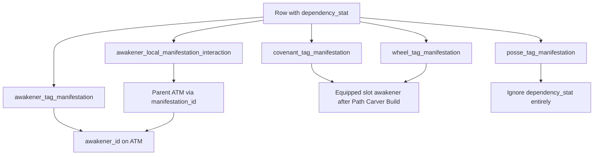

# Recommendation System — Path Carver–First Roadmap

## Strategic shift (locked)

Path Carver’s **Review Tags** page is the primary surface for testing recommendation math. Simulator Start / Recommend / radar / `desire_demand` fulfillment come **after** Path Carver math stabilizes (Phase 4); the simulator will copy Path Carver logic.

| Focus now (3b.1 → 3c.1)                                                                 | Later (Phase 4+)                               |
| --------------------------------------------------------------------------------------- | ---------------------------------------------- |
| Path Carver Review Tags apply + aggregation + interactions                              | Simulator radar / fulfillment UI               |
| Pass-order layers + `awakener_local_manifestation_interaction` rename (2c)              | Full `desire_demand` scoring / curves          |
| Manifestation-local unique_scaling / aftereffect + subject scheduling (3a→3c)           | Port math into Simulator page                  |
| `dependency_stat` scalar scaling + leaf-gated `buff_target_type_restriction` (2b, done) | Smart search / recommend optimization          |
| Layer pass order (2c) + drop leftover `final` enum via recreate (2c.1)                  | Calculation List layer breakdown               |
| Special Corrosion/Embers (exact Non-Active; keyed by name)                              | Non-Active parent+descendants + wire by tag id |

---

## Path Carver investment assumptions (locked)

- Account level 60
- Awakener level 60
- Awakener skills lv6
- Wheels +12
- Soulforge lv10
- Gnostic Potential lv0, except limited awakeners who are lv5

---

## Current baseline (as of this rewrite)

### Done

| Area                         | Status                                                                                                                                                                                                                                                                                      |
| ---------------------------- | ------------------------------------------------------------------------------------------------------------------------------------------------------------------------------------------------------------------------------------------------------------------------------------------- |
| Simulator Phase 1 core       | Seed script, `loadTeamData` (+ gear), Start flow, generate/recommend engines, entity bans, fulfillment module exist                                                                                                                                                                         |
| Path Carver shell            | `/path-carver` under TOOLS; Build → Review 1 → Review 2; load/save `desire` + template + anchors + demands                                                                                                                                                                                  |
| Anchors + `is_damage_dealer` | Build-step toggles; persisted on `desire_anchored_awakener`                                                                                                                                                                                                                                 |
| Review Tags                  | `loadTeamData` → realm apply filter → scalar sum by `tag.id`; debug table shows Applied / `target_type` / etc.                                                                                                                                                                              |
| Realm apply                  | [`manifestation-apply.ts`](src/lib/path-carver/manifestation-apply.ts) — `required_realm` / `required_realm2`                                                                                                                                                                               |
| Interaction column rename    | `tag_default_interaction.source_type` → `buff_target_type_restriction` ([migration](supabase/migrations/20260718120000_rename_tag_default_interaction_source_type.sql); reflected in [`schema-config.ts`](src/lib/schema-config.ts) and [`DefaultInteraction`](src/lib/team-data/types.ts)) |

### Not done (next work)

| Area                                             | Status                                                                                                                                               |
| ------------------------------------------------ | ---------------------------------------------------------------------------------------------------------------------------------------------------- |
| `target_type` apply rules                        | Loaded and shown in debug; **not applied** in aggregation                                                                                            |
| Interaction application                          | `tag_default_interaction` + overrides loaded in `TeamData` but **not applied**                                                                       |
| `dependency_stat` → `value_scalar`               | **Phase 2b done** — ATM/covenant/wheel/override scaled; posse + team/enemy max HP ignored                                                            |
| `buff_target_type_restriction` leaf-gating       | **Phase 2b done** — materialize-then-amplify + `creates_base` / `amplifies_subject`; Option B subject `source_type` context                          |
| Pass-order damage layers                         | **Phase 2c done**                                                                                                                                    |
| Remove leftover `layer.final` enum value         | **Phase 2c.1 done**                                                                                                                                  |
| Manifestation-local unique_scaling / aftereffect | unique_scaling **3b** + invent prefix **3b.1**; aftereffect + Layer B reshape + closure look-ahead **3c**; stack amplify Increase→sink **3c.1 done** |
| Calculation List layer breakdown                 | Deferred to Phase 4                                                                                                                                  |
| Simulator using Path Carver math                 | Port in Phase 4                                                                                                                                      |
| Corrosion/Embers Non-Active + wiring             | Deferred to Phase 4 — parent+descendants capacity; rewire name→id                                                                                    |

---

## `tag_default_interaction` domain model (locked)

Global rulebook: when the **modifier** tag is present on the team, change **target** tag values via `math_operation` + `default_factor` (subject to overrides, self-scoping, buff restriction, etc.).

### Matching rules

| Side                        | Rule                                                                                                                                                                                                                             |
| --------------------------- | -------------------------------------------------------------------------------------------------------------------------------------------------------------------------------------------------------------------------------- |
| **Modifier**                | **Exact-only** on modifier tag (`modifier_tag_id` / tag name). Having `Support.Crit Damage.Something` does **not** satisfy a row whose modifier is `Support.Crit Damage`.                                                        |
| **More specific modifiers** | A deeper modifier tag is a separate, more restricted rule. Example: `Support.Final Damage.Strike` only applies via its own rows (e.g. → `Attacker.Active Damage.Strike`), not by inheriting a parent `Support.Final Damage` row. |
| **Target**                  | **Prefix inheritance** — a rule targeting `A.B` applies to `A.B` and descendants `A.B.*`.                                                                                                                                        |
| **`exclusion_suffix`**      | Exclude that tag **and its descendants** from the target match set. Example: target `Attacker.Active Damage`, exclusion `Attacker.Active Damage.Fixed Damage` → Strike/Blast/etc. match; Fixed Damage and its children do not.   |

### Chaining

Interactions **can chain** across **multiple passes** (e.g. Increase Gain → Support buff → Attacker damage). A later pass may use values updated by an earlier pass.

### Existence gate + `creates_base` / `amplifies_subject`

| Flag / target                                                | Rule                                                                                                                                                                                                                                                              |
| ------------------------------------------------------------ | ----------------------------------------------------------------------------------------------------------------------------------------------------------------------------------------------------------------------------------------------------------------- |
| **`creates_base = true`** (with `amplifies_subject = false`) | Modifier **materializes** target as a synthetic base (Phase 1). May invent Support **and** Attacker/Defender targets. Writes into a synthetic channel (`*team*`), never into existing subject owner buckets. Example: Fiamma → Final Damage; Generate → Tentacle. |
| **`amplifies_subject = true`** (with `creates_base = false`) | Apply once per matching **existing** subject (Phase 2). Target must be Layer A or created-base present. Example: STR Up → each Active Damage; Increase Gain must not invent STR Up.                                                                               |

Intended pairs only (XOR). Same polarity is soft-warned in admin. Defaults: `creates_base=false`, `amplifies_subject=true`.

Prefix / exclusion still apply per matched tag (Strike base-present does not create parent Active Damage). Special Corrosion / Embers conversions are outside this rule.

**Examples:**

- `Support.STR Up` → `Attacker.Active Damage` with no Active Damage base → **skip** (no phantom).
- `Support.Fiamma` → `Support.Final Damage` (`creates_base`) → synthetic Final base → `Attacker.Active Damage` (`amplifies_subject`) → **allowed**.
- `Support.Increase Gain.STR Up` → `Support.STR Up` (`amplifies_subject`, no STR Up base) → **skip**.
- `Support.Create.Insight` → `Support.Draw` (`creates_base`) → Draw merged into Review Tags.
- `Support.Generate Permanent Tentacle` → `Attacker.Tentacle` (`creates_base`) → Tentacle subject invented.

### Pipeline (materialize then amplify)

1. **Phase 1 — unrestricted `creates_base`**: run create rows with null restriction; emit synthetic manifestations; Support created bases merge into totals (immune subjects); Attacker/Defender created bases become Phase 2 subjects.
2. **Phase 2 — per subject**: restricted `creates_base` as scoped seed (path-local, not globally merged), then `amplifies_subject` only. `leafContext = subject.sourceType`. Merge only the subject’s `tagId`.
3. **Special conversions** once on merged totals.

Subjects = Layer A applied + created Attacker/Defender synthetics. Cohort excludes same-`tagId` siblings and includes created-base synthetics as modifiers.

### `buff_target_type_restriction` (on the interaction row)

Renamed from the old `source_type` column on `tag_default_interaction` (oversight fix). Distinct from manifestation `source_type`.

**Locked model (Option B — subject context, one path only):**

- Do **not** compute both “restriction met” and “restriction unmet” totals in parallel.
- When calculating for a **subject** manifestation, carry that manifestation’s `source_type` as **leaf context** for the whole interaction chain.
- Restricted `creates_base` rows apply only when `leafContext` matches (scoped seed on that subject path).
- If restriction is **null**, unrestricted creates run in Phase 1; amplify rows apply regardless of leaf `source_type` (subject to other rules).
- Restriction does **not** live on `awakener_local_manifestation_interaction` (renamed from `manifestation_interaction_override` in Phase 2c) for now (may be added later). Gate using `tag_default_interaction.buff_target_type_restriction` only.
- Example: subject is an `Attacker.Active Damage` contribution with `source_type == command card`. Restricted `Support.Enhance → Support.Final Damage` **applies** as a scoped Final seed on this path; same seed with a tentacle subject **skips**. Downstream `Support.Final Damage → Attacker.Active Damage` (`amplifies_subject`) still applies when its other rules pass.
- Review Tags tag list: still one scalar per tag for the current team calculation (no per-branch columns).
- **Debug — Tag total math:** if a restricted interaction **applied** (restriction met for this subject), show **one extra** calculation line; if skipped due to restriction, **no** extra line for that interaction.

**Phase ownership:** `dependency_stat` → effective `value_scalar`, materialize-then-amplify, `creates_base` / `amplifies_subject`, and leaf-gated buff restriction are **Phase 2b** (redesigned). Phase 2a applied interactions without dependency scaling and without buff-restriction gating (2a ignored non-null restrictions — already implemented).

### Temporary operation order (2a / 2b only)

Assume **`add_scaled` first, then `presence_multiply` / `multiply_one_plus`**. Special conversions run as their own step (see below).

This order is **incorrect long-term**. Phase **2c** replaces it with pass order driven by the **modifier** tag’s `layer` (`pre_add` / `add` / `post_add` only). Aftereffects are Phase 3 **mode** timing, not a fourth layer.

### `math_operation` formulas (locked)

Enum values (only these three): `presence_multiply`, `add_scaled`, `multiply_one_plus`.

Dropped: `add_to_base_value`, `add_to_multiplier`, `compound_multiplier`, `add_hits`, `subtract`.

| Op                  | Formula                                               | Notes                                                                                                                      |
| ------------------- | ----------------------------------------------------- | -------------------------------------------------------------------------------------------------------------------------- |
| `presence_multiply` | if modifier present (≥1 / exists): `target *= factor` | **Only** `Support.Debuff.Vulnerability → Attacker.Active Damage`. Unique / Tentacle Vulnerability use `multiply_one_plus`. |
| `add_scaled`        | `target += modifier_value * factor`                   | Flat additive scale (e.g. STR Up → Active Damage).                                                                         |
| `multiply_one_plus` | see `tag.is_percent` below                            | Replaces old compound / add_to_multiplier.                                                                                 |

**`multiply_one_plus` with `tag.is_percent`:**

```text
contribution = modifier_value * factor
if target.is_percent:
  target = (1 + target) * (1 + contribution) - 1
else:
  target = target * (1 + contribution)
```

`is_percent` lives on `tag` (fractional bonus where `0` means no bonus). Percent-seeded prefixes include `Support.Final Damage`, `Support.Enhance`, `Support.Increase Gain`, `Support.Crit Damage`, `Support.Crit Rate`, `Support.Damage AMP`, `Support.Base Damage`, plus exact tags `Support.Aliemu`, `Support.Embryo Fusion`, `Support.Fiamma`, `Support.Propagation Fiesta`, `Support.Take Effect Again`.

### Special conversions (locked; not `tag_default_interaction`)

Corrosion / Ancient Embers consume+transfer is **not** driven by interaction rows (those rows are soft-deleted). Engine applies hardcoded conversion rates (table uses names as labels; **Phase 2a** keys tags by **name** via `findTagIdByName` / `m.tagName ===`):

| Special tag                         | Debuff                          | Consume sources                                                  | Transfer                                   |
| ----------------------------------- | ------------------------------- | ---------------------------------------------------------------- | ------------------------------------------ |
| `Special.Corrosion Conversion`      | `Support.Debuff.Corrosion`      | Active Damage ×1, Tentacle ×1, Non-Active Damage ×0.5; clamp ≥ 0 | lost ×3 → `Attacker.Corrosion Damage`      |
| `Special.Ancient Embers Conversion` | `Support.Debuff.Ancient Embers` | same consume rates                                               | lost ×3 → `Attacker.Ancient Embers Damage` |

```text
lost = min(debuff, sum(source_i * rate_i))
debuff -= lost
damage_tag += lost * 3
```

Phase 2a implements these Special conversions alongside interaction ops (interaction rows for this behavior are gone). Non-Active capacity currently uses the **exact** parent tag only — provisional. **Phase 4** (1) rewires conversion gate, debuff, Active, Tentacle, Non-Active **parent**, and Corrosion/Embers damage targets to **numeric tag id** constants (same pattern as Death Resist / Keyflare — ids are the contract); (2) widens Non-Active capacity to **parent id + descendants** (look up parent `tag_name` from `tagsById`, then prefix-sum children — do not hardcode Poison Damage ids). Do **not** roll child targets into the parent via `tag_default_interaction` (keeps Poison Trigger scoped to its own target). Active Damage and Tentacle capacity stay exact (by id). Prefix gates (`Attacker.*` / `Defender.*`) and interaction target prefix matching stay name-based.

### Manifestation-local interactions (current vs planned)

**Today (through 2b):** table `manifestation_interaction_override` can change `value_scalar` / op / `target_type` / `dependency_stat` or disable (`is_disabled`) a synergy link for a specific manifestation. It only patches a matching `tag_default_interaction`; it cannot invent rules or create bases. Effective `value_scalar` (after `dependency_stat` scaling in Phase 2b) is resolved before interaction ops consume it.

**Phase 2c:** rename table → `awakener_local_manifestation_interaction` (behavior unchanged aside from pass-order layers).

**Phase 3:** expand into manifestation-local `unique_scaling` / `aftereffect` (no stored `override` mode — see Phase 3).

---

## Phase 2a — Review Tags math: Attacker damage-dealer gate + `target_type = self` + interactions (DONE)

### Goal

Extend Path Carver Review Tags so team tag totals and interaction effects respect **`is_damage_dealer` for all Attacker.\* tags**, **`target_type = self` for non-Attacker scoping**, and a first-pass **interaction resolver** (exact modifier, target prefix, exclusion, multi-pass chain, self-scope), with full debug visibility of filtered rows.

Primary files: [`manifestation-apply.ts`](src/lib/path-carver/manifestation-apply.ts), [`aggregate-tag-scalars.ts`](src/lib/path-carver/aggregate-tag-scalars.ts), new `apply-interactions.ts`, [`review-tags-step.tsx`](src/components/path-carver/review-tags-step.tsx), [`review-tags-debug.tsx`](src/components/path-carver/review-tags-debug.tsx).

### Locked decisions

| #   | Decision                                                                                                                            |
| --- | ----------------------------------------------------------------------------------------------------------------------------------- |
| 1   | Work only on Path Carver Review Tags math; simulator copies later (Phase 4)                                                         |
| 2   | For **non-Attacker** tags: implement **`self` scoping** this phase; `single` / `aoe` keep applying if realm rules pass              |
| 3   | Two layers: (A) filter which manifestations enter **team tag totals**; (B) apply **interactions** with self-scoping                 |
| 4   | Attacker gate: tag name **starts with `Attacker.`**                                                                                 |
| 5   | **Attacker.\* never applies unless owner is `is_damage_dealer`** — for **all** `target_type` values (`self`, `single`, `aoe`, null) |
| 6   | No damage dealers marked → **no** Attacker.\* contributions (any target_type)                                                       |
| 7   | **Posse:** skip both `target_type` and damage-dealer gates (realm only); column kept for future behavior                            |
| 8   | All filtered-out manifestations **remain visible** in Review Tags debug with **Applied = no** (+ reason). Never hide filtered rows  |
| 9   | **`dependency_stat` scaling + leaf-gated `buff_target_type_restriction` → Phase 2b** (not in 2a)                                    |
| 10  | Interaction matching: **exact modifier**, **prefix target**, **exclusion = tag + descendants**, **multi-pass chain**                |
| 11  | Temporary op order: `add_scaled` then `presence_multiply` / `multiply_one_plus` (replaced in 2c)                                    |
| 12  | Implement locked `math_operation` formulas + `tag.is_percent` branch; Special Corrosion/Embers conversions by tag name              |

### Apply context extensions

Extend `ManifestationApplyContext` (or sibling types) with:

```ts
damageDealerAwakenerIds: Set<number>; // from Build-step anchors where isDamageDealer === true
// Plus per-manifestation ownership: awakenerId / slotIndex already on Manifestation
```

Pass `anchoredAwakeners` from Path Carver Build state into Review Tags (create and edit) so apply math uses live toggles before Save.

### Layer A — Manifestation filter for team totals

After existing realm rules, for each manifestation:

```
owner = awakener who owns this manifestation
        (awakener row, or wheel/covenant on that slot; null for posse)

if sourceKind === "posse":
  // Posse skips target_type and damage-dealer gates (future TBD)
  include if realm OK

else if tagName starts with "Attacker.":
  // Applies for ANY target_type (self / single / aoe / null)
  include ONLY if owner.id ∈ damageDealerAwakenerIds
  (if damageDealerAwakenerIds is empty → never include Attacker.*)
  reason when excluded: attacker.not_damage_dealer

else if targetType === "self":
  // Support.*, Defender.*, etc. with self — base scalar still counts
  // as that owner's contribution; interaction scoping is Layer B
  include if realm OK

else: // single | aoe | null (non-Attacker)
  include if realm OK
```

**Clarification for Support/Defender self scalars:** Base `value_scalar` on a self-targeted Support/Defender manifestation still counts toward that tag’s team total (it is that awakener’s contribution). What must **not** leak team-wide is **interaction modification** of other awakeners’ tags (Layer B).

**Attacker.\* + non-dealer (any target_type):** exclude from totals entirely; debug row stays listed with Applied = no.

### Layer B — Interaction application (2a MVP)

When resolving `tag_default_interaction` (+ overrides) for Review Tags math:

**Matching (locked):**

1. Load interactions already present on `TeamData`
2. **Modifier match: exact-only** (modifier tag name / id must match exactly)
3. **Target match: prefix inheritance** — reuse / share [`tag-matching.ts`](src/lib/simulator/tag-matching.ts) for targets; apply `exclusion_suffix` as exclude tag **and descendants**
4. Respect overrides + `is_disabled`
5. **Multi-pass chaining** until stable or a fixed pass limit (document limit in code)
6. **Self-scoping:** if the **modifier** manifestation (or effective `target_type` after override) is `self`, the interaction only modifies tags belonging to the **same owner awakener** (their awakener / wheel / covenant manifestations)
7. **Buff restriction:** do **not** implement branching in 2a — ignore non-null `buff_target_type_restriction` or skip those rows until 2b (pick one approach and document in code comments)
8. **Temporary op order:** `add_scaled` first, then `presence_multiply` / `multiply_one_plus` (placeholder until 2c)
9. **Ops:** implement `presence_multiply`, `add_scaled`, `multiply_one_plus` with `tag.is_percent` offset form; only Vulnerability uses `presence_multiply`
10. **Special conversions:** apply Corrosion / Ancient Embers conversion when the corresponding `Special.* Conversion` tag is in play (hardcoded rates above)
11. Output adjusted per-tag totals used by Review Tags list + debug

**Examples:**

- `Support.Increase Gain.Shield` with `self` only increases that awakener’s `Defender.Shield` / `Defender.Shield.*` — not other teammates’.
- `Support.Crit Damage` on self does not raise another awakener’s damage; any resulting Attacker.\* contribution still must pass the Layer A damage-dealer gate.

Defer: dependency_stat scaling + leaf-gated buff restriction (2b), pass-order layers (2c), manifestation-local unique_scaling/aftereffect (3), Summary layer breakdown (4).

### Debug UX

**Requirement:** every manifestation loaded for the team appears in the Review Tags debug section. Filtering only changes Applied / totals — it must **not** remove rows from the debug tables.

Each row shows:

- Applied yes/no
- Reason when no: e.g. `realm`, `attacker.not_damage_dealer`

Optional: show which interactions applied to which target tags (lightweight; full Calculation List in Phase 4).

### Files to touch (Phase 2a)

| File                                                                                                   | Change                                                                                                                                                 |
| ------------------------------------------------------------------------------------------------------ | ------------------------------------------------------------------------------------------------------------------------------------------------------ |
| [`src/lib/path-carver/manifestation-apply.ts`](src/lib/path-carver/manifestation-apply.ts)             | Damage-dealer set; Attacker.\* gate for all target_types; `target_type=self` for non-Attacker scoping; posse exception; apply reasons                  |
| [`src/lib/path-carver/aggregate-tag-scalars.ts`](src/lib/path-carver/aggregate-tag-scalars.ts)         | Use new apply rules; hook interaction-adjusted totals (exclude Applied=no from sums)                                                                   |
| New `src/lib/path-carver/apply-interactions.ts`                                                        | Exact modifier / prefix target / exclusion / multi-pass / self-scope; locked ops + `is_percent`; Special conversions; temp op order; no buff branching |
| [`src/components/path-carver/review-tags-step.tsx`](src/components/path-carver/review-tags-step.tsx)   | Pass anchors / damage dealers into apply context                                                                                                       |
| [`src/components/path-carver/review-tags-debug.tsx`](src/components/path-carver/review-tags-debug.tsx) | Show **all** manifestations (including filtered); Applied + reason columns                                                                             |
| [`src/components/path-carver/path-carver.tsx`](src/components/path-carver/path-carver.tsx)             | Wire `anchoredAwakeners` into Review Tags                                                                                                              |

### Phase 2a acceptance criteria

- [x] Attacker.\* (any `target_type`) only counts when owner awakener is `is_damage_dealer` (including that slot’s wheels/covenant)
- [x] Zero damage dealers → zero Attacker.\* contribution to team totals
- [x] Non–damage-dealer Attacker.\* dropped from totals; **still listed** in debug with Applied = no + reason `attacker.not_damage_dealer`
- [x] All realm-filtered (and other filtered) manifestations remain visible in debug with Applied = no + reason
- [x] Posse manifestations ignore `target_type` and damage-dealer gates (realm rules still apply)
- [x] Non-Attacker `single` / `aoe` unchanged beyond realm filter; non-Attacker `self` base scalars still count for owner
- [x] Interactions: exact modifier match; target prefix + exclusion descendants; multi-pass chaining
- [x] Self-targeted Support (etc.) interactions only modify the owning awakener’s matching target tags
- [x] Ops: `presence_multiply` (Vulnerability only), `add_scaled`, `multiply_one_plus` with `is_percent` offset on percent targets
- [x] Special Corrosion / Ancient Embers conversions applied by Special tag name (hardcoded rates)
- [x] Review Tags scalar list uses only Applied = yes totals (after interactions)
- [x] `dependency_stat` scaling and `buff_target_type_restriction` gating **not** implemented yet (Phase 2b)

---

## Phase 2b — `dependency_stat` scaling + materialize-then-amplify + buff restriction (DONE)

**Depends on:** Phase 2a interaction resolver (done).

### Goal

1. Resolve effective `value_scalar` via `dependency_stat` (manifestations + overrides) before interaction math consumes scalars.
2. **Subject-centric evaluation:** every Layer A base (plus created Attacker/Defender synthetics) is an isolated subject; cohort excludes same-tag siblings; merge only subject tag.
3. **`creates_base` / `amplifies_subject`**: Phase 1 materializes create rows into synthetic bases (may invent Attacker/Defender); Phase 2 amplifies existing subjects only. Restricted creates are path-scoped seeds. Soft-warn when flags are equal.
4. Gate `buff_target_type_restriction` using the **subject manifestation’s `source_type`** as chain context — **one calculation path only** (no dual-branch totals).

---

### Part A — `dependency_stat` → effective `value_scalar` (locked)

#### Purpose

When `dependency_stat` is non-null, the row’s `value_scalar` is **stat-dependent**. For realm manifestations, `dependency_stat` is the **base stat/source quantity**. When `dependency_rate` and `dependency_rate_stat` are both non-null, `dependency_rate_stat` is the stat that scales the conversion rate rather than replacing the base-stat role of `dependency_stat`.

**Scope:** `dependency_rate` / `dependency_rate_stat` / `pure_bonus_target` and the rate-scaled / two-row Fiesta rules apply to **`realm_tag_manifestation` only**. Other tables use `dependency_stat` multiply only (posse ignores it).

| Table                                                                                          | Scalar column  | Notes                                                 |
| ---------------------------------------------------------------------------------------------- | -------------- | ----------------------------------------------------- |
| `awakener_tag_manifestation` / `covenant_tag_manifestation` / `wheel_tag_manifestation`        | `value_scalar` | scale when `dependency_stat` set                      |
| `awakener_local_manifestation_interaction` (was `manifestation_interaction_override` until 2c) | `value_scalar` | same formula (renamed from `override_default_factor`) |
| `posse_tag_manifestation`                                                                      | `value_scalar` | **ignore** `dependency_stat`                          |

```text
rate_mult   = 2 when pure_bonus_target = dependency_rate and team is pure, else 1
scalar_mult = 2 when pure_bonus_target = value_scalar and team is pure, else 1

# flat (dependency_stat null, no rate pair)
effective = value_scalar * scalar_mult

# multiply-only (dependency_stat set; dependency_rate null OR dependency_rate_stat null)
# non-percent tag → ROUND UP to whole number
effective = ceil(value_scalar * scalar_mult * awakener.<stat>)

# multiply-only
# percent tag → ROUND UP to 2 decimal places
effective = ceil(value_scalar * scalar_mult * awakener.<stat> * 100) / 100

# percent dependency_stat special form (ATM/override; see list below)
effective = ceil(((value_scalar * 100) * (awakener.<stat> * 100)) * 100) / 100
# (apply scalar_mult to value_scalar first when pure_bonus_target = value_scalar)

# realm base-stat conversion with rate scaling
# (dependency_stat + dependency_rate + dependency_rate_stat all set)
# base_stat may be team_max_hp / enemy_max_hp (resolved for realm rows — not ignored)
base_rate = value_scalar * scalar_mult
raw = base_stat * (base_rate + dependency_rate * rate_stat * rate_mult)
# ROUND UP: non-percent tag → whole number; percent tag → 2 dp
effective = ceil(raw) or ceil(raw * 100) / 100
```

**Round up (ceil) is required** after dependency / pure scaling:

- Non-percent tags: ceil to a **whole number** (e.g. Enhance `15 + 0.0075 × 434 × 2 = 21.51 → 22`)
- Percent tags: ceil to **2 decimal places**
- Unscaled flat rows with no pure double stay raw (no ceil)
- ATM/override: `team_max_hp` / `enemy_max_hp` still **ignore** scaling (keep raw `value_scalar`). Realm rows that use those as `dependency_stat` **do** resolve them as `base_stat`.

If `dependency_stat` is null and there is no rate pair → flat branch above.

Do **not** encode Fiesta/Enhance as a single multiplicative row (`base × (1 + rate × RM)`). Use **two additive rows** instead (see row semantics). With `dependency_rate` set but `dependency_rate_stat` null, fall back to multiply-only (rate fields unused).

`tag_default_interaction.default_factor` is **not** a `value_scalar` and is not scaled by `dependency_stat`.

#### Row semantics

- **Flat pure double:** `value_scalar` set, `dependency_stat` null, `pure_bonus_target=value_scalar` → `value_scalar × 2` when pure
- **Current multiply:** `dependency_stat` set, `dependency_rate` null, `dependency_rate_stat` null → `ceil(value_scalar × scalar_mult × stat)`
- **Two-row Fiesta / Enhance** (preferred for `base × (1 + 0.0005 × RM × pureMult)`):
  - Base: flat `value_scalar` (e.g. 15 / 20 / 25 / 40), `pure_bonus_target=none`
  - RM: `value_scalar = base × 0.0005` (e.g. 0.0075 / 0.01 / 0.0125 / 0.02), `dependency_stat=realm_mastery`, `pure_bonus_target=value_scalar`
  - Sum then **round up**: pure RM 434 → `15 + 6.51 = 21.51 → 22`, `25 + 10.85 = 35.85 → 36`
- **Base conversion + scaling stat:** `dependency_stat=team_max_hp`, `value_scalar` base rate (or `0` for RM-only companion), `dependency_rate` + `dependency_rate_stat=realm_mastery`, `pure_bonus_target=dependency_rate` → `ceil(HP × (base_rate + rate × RM × rate_mult))`

#### Percent dependency stats

Treat these `all_stats` values as percent (both operands ×100 before multiply):

- `damage_amp`
- `crit_rate`
- `crit_dmg` (user label “crit_damage”; DB enum / awakener column is `crit_dmg`)
- `sigil_yield`
- `death_resist`

All other mapped awakener stats use the non-percent form.

#### Enum → awakener column map

| `dependency_stat`              | Awakener field on [`Awakener`](src/lib/team-data/types.ts)                                       |
| ------------------------------ | ------------------------------------------------------------------------------------------------ |
| `con` / `atk` / `def`          | `con` / `atk` / `def`                                                                            |
| `damage_amp`                   | `damageAmp`                                                                                      |
| `crit_rate`                    | `critRate`                                                                                       |
| `crit_dmg`                     | `critDmg` (never `crit_damage`)                                                                  |
| `realm_mastery`                | `realmMastery`                                                                                   |
| `keyflare_regen`               | **`keyflareRegen`** (never `skey`)                                                               |
| `aliemus_regen`                | `aliemusRegen`                                                                                   |
| `sigil_yield`                  | `sigilYield`                                                                                     |
| `death_resist`                 | `deathResist`                                                                                    |
| `team_max_hp` / `enemy_max_hp` | ATM/override: **ignore** (raw scalar). Realm rate-scaled / HP conversion: resolve as `base_stat` |

Null awakener stat → treat as `0` (effective becomes 0).

#### Owner resolution (which awakener)



- **ATM:** `awakener_id`
- **Override:** parent ATM’s `awakener_id` (already loaded on `Manifestation.interactionOverrides` in [`load-team-data.ts`](src/lib/team-data/load-team-data.ts))
- **Covenant / wheel:** slot owner after Build (manifestation already carries `awakenerId` / `slotIndex` once equipped)
- **Posse:** ignore `dependency_stat` (always use raw `value_scalar`)

ATM and override each scale their own `value_scalar` independently.

#### Pipeline order inside Phase 2b

1. Resolve effective `value_scalar` via `dependency_stat` (tables above)
2. Run interactions with **leaf-gated** buff restriction (Part B)

Debug: Review Tags debug already shows `dependency_stat`; show **raw vs effective** `value_scalar` (or at least effective) once implemented.

---

### Part B — Leaf-gated `buff_target_type_restriction` (locked — Option B)

#### Semantics

- Interaction row field: `buff_target_type_restriction` (enum `source_type`: command card / exalt / tentacle / rouse / talent), nullable.
- **Leaf context:** when resolving values for a demand / leaf manifestation, set `leafSourceType = that manifestation.source_type` (nullable).
- Carry `leafSourceType` as context for the **entire** multi-pass interaction chain for that calculation.
- If interaction restriction is **null** → apply (subject to other 2a rules).
- If interaction restriction is **set** → apply **only if** `leafSourceType === restriction`; otherwise **skip** this interaction for this leaf (do not compute a parallel unmet branch).
- **Overrides / local rows:** do **not** read buff restriction from `awakener_local_manifestation_interaction` in 2b (column may be added later).

```
Example leaf: Attacker.Active Damage manifestation with source_type == command card

Support.Enhance → Support.Final Damage   (restriction: command card)
  → APPLIES (leaf context matches)

Support.Final Damage → Attacker.Active Damage   (no restriction)
  → APPLIES when other rules pass

Same chain for a tentacle leaf → Enhance SKIPPED; no dual totals stored
```

#### UI / debug

- Review Tags tag list: **one** scalar per tag (no per-`source_type` columns, no dual-branch aggregates).
- **Debug — Tag total math** ([`review-tags-math-debug.tsx`](src/components/path-carver/review-tags-math-debug.tsx)): when a restricted interaction **applies** (restriction met for this leaf), emit **one extra** calculation line; when skipped due to restriction, **no** extra line. Existing debug layout otherwise unchanged.
- Full Calculation List remains Phase 4.

#### Implementation notes

- Replace Phase 2a stub in [`apply-interactions.ts`](src/lib/path-carver/apply-interactions.ts) that ignores non-null restrictions.
- Thread leaf `source_type` into the interaction engine when computing per-manifestation or per-leaf contributions that feed totals / math debug.
- How to aggregate multiple leaves with different `source_type` into the single Review Tags tag total: use the same overall team aggregation as 2a, but each leaf’s contribution is computed with **its own** leaf context (so command-card leaves get restricted buffs; tentacle leaves do not). Sum those contributions into the tag total — still one number in the UI.
- Part B consumes **already dependency-scaled** effective scalars from Part A.

### Acceptance criteria

**Part A — dependency_stat:**

- [x] ATM / covenant / wheel with non-null `dependency_stat` contribute scaled `value_scalar` (percent form when applicable)
- [x] Override with non-null `dependency_stat` scales its `value_scalar` the same way (owner = parent ATM awakener)
- [x] `team_max_hp` / `enemy_max_hp` leave scalar unchanged
- [x] Posse never applies dependency scaling
- [x] `keyflare_regen` → `awakener.keyflareRegen` (never `skey`); `crit_dmg` not `crit_damage`
- [x] Effective scalars feed leaf-gated interactions and downstream totals
- [x] Debug shows raw vs effective scalar (or effective clearly)

**Part B — buff restriction (Option B):**

- [x] Restricted interactions apply only when leaf manifestation `source_type` matches restriction
- [x] Unrestricted interactions still apply under other 2a rules
- [x] Leaf context is used for the whole chain (Enhance can affect Active Damage via Final Damage when leaf is command card)
- [x] No dual-branch / parallel unmet totals computed or shown in the tag list
- [x] Tag total math: extra line only when restricted interaction applied; silent skip when unmet
- [x] Overrides do not supply buff restriction in 2b

---

## Phase 2b.1 — Awakener total base stats + transfer tags (Path Carver)

**Depends on:** Phase 2b.

### Goal

Replace raw `awakener` table stats for `dependency_stat` with **total base stats**, inject synthetic Support/Defender tags from selected stats, and apply Special.Increase Base Keyflare after keyflare DR.

### Locked calculation order

1. Sum per awakener: table stats + wheel1 + wheel2 + covenant (`stat` / `stat_amount` when set)
2. **keyflare_regen DR:** `Math.ceil(15 + 144 * (x - 15) / (x + 129))`
3. **aliemus_regen DR:** `Math.ceil(x * (1 - (x / 0.2) / (x / 0.2 + 360)))`
4. **Special.Increase Base Keyflare** (tag id **131**):  
   `finalKeyflare = Math.ceil(originalDr * (1 + Σ effective value_scalar))`  
   Multiple sources use the same original (additive scalars). Scale those rows with **pre-boost** totals if they have `dependency_stat`.
5. **dependency_stat** scaling uses these totals — including **post–Special.Increase** `keyflare_regen`
6. Inject synthetic manifestations (absolute `value_scalar`, `dependency_stat` null); they act as modifiers but are **immune as interaction subjects**

### Transfer tag ids

| Base stat       | Tag id | `target_type` |
| --------------- | ------ | ------------- |
| `damage_amp`    | 16     | `aoe`         |
| `crit_rate`     | 18     | `self`        |
| `crit_dmg`      | 17     | `self`        |
| `realm_mastery` | 63     | `aoe`         |
| `aliemus_regen` | 28     | `self`        |
| `death_resist`  | 12     | `aoe`         |

Keyflare is **not** transferred to a tag; it only feeds `dependency_stat` (after DR + Special.Increase).

### Primary files

- [`src/lib/path-carver/awakener-base-stats.ts`](src/lib/path-carver/awakener-base-stats.ts)
- [`src/lib/team-data/load-team-data.ts`](src/lib/team-data/load-team-data.ts) — gear `stat` / `stat_amount`
- [`src/lib/path-carver/aggregate-tag-scalars.ts`](src/lib/path-carver/aggregate-tag-scalars.ts)
- [`src/lib/path-carver/apply-interactions.ts`](src/lib/path-carver/apply-interactions.ts) — skip inbound ops for `isBaseStatTransfer`
- Smoke: `npx tsx scripts/smoke-phase-2b1.ts`

---

## Phase 2b.2 — Team Max HP (`all_stats.team_max_hp`)

**Depends on:** Phase 2b.1.

### Goal

Compute Path Carver **team Max HP** from total base CON × `AcountLevelConfig` HpMultiplier, emit synthetic **Defender.Max HP Up** (tag 130) from Death Resist reduction, and resolve `dependency_stat=team_max_hp` to `finalMaxHp`.

### Locked formula

- Account / awakener levels: **Path Carver investment assumptions**; average always ÷ 4 slots
- `baselineMaxHp = ceil(sumCON * HpMultiplier[effectiveHpLevel])`
- Full 1–100 multiplier table: [`account-level-hp-multipliers.ts`](src/lib/path-carver/account-level-hp-multipliers.ts)
- DR reduction → tag 130; `bonusMaxHp = ceil(baseline * maxHpUpTotal)` (0.1 = +10%; Max HP Up is not Death Resist)
- `enemy_max_hp` remains ignored

### Primary files

- [`src/lib/path-carver/team-max-hp.ts`](src/lib/path-carver/team-max-hp.ts)
- [`src/lib/path-carver/death-resist-trigger.ts`](src/lib/path-carver/death-resist-trigger.ts)
- [`src/lib/path-carver/aggregate-tag-scalars.ts`](src/lib/path-carver/aggregate-tag-scalars.ts)
- [`src/lib/path-carver/effective-value-scalar.ts`](src/lib/path-carver/effective-value-scalar.ts)
- Smoke: `npx tsx scripts/smoke-team-max-hp.ts`

---

## Phase 2b.3 — Realm tag manifestations (`realm_tag_manifestation`)

**Depends on:** Phase 2b.1 + 2b.2.

### Goal

Load `realm_tag_manifestation` into Path Carver Review Tags as **team-once** Layer A bases (not per awakener), gated by `realm.replace` + `required_realm_mode`, scaled with realm-only dependency/pure/combo rules, and **interaction-immune** as subjects (like transfers)—except scalars still use **team Max HP** / **team Realm Mastery** as dependency inputs.

### Locked decisions

| Topic           | Lock                                                                                                                                                                                                       |
| --------------- | ---------------------------------------------------------------------------------------------------------------------------------------------------------------------------------------------------------- |
| Apply count     | One contribution per matching RTM row                                                                                                                                                                      |
| Combo           | × `chaosComboStacks` on effective scalar                                                                                                                                                                   |
| Replaced realms | **present / exclusive:** `realm_id ∈ effectiveRealmIds`. **combo:** family present (replacer satisfies base) + `chaosComboStacks > 0`; dedupe `(familyId, tagId)` preferring effective, else replaced base |
| Chaos replaced  | Chaos RTM off; `chaosComboStacks === 0` ⇒ all `combo` off                                                                                                                                                  |
| Attacker.\* RTM | Always apply when realm mode gates pass (no damage-dealer check)                                                                                                                                           |
| `realm_mastery` | Σ total-base `awakener.realmMastery`                                                                                                                                                                       |
| Immunity        | `sourceKind === "realm"` skips inbound interaction ops                                                                                                                                                     |

### Follow-up — combo through replace

Non-chaos `realm.replace` (e.g. Propagation → Caro) no longer drops `required_realm_mode = combo` rows for the replaced base: combo gates on family presence via `satisfiesRequiredRealm(..., "present")` plus stacks. Primordia / any chaos replacer still zeros `chaosComboStacks`, wiping all combo. When both base and variant have a combo row for the same tag, prefer the effective realm’s row (`suppressedRealmComboIds` on apply context) so Caro + Propagation never double. Implemented in [`manifestation-apply.ts`](src/lib/path-carver/manifestation-apply.ts); covered by `npx tsx scripts/smoke-realm-tags.ts`.

### Primary files

- [`src/lib/team-data/types.ts`](src/lib/team-data/types.ts) / [`load-team-data.ts`](src/lib/team-data/load-team-data.ts)
- [`src/lib/team-data/resolve-team-realms.ts`](src/lib/team-data/resolve-team-realms.ts)
- [`src/lib/path-carver/manifestation-apply.ts`](src/lib/path-carver/manifestation-apply.ts)
- [`src/lib/path-carver/effective-value-scalar.ts`](src/lib/path-carver/effective-value-scalar.ts)
- [`src/lib/path-carver/aggregate-tag-scalars.ts`](src/lib/path-carver/aggregate-tag-scalars.ts)
- [`src/lib/path-carver/apply-interactions.ts`](src/lib/path-carver/apply-interactions.ts)
- Smoke: `npx tsx scripts/smoke-realm-tags.ts`

---

## Phase 2b.4 — Keyflare → Create.Posse

**Depends on:** Phase 2b.1 + 2b.3.

### Goal

Derive **Support.Create.Posse** from **Support.Keyflare** in Path Carver Review Tags without reducing Keyflare totals. Base cost **1000** Keyflare per Posse; **Special.Increase Posse Keyflare Cost** (155) raises cost. Cap **2** Posse from Keyflare conversion only.

### Tag map

| Id  | Name                                   | Role                                    |
| --- | -------------------------------------- | --------------------------------------- |
| 37  | `Support.Keyflare`                     | Conversion input (unchanged in totals)  |
| 155 | `Special.Increase Posse Keyflare Cost` | Absolute add to cost                    |
| 52  | `Support.Create.Posse`                 | Conversion output; Cause for When.Posse |
| 129 | `Special.When.Posse`                   | Existing Cause→When                     |
| 131 | `Special.Increase Base Keyflare`       | `keyflare_regen` only — not posse cost  |
| 146 | `Support.Keyflare Cap Up`              | Deferred; unused                        |

### Formula

```text
costPerPosse = max(1, 1000 + Σ Special.Increase Posse Keyflare Cost)
posseCreated = min(2, floor(Σ Support.Keyflare / costPerPosse))
# Support.Keyflare not reduced
```

Runs after Death Resist derived synthetics and **before** Cause→When so When.Posse sees created count.

### Primary files

- [`src/lib/path-carver/keyflare-to-posse.ts`](src/lib/path-carver/keyflare-to-posse.ts)
- [`src/lib/path-carver/aggregate-tag-scalars.ts`](src/lib/path-carver/aggregate-tag-scalars.ts)
- Smoke: `npx tsx scripts/smoke-keyflare-to-posse.ts`

---

## Phase 2b.5 — Keyflare Harmony

**Depends on:** Phase 2b.1 + 2b.4.

### Goal

Always-on synthetic **Support.Keyflare** from team-average post–Special.Increase `keyflare_regen` × **8**. Applied to every team (no presence gate). Feeds Keyflare→Posse.

### Formula

```text
sumKeyflare = Σ (awakener.keyflareRegen ?? 0)  // after DR + tag 131
teamAverage = sumKeyflare / 4                  // empty slots = 0
valueScalar = teamAverage * 8
```

Synthetic: `target_type=aoe`, `is_accumulating=true`, `isBaseStatTransfer=true`, `sourceName="Keyflare Harmony"`.

### Primary files

- [`src/lib/path-carver/keyflare-harmony.ts`](src/lib/path-carver/keyflare-harmony.ts)
- [`src/lib/path-carver/aggregate-tag-scalars.ts`](src/lib/path-carver/aggregate-tag-scalars.ts)
- Smoke: `npx tsx scripts/smoke-keyflare-harmony.ts`

---

## Phase 2b.6 — Base Tentacle Damage (Aequor + Benthos)

**Depends on:** Phase 2b.2 + 2b.3.

### Goal

Emit synthetic **Support.Tentacle Damage Up** (tag 29) for normal Aequor and Benthos after team Max HP. Damage AMP (tag 16) applies `multiply_one_plus` / factor 1 on the **final** pre-AMP base. Suppress RTM ids **5** and **30** while the synthetic is active.

### Formulas

```text
amp   = Σ Support.Damage AMP   # Layer A pre-interaction (incl. RTM pure double)
value = ceil(baseAmount × (1 + amp))
```

**Normal Aequor** (effective has aequor id 4):

```text
avgAtk     = (Σ ceil(atk × (1 + atk_per/100))) / 4
rawAtk     = ceil(avgAtk × OceanDamageMultiplier[accountLevel] × 0.2)
hpTerm     = ceil(teamMaxHp × 0.01) × chaosComboStacks
baseAmount = rawAtk + hpTerm
```

Verified (Lv80, HP 1724, chaos 3, amp 0): **116**.

**Benthos Aequor** (effective has benthos id 5; ATK/Ocean unused):

```text
baseAmount = ceil(teamMaxHp × (0.05 + 0.01 × chaosComboStacks))
```

Verified (HP 1560, chaos 3, amp 1.0 from RTM 31 pure): **250**.

### Locked defaults

- `atk_per = 0`; `accountLevel = DEFAULT_ACCOUNT_LEVEL` (60)
- Ocean step table: 1–25→1.00 … 60–69→1.80 … 70+→1.90
- Hardcoded AMP (no TDI); realm synthetic receives inbound amplify (TDI Multiply / Increase Gain); other RTMs stay interaction-immune as subjects

### Primary files

- [`src/lib/path-carver/base-tentacle-damage.ts`](src/lib/path-carver/base-tentacle-damage.ts)
- [`src/lib/path-carver/ocean-damage-multipliers.ts`](src/lib/path-carver/ocean-damage-multipliers.ts)
- [`src/lib/team-data/realm.ts`](src/lib/team-data/realm.ts) — `AEQUOR_REALM_ID`, `BENTHOS_AEQUOR_REALM_ID`
- [`src/lib/path-carver/aggregate-tag-scalars.ts`](src/lib/path-carver/aggregate-tag-scalars.ts)
- Smoke: `npx tsx scripts/smoke-base-tentacle-damage.ts`

---

## Phase 2c — Pass-order layers + rename (easy) — DONE

**Depends on:** Phase 2a + 2b (stable Review Tags interaction math with leaf-gated buff restriction).

### Goal

Replace the temporary “all `add_scaled` then all multipliers” order with **pass order driven by the modifier tag’s `layer`**, rename the DB `layer` enum to meaningful values (`pre_add` / `add` / `post_add` only), and rename the manifestation-local table so Phase 3 can expand it without carrying “override-only” naming.

No `unique_scaling` / `aftereffect` / subject-scheduling behavior in this phase — existing override semantics stay (patch matching `tag_default_interaction` only).

**Layers (locked end state):** only three values — `pre_add`, `add`, `post_add`. There is **no `final` layer**. Phase 3 `aftereffect` is scheduled by **mode** after `post_add`, not by a fourth layer. (2c left a leftover `final` enum label; **Phase 2c.1** removes it via recreate-type migration.)

### Renames (locked)

| Current                                        | New                                                             | Notes                                                                                                                                                                                |
| ---------------------------------------------- | --------------------------------------------------------------- | ------------------------------------------------------------------------------------------------------------------------------------------------------------------------------------ |
| Table `manifestation_interaction_override`     | `awakener_local_manifestation_interaction`                      | Drop “override”; rows will mean more than patches in Phase 3. Update schema-config, types, CRUD, loaders, admin sidebar label. FK already targets `awakener_tag_manifestation` only. |
| Type / helpers `InteractionOverride`           | `AwakenerLocalManifestationInteraction` (or keep alias briefly) | Align TS names with table.                                                                                                                                                           |
| DB enum `layer` values `x` / `y` / `z` (/ `f`) | `pre_add` / `add` / `post_add`                                  | Three pass bands only. See migration order below.                                                                                                                                    |

| Enum value | Old | Pass meaning                                       |
| ---------- | --- | -------------------------------------------------- |
| `pre_add`  | `x` | Multiplies / presence **before** the additive band |
| `add`      | `y` | `add_scaled` band                                  |
| `post_add` | `z` | Multiplies **after** flats                         |

### Migration order (locked)

1. **Datapatch:** `UPDATE tag SET layer = 'z' WHERE layer = 'f'` (include soft-deleted rows so none remain on `f`). Moves former `f` tags (e.g. `Support.Crit Damage`) onto `z` / soon-`post_add`.
2. **Enum rename:** `ALTER TYPE layer RENAME VALUE 'x' TO 'pre_add'` (and `y`→`add`, `z`→`post_add`; earlier draft also renamed `f`→`final`). Removing the leftover `final` label is **Phase 2c.1** (Postgres has no `DROP VALUE`).
3. **Table rename:** `manifestation_interaction_override` → `awakener_local_manifestation_interaction` (constraints/grants follow the table).
4. Regenerate TypeScript DB types; update hardcoded old layer / table-name string references in app code, export script, sample-data dumps/README.

Do **not** rename `tag_default_interaction` in this phase.

### Locked engine decisions

| #   | Decision                                                                                                                                                                                                                                                   |
| --- | ---------------------------------------------------------------------------------------------------------------------------------------------------------------------------------------------------------------------------------------------------------- |
| 1   | **Pass sort key = modifier tag `layer` only.** Target tag layer does not affect when a rule fires.                                                                                                                                                         |
| 2   | **Null / layer ranks:** `pre_add=0`, `add=1`, `null=1` (same band as `add`), `post_add=2`. Within the same rank: `add_scaled` before other ops, then interaction `id`.                                                                                     |
| 3   | **No `final` layer.** Aftereffects are Phase 3 mode timing after `post_add`.                                                                                                                                                                               |
| 4   | **Keep materialize-then-amplify outer pipeline.** Layer order replaces `opPriority` **inside** each interaction list (unrestricted creates; per-subject restricted creates + amplify). Do **not** flatten creates and amplifies into one layer-sorted bag. |
| 5   | **Multi-pass until stable unchanged:** each pass still reapplies the full ordered list from base (`INTERACTION_MAX_PASSES` model). Layers only change sort order within that list.                                                                         |
| 6   | **Override changing `math_operation` does not move the pass.** Timing still follows the matched default interaction’s **modifier tag layer**.                                                                                                              |
| 7   | **Special conversions (Corrosion / Ancient Embers) run once after all layer interaction passes** (same as today — after the interaction loop, not interleaved by layer).                                                                                   |
| 8   | **Review Tags math debug** shows the resolved **layer** on interaction steps in 2c (not deferred to Phase 4 Calculation List).                                                                                                                             |

### Scope

- Replace temporary global “`add_scaled` first, then multipliers” with modifier-layer sort (`pre_add` → `add`/null → `post_add`)
- Within a layer rank, keep locked `math_operation` / `is_percent` semantics
- Datapatch former `f` → `z`/`post_add`, enum rename to three values, table rename
- Regenerate types; update app / export / sample-data references
- Review Tags Tag total math debug: show layer on steps
- Smoke: `scripts/smoke-phase-2c.ts` (or extend 2b smokes) with a **concrete fixture** — fixed inputs and expected step order and/or totals proving `pre_add` before `add` before `post_add` (include a former-`f` tag now on `post_add`, e.g. Crit Damage)
- Path Carver Review Tags remains the validation surface
- Out of scope: `unique_scaling` / `aftereffect` modes, inter-subject scheduling, full Calculation List UI

### Primary files / blast radius

- Migration (datapatch + enum `RENAME VALUE` + table rename)
- [`apply-interactions.ts`](src/lib/path-carver/apply-interactions.ts) — replace `opPriority` with layer rank sort; Special still after loop
- [`review-tags-math-debug.tsx`](src/components/path-carver/review-tags-math-debug.tsx) — show layer on steps
- `schema-config`, CRUD / actions, [`load-team-data.ts`](src/lib/team-data/load-team-data.ts), admin manifestation form, simulator action
- `scripts/export-sample-data.ts`, `sample-data/` dumps + README
- Generated `database.types*.ts`
- New/extended smoke script

### Acceptance criteria (outline)

- [x] Temporary op order removed; **modifier** `tag.layer` drives pass order inside each create/amplify list
- [x] Datapatch: former `f` tags (e.g. Crit Damage) are on `post_add`
- [x] Pass order uses `pre_add`/`add`/`post_add`; generated types updated (leftover `final` enum label → Phase 2c.1)
- [x] Null-layer rank matches locked key (`null` with `add`; within rank add_scaled then multiply, then id)
- [x] Materialize-then-amplify outer structure unchanged; Special conversions still after all layer passes
- [x] Override op change does not change pass layer
- [x] Review Tags math debug shows layer on interaction steps
- [x] Smoke fixture passes with expected order/totals
- [x] Table renamed to `awakener_local_manifestation_interaction`; loaders / admin / types compile and load data
- [x] Override patch behavior unchanged (still requires matching `tag_default_interaction`)

---

## Phase 2c.1 — Remove leftover `layer.final` enum value

**Depends on:** Phase 2c done (pass-order layers live; enum currently includes unused `final`).

### Goal

Postgres cannot `DROP VALUE` from an enum. Remove the leftover `final` label so `layer` is only `pre_add` / `add` / `post_add`, **without losing existing `tag.layer` (or other `layer`-typed) data**.

`aftereffect` remains Phase 3 **mode** timing — this phase is schema cleanup only.

### Why a separate phase

2c correctly datapatch-moved former `f` tags onto `post_add` and renamed labels, but left `final` on the type. Dropping it needs a recreate-type migration that must be careful and reviewable on its own.

### Migration method (locked)

There is **no** `ALTER TYPE ... DROP VALUE`. Use recreate + column swap:

1. **Inventory:** list every column (and default/cast) typed as `layer` in `public` before changing anything. At minimum expect `tag.layer`; re-query at implement time.
2. **Counts before:** record counts per `layer` value (including nulls and soft-deleted rows) for each affected table.
3. **Datapatch:** `UPDATE … SET layer = 'post_add' WHERE layer = 'final'` on **every** affected table (include soft-deleted). Zero rows may remain on `final` or the later cast fails / would drop meaning.
4. **Create new type:** `CREATE TYPE layer_new AS ENUM ('pre_add', 'add', 'post_add');`
5. **Swap columns:** for each inventoried column,  
   `ALTER TABLE … ALTER COLUMN layer TYPE layer_new USING layer::text::layer_new;`  
   (nulls pass through; do not use a USING that maps unknowns to null.)
6. **Replace type name:** `DROP TYPE layer;` then `ALTER TYPE layer_new RENAME TO layer;`
7. **Counts after:** same breakdown as step 2 — totals and per-label counts must match (with former `final` counted under `post_add` if any existed).
8. Regenerate TypeScript DB types; purge `"final"` from app/hardcoded layer unions; confirm admin enum select only shows three values.

Run the migration in **one transaction**. Do **not** truncate or recreate `tag` rows. Prefer `USING layer::text::layer_new` so labels match by name.

### Out of scope

- Phase 3 modes / engine / aftereffect scheduling
- Changing pass-order math (already 2c)

### Acceptance criteria (outline)

- [x] No column still typed with a four-value `layer` that includes `final`
- [x] DB enum labels are exactly `pre_add`, `add`, `post_add`
- [x] Zero rows have `layer = 'final'` (datapatch applied where needed)
- [x] Before/after counts prove no accidental nulling or row loss on `tag.layer` (and any other swapped columns)
- [x] Generated types are `"pre_add" | "add" | "post_add"` only; app compiles

---

## Phase 3 — Manifestation-local unique_scaling / aftereffect (hard)

**Depends on:** Phase 2c + **2c.1** (`layer` enum is three-valued only; `awakener_local_manifestation_interaction` renamed).

### Goal

Expand `awakener_local_manifestation_interaction` beyond patch-only behavior: **`unique_scaling`** covers both inventing a local modifier→target link and patching an existing `tag_default_interaction` (engine infers which), and **`aftereffect`** emits `op(finishedOnce, factor)` into another tag and merges **`contribution × hitCount`** via `tag.is_additive` — with clear attachment scope, precedence, and scheduling.

### Why this is a separate phase

Pass letters alone do not solve invent-without-default, create-from-final-value, or “all bleed applies before bleed trigger.” Those need modes, a subject pipeline, and **creates_base closure look-ahead** deferred create/amplify.

### Implementation split (locked)

| Subphase | Depends on | Deliverable                                                                                                                                                                      |
| -------- | ---------- | -------------------------------------------------------------------------------------------------------------------------------------------------------------------------------- |
| **3a**   | 2c.1       | Schema + admin + backfill + loaders/types — **no engine math change** beyond loading new fields                                                                                  |
| **3a.1** | 3a         | Base-stat unique_scaling admin/contract — null `modifier_tag_id` + required `dependency_stat`; check constraint; Stat Scaling datapatch; plan/manual — **no engine invent math** |
| **3a.2** | 3a.1       | Disable-only admin UI — hide layer / op / value_scalar / target_type when `is_disabled`; docs — **no schema/engine change**                                                      |
| **3b**   | 3a.1       | `unique_scaling` patch/invent in existing subject path (tag-mod + base-stat null-mod; local layer, modifier aggregation, defaults)                                               |
| **3b.1** | 3b         | Invent modifier pool prefix (`Defender.Shield` → `Defender.Shield.*`); patch/inference stay exact                                                                                |
| **3c**   | 3b.1       | Aftereffect emit/merge + **restructure Layer B** + closure look-ahead deferred create/amplify (Option A)                                                                         |

Shared design locks below apply to all three; each subphase has its own scope and acceptance.

---

### Schema expansions (locked direction)

Add / use (names may refine in migration):

| Column / concept                                                                               | Purpose                                                                                                                                                                                                                                                      |
| ---------------------------------------------------------------------------------------------- | ------------------------------------------------------------------------------------------------------------------------------------------------------------------------------------------------------------------------------------------------------------ |
| `mode`                                                                                         | `unique_scaling` \| `aftereffect` only — **no `override` mode**                                                                                                                                                                                              |
| `layer`                                                                                        | Used by **both** modes (`pre_add` / `add` / `post_add`)                                                                                                                                                                                                      |
| `modifier_tag_id`                                                                              | **unique_scaling** — modifier tag, **or null** when `dependency_stat` is the awakener base-stat modifier (3a.1). Null for `aftereffect`.                                                                                                                     |
| `target_tag_id`                                                                                | **aftereffect only** — the apply-into / target tag (e.g. `Attacker.Bleed` stack — not Bleed Damage directly). Null for `unique_scaling` (apply target is the parent manifestation’s tag).                                                                    |
| Existing `math_operation` / `value_scalar` / `is_disabled` / `dependency_stat` / `target_type` | Keep; semantics depend on mode. **`target_type` NOT NULL; default `aoe`**. Mode-specific defaults for `value_scalar` / op — see below. For unique_scaling, `dependency_stat` either scales the factor (tag-mod) or **is** the modifier (null-mod base-stat). |

**Do not add** `creates_base` / `amplifies_subject` on local rows — **`mode` is enough**.

**Column usage by mode (locked):**

| Mode             | `modifier_tag_id`                                                        | `target_tag_id`       | Apply target               |
| ---------------- | ------------------------------------------------------------------------ | --------------------- | -------------------------- |
| `unique_scaling` | tag modifier **or null** (null ⇒ `dependency_stat` required — base-stat) | **null**              | parent manifestation’s tag |
| `aftereffect`    | **null**                                                                 | required (target tag) | `target_tag_id`            |

**Backfill:** existing local rows → `mode = 'unique_scaling'`; keep `modifier_tag_id`; `target_tag_id` null; set `layer` from the modifier tag’s layer when null, if needed; set `target_type = 'aoe'` where null. **3a.1 datapatch:** placeholder `Support.Stat Scaling` modifier → `modifier_tag_id = null` (keep `dependency_stat` / `value_scalar`).

**Modes:**

1. **`unique_scaling`** — row attached to the **target** manifestation (`manifestation_id`). Apply target = parent manifestation’s tag. `modifier_tag_id` = modifier tag **or null** when `dependency_stat` supplies an awakener base-stat modifier; `target_tag_id` null. Fires in the row’s `layer` band while resolving that target subject.
2. **`aftereffect`** — row attached to the **source** subject manifestation. **`finishedOnce`** (single-hit value after that subject completes through `post_add`, including in-band unique_scaling) is the **source finished value** for emit math — not `finishedOnce × hitCount`. `target_tag_id` = apply target tag (required); `modifier_tag_id` null. Emit + merge math is **not** the same as `tag_default_interaction`’s `applyMathOp(before, …)` — see **Aftereffect math** below. **Write owner** is always `ownerKeyFor(source subject)` (ATM → `awakener:{id}`); row **`target_type`** stamps the synthetic’s `targetType` (`self` vs `aoe`/`single`) — it does **not** invent a second `*team*` bucket. Typical Bleed kits write to **`Attacker.Bleed`** (stack); `creates_base` Bleed → Bleed Damage and Bleed Trigger are scheduled via **closure look-ahead** (below) so Trigger amplifies Bleed Damage, not the Bleed stack. Contributions merge via `tag.is_additive` with **`isCreatedBase` synthetics** for tags in the closure. Among a subject’s aftereffect rows, order by `layer` (`pre_add` → `add` → `post_add`).

### Aftereffect math (locked)

Aftereffect does **not** use `applyMathOp(before, modifierValue, factor, op)`. `before` (the target tag’s current total) never enters the op. Merge with any existing total uses **`tag.is_additive` only** — aftereffect does not change `is_additive` and does not branch on “was there already a base for this tag?”

**Two steps** (`finishedOnce` = single-hit finished value; **not** the folded subject total):

```text
factor = effectiveOverrideFactor(local row)
  // value_scalar required in admin; default 1
  // dependency_stat scales against the source ATM’s awakener

contribution = op(finishedOnce, factor)   // op does not see before
  // do NOT use op(finishedOnce × hitCount, factor)

newTotal = combineSameTagScalar(
  before,
  contribution × hitCount,   // scale at merge (3a.3); hitCount = instances × effective copies
  tag.is_additive,
  tag.is_percent
)
```

**Ops (`finishedOnce` ↔ factor only):**

| `math_operation`         | contribution            | Aftereffect dropdown |
| ------------------------ | ----------------------- | -------------------- |
| `multiply` (**default**) | `finishedOnce * factor` | yes                  |
| `add_scaled`             | `finishedOnce + factor` | yes                  |
| `multiply_one_plus`      | —                       | **removed**          |
| `presence_multiply`      | —                       | **removed**          |

**Admin:** `value_scalar` required for aftereffect; default **1**. Op dropdown for aftereffect mode only lists `multiply` and `add_scaled`.

**Not aftereffect math:** multi-writer / multi-base combine policy stays on **`tag.is_additive`**. Do not invent an aftereffect-specific “absent base vs skip” path.

**Aftereffect synthetic owner (locked — 3c):**

```text
Invent/update the aftereffect target under ownerKeyFor(source subject)
  (ATM → awakener:{id}).

self:          that owner only; synthetic targetType = self
aoe / single:  same write owner; synthetic targetType as the row;
               later reads use existing non-self modifier pooling
               (no second *team* invent)

Do not reuse Phase 1 *team* create for aftereffect emits.
If that owner already has the tag (e.g. Layer A Bleed):
  merge via is_additive — do not invent a parallel synthetic.
```

### Admin UI: single tag dropdown + label-swap (locked)

- Show **one** tag dropdown at a time — never both `modifier_tag_id` and `target_tag_id` fields together.
- Label switches by mode: **“Modifier Tag”** when `unique_scaling`, **“Target Tag”** when `aftereffect`.
- Writes go to the **matching column**; the other column stays **null**.
- On **mode switch:** move the selected tag id into the newly active column and **null** the unused column (preserve the user’s pick when possible).
- Soft-warn / validate: unique_scaling = (Modifier set **or** dep set) + `target_tag_id` null; aftereffect = target set + modifier null. Soft hint when unique_scaling has **both** modifier and dep (dep scales factor — tag-mod path).

### unique_scaling: patch vs invent (inferred — locked)

One stored mode; one resolver. Do **not** store `override` as a mode.

```text
Local unique_scaling row on manifestation M (tag T), layer = L
(target_tag_id is null)

If modifier_tag_id is null (base-stat — dependency_stat required):
  → always INVENT (no tag_default_interaction match)
Else (modifier_tag_id = Mod):
  If a tag_default_interaction exists for Mod → T
    (same matching rules as today: exact modifier, prefix target, exclusion):
    → PATCH that link for this manifestation only (local wins: op / factor / disable / target_type / layer / etc.)
  Else:
    → INVENT Mod → T for this manifestation only from the local row’s op / factor / layer
```

Admin UI may **display** “override” vs “invent” from “default found?”, but must not require the user to pick a separate override mode.

Disable-only: matching default + `is_disabled` → cut the link for this manifestation; no default + disabled → no-op.

**unique_scaling admin defaults (locked):**

| Field            | Default                 | Notes                                                                                                                                                                                                                                       |
| ---------------- | ----------------------- | ------------------------------------------------------------------------------------------------------------------------------------------------------------------------------------------------------------------------------------------- |
| `value_scalar`   | **1**                   | Required in admin. Tag-mod: scaled by parent ATM awakener `dependency_stat` via `effectiveOverrideFactor` when set. Base-stat (null mod): **raw** fraction — do **not** dep-scale the factor again; admin may show as `%` (store fraction). |
| `math_operation` | **`multiply_one_plus`** | Full op dropdown for unique_scaling (includes `multiply_one_plus`, `add_scaled`, `multiply`, `presence_multiply`) — unlike aftereffect                                                                                                      |

### unique_scaling: base-stat modifier (locked — 3a.1 admin / 3b engine)

When the modifier is an **awakener base stat** (not a tag total):

| Field             | Rule                                                                                                                                                                       |
| ----------------- | -------------------------------------------------------------------------------------------------------------------------------------------------------------------------- |
| `modifier_tag_id` | **null**                                                                                                                                                                   |
| `dependency_stat` | **required** — supplies `modifierValue` from the parent ATM’s awakener                                                                                                     |
| Percent deps      | If `isPercentDependencyStat(stat)` (`damage_amp`, `crit_rate`, `crit_dmg`, `sigil_yield`, `death_resist`) → use **percentage points** (`stat × 100`), e.g. `0.036` → `3.6` |
| Factor            | **raw** `value_scalar` (e.g. `0.005` = 0.5%/point). Do **not** also run `scaleValueScalar` / `effectiveOverrideFactor` on the factor with the same dep                     |
| Patch vs invent   | Always **invent**                                                                                                                                                          |
| Layer             | Local `layer` wins; null local layer → fall back to **`add`** (no modifier tag layer)                                                                                      |

**Worked example (ATM 27 — Agrippa Exalt Shield.Fixed):** base `ceil(0.8×136)=109`; local null mod, `dependency_stat=sigil_yield`, `value_scalar=0.005`, `multiply_one_plus` → `3.6×0.005=0.018` → `109×1.018→111`.

Do **not** refactor whole-DB percent conventions; targeted rule + optional `%` UI for null-mod unique_scaling only.

### unique_scaling: modifier aggregation (locked)

Local attachment narrows **which target row** receives the op — **not** which modifier values feed it (tag-mod path).

For invent or patch with a **tag** modifier (e.g. Shield → that Active Damage manifestation):

| Side                         | Rule                                                                                                                                                                                                                                                                                         |
| ---------------------------- | -------------------------------------------------------------------------------------------------------------------------------------------------------------------------------------------------------------------------------------------------------------------------------------------- |
| **Target**                   | Only the attached manifestation (its owner + tag). Narrower than `target_type = self` on a global rule.                                                                                                                                                                                      |
| **Modifier (invent — 3b.1)** | Prefix under the chosen Modifier Tag (`matchesDemandTag`): `Defender.Shield` includes `Defender.Shield` + all `Defender.Shield.*`. Self / non-self split + fold via `combineTagAcrossOwners` / **`tag.is_additive`** (across sibling tags use the **root** modifier tag’s additive/percent). |
| **Modifier (patch)**         | Unchanged: matching `tag_default_interaction` still uses **exact** modifier id; local only overrides op / factor / layer / disable / `target_type`.                                                                                                                                          |

Do **not** invent a “only this awakener’s Shield” rule unless a Shield manifestation is itself `target_type = self`. Local row `target_type` (required; default `aoe`) constrains **write scope on the target**, not which modifier totals contribute.

**Base-stat path (null `modifier_tag_id`):** modifier value = parent ATM awakener’s `dependency_stat` (percent-points when `isPercentDependencyStat`); no tag aggregation.

### unique_scaling: layer timing (locked)

**When** unique_scaling fires on the **target** subject path is controlled by the local row’s `layer`:

| Local `layer`                        | Pass band on target path                                                                       |
| ------------------------------------ | ---------------------------------------------------------------------------------------------- |
| set (`pre_add` / `add` / `post_add`) | **that** band — **local wins** over modifier tag `tag.layer`                                   |
| null + tag modifier                  | fall back to **modifier tag** `tag.layer` (null modifier layer → same band as `add`, as in 2c) |
| null + base-stat (null mod)          | fall back to **`add`**                                                                         |

This **supersedes** Phase 2c “override does not move the pass” for unique_scaling local rows.

**unique_scaling does not grow the modifier.** It has no separate pass that increases Shield (or any Mod). Mod is resolved by its own subjects / interactions first; unique_scaling only **reads** the current Mod total when the target’s chosen band runs, then applies Mod → that target row.

**Example:**

```text
Shield base 10
Shield increase (+100%) → Shield = 20     // Shield’s own math — not unique_scaling

Damage ATM unique_scaling: modifier = Shield, local layer = add
  in Damage’s add band: read Shield = 20 → Damage += 20 (per op/factor)
```

Even if `Defender.Shield`’s tag layer is `pre_add`, local `add` wins for **when** the link applies on Damage. Shield’s value is already 20 by then; unique_scaling does not re-run Shield increase.

### Locked decisions

| #   | Decision                                                                                                                                                                                                                                                                                                                                                                                                                                                                                                                                                                                                                                                                                                                                                                                                                                                                                                                                                                                                                                                                                                                                               |
| --- | ------------------------------------------------------------------------------------------------------------------------------------------------------------------------------------------------------------------------------------------------------------------------------------------------------------------------------------------------------------------------------------------------------------------------------------------------------------------------------------------------------------------------------------------------------------------------------------------------------------------------------------------------------------------------------------------------------------------------------------------------------------------------------------------------------------------------------------------------------------------------------------------------------------------------------------------------------------------------------------------------------------------------------------------------------------------------------------------------------------------------------------------------------ |
| 1   | **Modes are only `unique_scaling` and `aftereffect`.** Patch vs invent for scaling is inferred from whether `tag_default_interaction` exists.                                                                                                                                                                                                                                                                                                                                                                                                                                                                                                                                                                                                                                                                                                                                                                                                                                                                                                                                                                                                          |
| 2   | **`target_tag_id` exists for aftereffect only.** unique_scaling apply-target is always the parent manifestation’s tag (`target_tag_id` null).                                                                                                                                                                                                                                                                                                                                                                                                                                                                                                                                                                                                                                                                                                                                                                                                                                                                                                                                                                                                          |
| 3   | **No `creates_base` / `amplifies_subject` on local rows** — mode is enough.                                                                                                                                                                                                                                                                                                                                                                                                                                                                                                                                                                                                                                                                                                                                                                                                                                                                                                                                                                                                                                                                            |
| 4   | **Both modes use `layer`.** unique_scaling: local `layer` sets the target-path band (null → modifier tag `layer`, or **`add`** if null-mod base-stat); aftereffects run after source `post_add`, ordered by their `layer`.                                                                                                                                                                                                                                                                                                                                                                                                                                                                                                                                                                                                                                                                                                                                                                                                                                                                                                                             |
| 5   | **`unique_scaling` attachment = target manifestation.** Sole target row scaled (narrower than `target_type = self`). `modifier_tag_id` = modifier tag **or null** for base-stat (`dependency_stat` required).                                                                                                                                                                                                                                                                                                                                                                                                                                                                                                                                                                                                                                                                                                                                                                                                                                                                                                                                          |
| 6   | **`aftereffect`:** `target_tag_id` = apply target (Bleed kits: prefer **Bleed** stack, not Bleed Damage); source = **`finishedOnce`** (not folded); `modifier_tag_id` null; required `target_type` (default `aoe`); write owner = `ownerKeyFor(source)` (not `*team*`); merge via `is_additive` + `isCreatedBase` synthetics; Trigger via closure look-ahead.                                                                                                                                                                                                                                                                                                                                                                                                                                                                                                                                                                                                                                                                                                                                                                                          |
| 7   | **UI label-swap** as above — one dropdown, mode-dependent label, writes to different columns.                                                                                                                                                                                                                                                                                                                                                                                                                                                                                                                                                                                                                                                                                                                                                                                                                                                                                                                                                                                                                                                          |
| 8   | **Local always wins** when a matching default exists. When no default exists, invent from the local row.                                                                                                                                                                                                                                                                                                                                                                                                                                                                                                                                                                                                                                                                                                                                                                                                                                                                                                                                                                                                                                               |
| 9   | **Deferred scheduling (Option A — implement):** look-ahead closure from aftereffect targets through `creates_base` edges; hold amplifies (and deferred creates along those edges) until aftereffects have written; then **one thin create hop + one thin amplify pass** on combined bases (not a full subject loop). Before Special. Approximation — see below.                                                                                                                                                                                                                                                                                                                                                                                                                                                                                                                                                                                                                                                                                                                                                                                        |
| 10  | **Local binding:** aftereffect on A uses **A’s `finishedOnce`** at emit time (single-hit; before own-tag `× hitCount`).                                                                                                                                                                                                                                                                                                                                                                                                                                                                                                                                                                                                                                                                                                                                                                                                                                                                                                                                                                                                                                |
| 11  | **Subject order (3c):** deterministic — `slotIndex` → `awakenerId` → `tagId` → `sourceKind` → `manifestation.id`. **Null last** on `slotIndex` / `awakenerId` (posse, realm, created-base). Empty aftereffect set matches 3b on **additive** totals; keep 3b smokes as 3c regressions. Out of scope: combinatorial max-damage order.                                                                                                                                                                                                                                                                                                                                                                                                                                                                                                                                                                                                                                                                                                                                                                                                                   |
| 12  | Special Corrosion / Embers stay hardcoded post-pass (Phase 4).                                                                                                                                                                                                                                                                                                                                                                                                                                                                                                                                                                                                                                                                                                                                                                                                                                                                                                                                                                                                                                                                                         |
| 13  | `buff_target_type_restriction` on local rows remains optional/later.                                                                                                                                                                                                                                                                                                                                                                                                                                                                                                                                                                                                                                                                                                                                                                                                                                                                                                                                                                                                                                                                                   |
| 14  | **No `final` layer** — only `pre_add` / `add` / `post_add`.                                                                                                                                                                                                                                                                                                                                                                                                                                                                                                                                                                                                                                                                                                                                                                                                                                                                                                                                                                                                                                                                                            |
| 15  | **Aftereffect emit:** `contribution = op(finishedOnce, factor)`; `before` is not in the op. Default op `multiply` → `finishedOnce * factor`; `add_scaled` → `finishedOnce + factor`. Merge scales by **`hitCount`** (`contribution × hitCount`); do not `op` the folded total.                                                                                                                                                                                                                                                                                                                                                                                                                                                                                                                                                                                                                                                                                                                                                                                                                                                                         |
| 16  | **Aftereffect factor:** `value_scalar` required (admin default **1**); scaled by source ATM awakener `dependency_stat` via `effectiveOverrideFactor`.                                                                                                                                                                                                                                                                                                                                                                                                                                                                                                                                                                                                                                                                                                                                                                                                                                                                                                                                                                                                  |
| 17  | **Aftereffect merge:** always `combineSameTagScalar` / **`tag.is_additive`** (unchanged). No aftereffect-specific combine; no invent-0-vs-skip branch.                                                                                                                                                                                                                                                                                                                                                                                                                                                                                                                                                                                                                                                                                                                                                                                                                                                                                                                                                                                                 |
| 18  | **Aftereffect op dropdown:** only `multiply` and `add_scaled`. Remove `multiply_one_plus` and `presence_multiply` for this mode.                                                                                                                                                                                                                                                                                                                                                                                                                                                                                                                                                                                                                                                                                                                                                                                                                                                                                                                                                                                                                       |
| 19  | **unique_scaling modifier aggregation:** target scope = attached manifestation only; **invent** tag-mod pool = prefix under Modifier Tag (`Shield` → `Shield.*`) + self/non-self + `combineTagAcrossOwners` / root `is_additive`; **patch** stays exact via TDI. Local `target_type` does not shrink the modifier pool. Null-mod: awakener `dependency_stat` only.                                                                                                                                                                                                                                                                                                                                                                                                                                                                                                                                                                                                                                                                                                                                                                                     |
| 20  | **Look-ahead closure (not bare target_tag_id):** `closure0` = this team’s aftereffect `target_tag_id`s; expand via `creates_base` defaults whose **modifier exact-matches** a tag in `closure`. **Split amplifies (3c.1):** stack = target intersects `closure0`; create = target intersects `closure \ closure0`. Empty `closure0` → pull nothing (3b path). If Bleed is in `closure`, pull Bleed → Bleed Damage and Trigger → Bleed Damage even when Layer A Bleed exists. **Naming:** loop variable = `subject`; start set = `closure0`; expanded tag set = `closure` — do not reuse `S` for both.                                                                                                                                                                                                                                                                                                                                                                                                                                                                                                                                                  |
| 21  | **Restructure Layer B:** shared aftereffect/deferred state + sequential subjects (see below). Per subject: finish single-hit → aftereffect from `finishedOnce` (merge `× hitCount`) → merge own tag `finishedOnce × hitCount`. No new stage after Layer B — Special stays end of Layer B; aggregate pipeline still ends at `applyInteractions`.                                                                                                                                                                                                                                                                                                                                                                                                                                                                                                                                                                                                                                                                                                                                                                                                        |
| 22  | **Local `target_type`:** NOT NULL; admin required; DB/admin default **`aoe`**. Backfill existing nulls → `aoe`. No null write-scope branch. Aftereffect: `target_type` stamps the synthetic’s `targetType`; it does **not** change write owner (always source owner).                                                                                                                                                                                                                                                                                                                                                                                                                                                                                                                                                                                                                                                                                                                                                                                                                                                                                  |
| 23  | **unique_scaling layer:** local `layer` wins for target-path timing; null → modifier tag `layer` (tag-mod) or **`add`** (base-stat null-mod). Does **not** grow Mod — reads current Mod total when the band runs (e.g. Shield 10→20 via increase, then add-band unique_scaling adds 20 to Damage). Supersedes 2c override pass timing for local rows.                                                                                                                                                                                                                                                                                                                                                                                                                                                                                                                                                                                                                                                                                                                                                                                                  |
| 24  | **Synthetics + create hop:** aftereffects invent/update the **direct** target under the source owner (`isCreatedBase` only if that owner lacked the tag). Deferred **`creates_base`** (once) Bleed → Bleed Damage from the combined Bleed stack (`is_additive` across owners; one `isCreatedBase`; `hitCount = 1`; Phase 1–style `*team*` OK on this hop only). Deferred amplifies = **thin** TDI pass on that synthetic (existing amplify helper; `leafContext` = synthetic `sourceType` which is `null`). Trigger does not multiply the Bleed stack. Not a full isolated subject loop; not a raw totals overwrite.                                                                                                                                                                                                                                                                                                                                                                                                                                                                                                                                   |
| 25  | **unique_scaling defaults:** `value_scalar` default **1**; `math_operation` default **`multiply_one_plus`**. (Aftereffect keeps default op **`multiply`** and excludes `multiply_one_plus` / `presence_multiply` from its dropdown.)                                                                                                                                                                                                                                                                                                                                                                                                                                                                                                                                                                                                                                                                                                                                                                                                                                                                                                                   |
| 26  | **Combined before Trigger:** deferred create input = **finished Layer A Bleed subjects + aftereffect Bleed writes**, combined `is_additive` (across owners). One Bleed Damage rebuilt once from that stack; Trigger hits that synthetic once (Option A). Not Layer A only, not aftereffect only.                                                                                                                                                                                                                                                                                                                                                                                                                                                                                                                                                                                                                                                                                                                                                                                                                                                       |
| 27  | **unique_scaling base-stat (null mod):** `modifier_tag_id` null + `dependency_stat` required; modifierValue from parent ATM awakener; percent deps via `isPercentDependencyStat` → ×100 points; factor = raw `value_scalar` (no second dep-scale); always invent. Example ATM 27 → 111.                                                                                                                                                                                                                                                                                                                                                                                                                                                                                                                                                                                                                                                                                                                                                                                                                                                                |
| 28  | **Per-subject `finishedOnce` vs `hitCount` (3c):** (1) finish `subject` on the single-hit base (`pre_add` → `add` → `post_add`, unique_scaling in-band) → `finishedOnce`; (2) aftereffect `contribution = op(finishedOnce, factor)`, merge `contribution × hitCount` into the target (e.g. Bleed); (3) merge `subject`’s own tag as `finishedOnce × hitCount`. Never `op` the folded total.                                                                                                                                                                                                                                                                                                                                                                                                                                                                                                                                                                                                                                                                                                                                                            |
| 29  | **Aftereffect synthetic owner (3c):** invent/update the target under `ownerKeyFor(source subject)` (ATM → `awakener:{id}`). `self` → that owner only, synthetic `targetType = self`. `aoe` / `single` → same write owner, synthetic `targetType` as the row; later reads use existing non-self modifier pooling. No second `*team*` invent. Do not reuse Phase 1 `*team*` create for aftereffect emits. If that owner already has the tag (Layer A Bleed), merge via `is_additive` — do not invent a parallel synthetic.                                                                                                                                                                                                                                                                                                                                                                                                                                                                                                                                                                                                                               |
| 30  | **Deferred create/amplify (3c — thin, not a subject):** Deferred **create** (once): one `creates_base` Bleed → Bleed Damage from the combined Bleed stack (`is_additive` across owners); keep/update one `isCreatedBase`; `hitCount = 1`. This hop **may** use Phase 1–style combined/`*team*` ownership — that ban applies to aftereffect emits (Bleed stays on `ownerKeyFor(subject)`), not to this create. Trigger must not multiply the Bleed stack. Deferred **amplify** (once): run only the deferred TDI rows (Trigger → Bleed Damage) in modifier `tag.layer` order on that synthetic, via the existing amplify helper; `leafContext` = synthetic `sourceType` (`null` — do not invent a `sourceType`). Restricted creates that need command-card / exalt / etc. skip. **Not** a full isolated subject loop (no cohort, no unique_scaling on the synthetic in 3c, no leftover amplifies, no second `hitCount` from the source ATM). Bleed Damage is not another ATM — no Layer A–style subject career. **Not** a raw totals overwrite: do not set `BleedDamage = f(Bleed, Trigger)` on the final tag map; go through create + amplify helpers. |
| 31  | **Layer A Bleed + aftereffect Bleed (3c):** Look-ahead still defers when Layer A Bleed exists — do not skip because Phase 1 “would already create.” Pull Bleed → Bleed Damage and Trigger → Bleed Damage whenever Bleed is in the aftereffect closure. Combined stack = finished Layer A Bleed subjects + aftereffect Bleed writes (`is_additive` across owners). One Bleed Damage, rebuilt once from that stack — no Phase 1 Bleed Damage beside a deferred one; no second Trigger on the Layer-A-only value. Layer A Bleed is still a normal subject (isolated path, unique_scaling, `hitCount`, own-tag merge); it is not an aftereffect emit — aftereffect only adds to the same owner Bleed bucket. Empty aftereffect set: do not pull these edges; Layer A Bleed + Phase 1 create + Trigger stay as 3b.                                                                                                                                                                                                                                                                                                                                          |
| 32  | **Aftereffect stack amplify (3c.1):** Split deferred amplifies. **`deferredStackAmplifies`** = `amplifies_subject` whose target intersects **`closure0`** (e.g. Increase Gain.Poison → Poison). **`deferredCreateAmplifies`** = target intersects **`closure \ closure0`** (e.g. Trigger → Poison Damage). After the subject/aftereffect loop and **before** deferred create: run stack amplifies once on **combined per-owner** closure0 totals (Layer A sink + aftereffect writes); snapshot with correct `awakenerId` so `target_type=self` works; **replace** owner totals (do not re-merge). Then deferred create snapshots the amplified stack; thin Trigger amplify stays on Damage synthetics only. Empty `closure0` → neither pull (3b subject-path Increase unchanged). Example: aftereffect Poison 50 + Sunfall Increase 0.2 → Poison 60 → Poison Damage 60.                                                                                                                                                                                                                                                                                |

### Layer B pipeline reshape (locked — implement in **3c**; stack amplify in **3c.1**)

Today Layer B (`applyInteractions`) is: unrestricted creates → **isolated per-subject** cohort runs (merge finished subject values only) → Special. Aftereffects need **shared write state**, so Phase 3 explicitly restructures Layer B (not a new outer layer).

**Nothing after Layer B** in Path Carver aggregation today (`aggregate-tag-scalars` ends at `applyInteractionsForTeamData`). Phase 3 keeps that: reshape **inside** Layer B only.

**Restructured Layer B:**

```text
0. Look-ahead: build closure0 from this team’s aftereffect target_tag_ids
   + creates_base edges (exact modifier match) → closure
   If closure0 is empty: pull nothing (Layer A Bleed + Phase 1 create + Trigger stay as 3b)
   If Bleed ∈ closure: pull Bleed → Bleed Damage and Trigger → Bleed Damage
     even if Layer A Bleed exists — do not skip because Phase 1 “would already create”
   Split amplifies_subject:
     deferredStackAmplifies = target intersects closure0 (Increase → stack)
     deferredCreateAmplifies = target intersects closure\closure0 (Trigger → Damage)
   Pull both out of the per-subject loop
   Pull creates_base edges used in the closure out of the early unrestricted/subject create path
   (no Phase 1 Bleed Damage beside the deferred hop)

1. Other unrestricted creates_base (unchanged; excluding pulled closure edges)
   → synthetics / *team* merge as today

2. Shared owner totals (aftereffect sinks + deferred create/amplify live here)

3. For each subject in deterministic order
   (slotIndex → awakenerId → tagId → sourceKind → manifestation.id;
    null slotIndex / awakenerId last):
     // 1. Finish subject on the single-hit base → finishedOnce
     run subject’s path: pre_add → add → post_add
       defaults + unique_scaling on subject (local layer wins; null → modifier tag layer; read current Mod — do not grow Mod)
       do NOT run amplifies whose target is in closure (stack or created)
     subject isolation still applies to subject’s own finishedOnce (cohort as needed)

     // 2. Aftereffect uses finishedOnce, not the folded total
     after subject finished post_add:
       contribution = op(finishedOnce, factor)   // not op(finishedOnce × hitCount, factor)
       writeOwner = ownerKeyFor(subject)         // ATM → awakener:{id}; never *team*
       merge contribution × hitCount into (writeOwner, target_tag_id) via is_additive
       if that owner already has the tag: merge only — do not invent a parallel synthetic
       else invent isCreatedBase synthetic on writeOwner
         targetType = row target_type (self → self; aoe/single as the row)
       aftereffect rows ordered by layer

     // 3. Then merge subject’s own tag (e.g. Active Damage)
     merge finishedOnce × hitCount into shared totals for subject’s tag

4. Deferred Option A (closure) — thin hops, not a subject loop:
   a. deferred stack amplify (3c.1): Increase → closure0 stack
      per-owner snapshots of combined Layer A + aftereffect totals
      (preserve awakenerId for target_type=self); replace owner totals
   b. deferred create (once): creates_base Bleed → Bleed Damage
      from amplified combined stack = finished Layer A Bleed subjects
        + aftereffect Bleed writes (+ stack Increase) (is_additive across owners)
      rebuild/update that same one isCreatedBase; hitCount = 1
      no Phase 1 Bleed Damage beside this hop; no second Trigger on Layer-A-only
      Phase 1–style *team* ownership OK on this hop only
      (aftereffect Bleed stays on ownerKeyFor(subject))
   c. deferred amplify (once, thin): only deferredCreateAmplifies
      (Trigger → Bleed Damage) in modifier tag.layer order
      existing amplify helper; leafContext = synthetic sourceType (null)
      restricted creates that need command-card / exalt / etc. skip
      no cohort / unique_scaling / leftover amplifies / second hitCount
   Trigger must not multiply the Bleed stack
   Do not set BleedDamage = f(Bleed, Trigger) on the final tag map

5. Special Corrosion / Ancient Embers (still last inside Layer B)
```

**Per-subject order (locked — 3a.3 / 3c):** finish single-hit → aftereffect from `finishedOnce` (scale `× hitCount` at Bleed merge) → merge own tag `finishedOnce × hitCount`. Do not run aftereffect on the already-multiplied subject total. **Layer A Bleed** is a normal subject on this path (not an aftereffect emit); aftereffect writes only add to the same owner Bleed bucket. Subject path stays per-subject for finishing each subject; aftereffect + deferred create/amplify use **shared** totals across subjects. Max-damage subject-order search remains out of scope (Phase 5).

**Subject sort (locked — 3c):**

```text
slotIndex → awakenerId → tagId → sourceKind → manifestation.id
  null last on slotIndex / awakenerId
    (posse, realm, isCreatedBase often have both null)
  then sourceKind before id

Empty aftereffect set matches 3b on additive totals.
Keep 3b smokes as 3c regressions.
(Non-additive same-tag merge can be order-sensitive; not a 3c gate.)
```

### Deferred amplify — closure look-ahead (locked — Option A; implement in **3c**)

**Not** “family = bare aftereffect `target_tag_id` only.” Bleed kits aftereffect into the **Bleed stack**; Trigger targets **Bleed Damage** via a `creates_base` hop so Trigger does not inflate total Bleed.

**Look-ahead scan (before / at start of Layer B subject loop):**

```text
closure0 = { target_tag_id of every aftereffect on applied manifestations this team }

If closure0 is empty:
  do not pull any creates/amplifies
  Layer A Bleed + Phase 1 create + Trigger stay as 3b

closure = closure0
repeat until fixpoint:
  for each creates_base tag_default_interaction
    whose modifier_tag_id exact-matches some tag in closure:
      add that interaction’s target tag id(s) to closure
      // e.g. Attacker.Bleed → Attacker.Non-Active Damage.Bleed Damage

Deferred amplifies = amplifies_subject whose target match set
  intersects closure (exact modifier / prefix target / exclusion as today)

Deferred creates = the creates_base edges used to expand closure0 → closure
  // If Bleed ∈ closure, pull Bleed → Bleed Damage and Trigger → Bleed Damage
  // even when Layer A Bleed exists. Do not skip because Phase 1
  // “would already create.”
```

**Example (Bleed):**

```text
Aftereffect target_tag_id = Attacker.Bleed
closure0 = { Bleed }
creates_base: Bleed → Bleed Damage  →  closure = { Bleed, Bleed Damage }
Deferred amplifies include Bleed Trigger → Bleed Damage
(Bleed Trigger is NOT deferred merely because it “sounds related” —
 it is deferred because Bleed Damage ∈ closure)
```

**Synthetics:** Aftereffect contributions invent/update the **direct** target (Bleed) under **`ownerKeyFor(source subject)`** via `tag.is_additive`. Invent `isCreatedBase` only when that owner lacks the tag; if Layer A already has it, merge only — no parallel synthetic, no Phase 1 `*team*` create. Synthetic `targetType` follows the aftereffect row (`self` vs `aoe`/`single`); `aoe`/`single` still write to the source owner and use existing non-self modifier pooling on later reads.

**Deferred create / amplify (locked — thin; not “like a normal subject”):**

```text
Deferred create (once)
  One creates_base Bleed → Bleed Damage from the combined Bleed stack
    (is_additive across owners).
  Keep/update one isCreatedBase synthetic. hitCount = 1.
  This hop may use Phase 1–style combined/*team* ownership.
  That *team* ban applies to aftereffect emits (Bleed stays on ownerKeyFor(subject)),
  not to this create.
  Trigger must not multiply the Bleed stack.

Deferred amplify (once, thin)
  Run only the deferred TDI rows (Trigger → Bleed Damage), once,
  in modifier tag.layer order, on that synthetic.
  Use the existing amplify helper.
  leafContext = synthetic sourceType (null). Do not invent a sourceType.
  Restricted creates that need command-card / exalt / etc. skip.

Not a full isolated subject loop
  No cohort, no unique_scaling on the synthetic in 3c, no leftover amplifies,
  no second hitCount multiply from the source ATM.
  Bleed Damage is not another ATM; do not give it a Layer A–style subject career.

Not a raw totals overwrite
  Do not set BleedDamage = f(Bleed, Trigger) on the final tag map.
  Go through create + amplify helpers.
```

**Layer A Bleed mixed with aftereffect Bleed (locked):**

```text
Look-ahead still defers, even if Layer A Bleed exists.
  Do not skip deferral because Phase 1 “would already create.”
  Pull Bleed → Bleed Damage and Trigger → Bleed Damage
  whenever Bleed is in the aftereffect closure.

Combined stack is both sources.
  Deferred create input = finished Layer A Bleed subjects
    + aftereffect Bleed writes,
    combined with is_additive (across owners as already locked).
  Not Layer A only, not aftereffect only.

One Bleed Damage, rebuilt once.
  Deferred create rebuilds/updates that same synthetic from the combined stack.
  No Phase 1 Bleed Damage beside a deferred one.
  No second Trigger on the Layer-A-only value.

Layer A Bleed is still a normal subject.
  It finishes its own isolated path (unique_scaling, hitCount, own-tag merge).
  It is not an aftereffect emit.
  Aftereffect only adds to the same owner Bleed bucket.

Empty aftereffect set is unchanged.
  No aftereffects ⇒ do not pull these edges;
  Layer A Bleed + Phase 1 create + Trigger stay as 3b.
```

**Implement (Option A — approximation):**

```text
Look-ahead → closure, deferred amplifies, deferred creates

For each subject (deterministic order:
  slotIndex → awakenerId → tagId → sourceKind → id; null last):
  finish subject through post_add on the single-hit base
    (+ unique_scaling; no amplifies targeting tags in closure)
    → finishedOnce
  run subject’s aftereffect rows (by layer)
    contribution = op(finishedOnce, factor)
    merge contribution × hitCount into (ownerKeyFor(subject), target) via is_additive
    invent isCreatedBase on that owner only if the tag is absent there
    (no *team* invent; no parallel synthetic beside Layer A Bleed)
  merge subject’s own tag as finishedOnce × hitCount
  do NOT run Bleed Trigger (or other deferred amplifies) here

After all aftereffects into closure0 tags are done:
  deferred create (once): Bleed → Bleed Damage from combined Bleed
    (Layer A Bleed subjects + aftereffect writes, is_additive across owners;
     one isCreatedBase; hitCount = 1;
     Phase 1–style *team* OK on this hop;
     no Phase 1 Bleed Damage beside this hop)
  deferred amplify (once, thin): Trigger → Bleed Damage via amplify helper
    leafContext = synthetic sourceType (null); modifier tag.layer order
    no cohort / unique_scaling / leftover amplifies / second hitCount
  do NOT set BleedDamage = f(Bleed, Trigger) on the final tag map
  Trigger must not multiply the Bleed stack
Then Special Corrosion / Embers
```

**Combined before Trigger:** deferred create input = finished Layer A Bleed subjects **plus** aftereffect Bleed writes (`is_additive` across owners); one thin Bleed → Bleed Damage create from that combined stack; Bleed Trigger amplifies that Bleed Damage **once** via the amplify helper (not a subject career, not a raw overwrite, not a second Trigger on Layer-A-only). Trigger never multiplies the Bleed stack itself. Empty aftereffect set: do not pull; 3b path unchanged.

Accepted tradeoff: can **overstate** vs true sequential per-subject trigger. Good enough for Phase 3 / recommend ranking for now.

**Correct behavior (record only — do not implement in Phase 3):**

Effects attached to a tag fire **immediately in sequence** after that tag finishes. Example: 3 ATMs each with aftereffects (bleed, then trigger-bleed) should process ATM1 bleed→trigger, then ATM2 bleed→trigger, then ATM3 — so trigger strength / application grows per subject. Applying all bleeds first then one trigger yields a **higher, incorrect** value. Revisit sequential scheduling later if recommend discrimination on Bleed/Trigger kits is poor.

### Evaluation sketch (Bleed closure — Option A)

```text
Look-ahead: aftereffect → Bleed; creates_base Bleed → Bleed Damage;
  defer amplifies of {Bleed, Bleed Damage} (incl. Bleed Trigger → Bleed Damage)

For each damage subject (deterministic order:
  slotIndex → awakenerId → tagId → sourceKind → id; null last):
  1. Finish subject on the single-hit base
     (pre_add → add → post_add, unique_scaling in-band)
     → finishedOnce
  2. Aftereffect uses finishedOnce, not the folded total
     contribution = op(finishedOnce, factor)
     then scale by hitCount when merging into Bleed
     writeOwner = ownerKeyFor(subject); synthetic targetType = row target_type
     if owner already has Bleed: merge via is_additive (no parallel synthetic)
     else invent isCreatedBase on writeOwner (not *team*)
  3. Merge subject’s own tag (e.g. Active Damage) as
     finishedOnce × hitCount
  do not run Bleed Trigger here

After all subjects’ aftereffects into Bleed:
  deferred create (once): Bleed → Bleed Damage from combined Bleed
    (finished Layer A Bleed subjects + aftereffect writes;
     is_additive across owners; one isCreatedBase; hitCount = 1;
     no Phase 1 Bleed Damage beside this hop)
  deferred amplify (once, thin): Trigger → Bleed Damage
    amplify helper; leafContext = null; no subject loop
    (no second Trigger on Layer-A-only value)
Then Special
```

### Worked examples (acceptance narrative)

1. **`unique_scaling` invent (Shield → Damage):** row on a specific **Active Damage** manifestation; `modifier_tag_id` = Defender.Shield; `target_tag_id` null; no matching default → invent onto **that** damage row only. Modifier value = **prefix pool** `Defender.Shield` + `Defender.Shield.*` combined via existing self/non-self + `is_additive` rules (not “owner’s Shield only” unless Shield rows are `self`). Local `layer = add` fires in Damage’s add band using already-increased Shield (e.g. 10→20), not a unique_scaling pass that grows Shield.
2. **`unique_scaling` patch:** same shape; matching default exists → local fields replace the default for that manifestation only.
3. **`unique_scaling` base-stat invent (ATM 27):** Shield.Fixed base `ceil(0.8×136)=109`; `modifier_tag_id` null; `dependency_stat=sigil_yield`; `value_scalar=0.005`; `multiply_one_plus` → modifierValue `3.6` (percent points); factor raw `0.005` → `109×1.018→111`. Always invent.
4. **`aftereffect` Bleed:** row on Active Damage; `mode = aftereffect`; `target_tag_id` = `Attacker.Bleed` (not Bleed Damage); `modifier_tag_id` null; default `multiply`; after Damage finishes `post_add`, `contribution = finishedOnce * factor`, merge **`contribution × hitCount`** into Bleed on **`ownerKeyFor(Damage ATM)`** via `tag.is_additive` (not `op(finishedOnce × hitCount, factor)`, not `*team*`); invent `isCreatedBase` only if that owner has no Bleed (else merge into Layer A Bleed); synthetic `targetType` = row `target_type`; then merge Active Damage as `finishedOnce × hitCount`; look-ahead pulls Bleed → Bleed Damage create and Bleed Trigger into the deferred bucket.
5. **Two damage subjects + trigger (Option A):** each aftereffect merges into Bleed via `is_additive` on its source owner; then **one** deferred `creates_base` Bleed → Bleed Damage from the **combined** stack (`is_additive` across owners, one `isCreatedBase`, `hitCount = 1`, Phase 1–style `*team*` OK); then **thin** Trigger amplify once on that synthetic (`leafContext` null — not a subject loop, not `BleedDamage = f(Bleed, Trigger)` on the tag map). Approximation — not per-subject sequential trigger. Trigger does not multiply the Bleed stack.
6. **Layer A Bleed + aftereffect Bleed:** Layer A Bleed ATM finishes as a normal subject (isolated path, unique_scaling, `hitCount`, own-tag merge) — not an aftereffect emit. Aftereffect writes merge into the **same owner Bleed bucket**. Look-ahead still pulls Bleed → Bleed Damage and Trigger even though Layer A Bleed exists. Deferred create input = finished Layer A Bleed + aftereffect writes (`is_additive`); one Bleed Damage rebuilt once; one Trigger on that combined synthetic — no Phase 1 Bleed Damage beside it, no second Trigger on Layer-A-only. **No aftereffects on the team** → do not pull; Layer A Bleed + Phase 1 create + Trigger stay as 3b.

### Phase 3a — Schema + admin + backfill

**Depends on:** 2c.1.

**Goal:** Land columns, constraints, admin UI, backfill, and typed loaders so 3b/3c can consume local rows. **Do not** change interaction engine math beyond reading the new fields (existing override/patch-only behavior may keep working via `mode = unique_scaling` backfill).

**Scope:**

- Migration: `mode` enum (`unique_scaling` \| `aftereffect`); `layer` on local rows; `target_tag_id`; `target_type` NOT NULL default `aoe`; nullability by mode (`modifier_tag_id` / `target_tag_id`)
- Backfill: existing rows → `unique_scaling`; `target_tag_id` null; `layer` from modifier tag when null; `target_type = aoe` where null
- Admin: mode field; single tag dropdown + label-swap; mode switch migrates selection; aftereffect op dropdown limited; unique_scaling full ops; defaults per mode
- schema-config, types, CRUD, `loadTeamData` / local interaction loader
- Soft-warn / validate mode vs columns
- Out of scope: unique_scaling invent engine, aftereffect emit, Layer B reshape, deferred amplify

**Acceptance:**

- [x] No stored `override` mode; only `unique_scaling` and `aftereffect`
- [x] `target_tag_id` present; unique_scaling keeps it null; aftereffect requires it and nulls `modifier_tag_id`
- [x] Admin shows one tag dropdown; label Modifier vs Target by mode; writes to the correct column
- [x] Mode switch migrates selection into the active column and nulls the other
- [x] No local `creates_base` / `amplifies_subject`
- [x] Both modes can store `layer`; local `target_type` NOT NULL; default `aoe`; backfill null → `aoe`
- [x] unique_scaling admin defaults: `value_scalar` = 1, `math_operation` = `multiply_one_plus`
- [x] aftereffect admin defaults: `value_scalar` = 1, `math_operation` = `multiply`; no `multiply_one_plus` / `presence_multiply` in aftereffect dropdown
- [x] Types/loaders expose new fields; app compiles; existing Review Tags path still runs

---

### Phase 3a.1 — Base-stat unique_scaling (admin + docs)

**Depends on:** 3a.

**Goal:** Correct admin/DB contract so unique_scaling may use **null** `modifier_tag_id` when `dependency_stat` is the awakener base-stat modifier. Update plan + admin manual. **Do not** implement engine invent math (3b).

**Scope:**

- Check constraint: unique_scaling OK when `target_tag_id` null and (`modifier_tag_id` OR `dependency_stat` set)
- Admin validate / soft-warns / optional `%` UI for null-mod `value_scalar`
- Datapatch `Support.Stat Scaling` placeholder → `modifier_tag_id = null`
- Docs: this plan + `docs/admin/atm-and-local-interaction-inputs.md`
- Out of scope: engine invent/patch for null-mod; Review Tags base-stat debug steps

**Acceptance:**

- [x] unique_scaling with null modifier + set `dependency_stat` + null target does not soft-mismatch / passes DB check
- [x] unique_scaling with both modifier and dep null warns
- [x] aftereffect column rules unchanged
- [x] Stat Scaling placeholder rows datapatch’d to null modifier
- [x] Optional `%` display for null-mod `value_scalar` only
- [x] Plan + admin manual document base-stat semantics + ATM 27 example

---

### Phase 3a.2 — Disable-only admin UI

**Depends on:** 3a.1.

**Goal:** When Disabled is checked on a local interaction, hide fields the engine ignores for disable-only cuts. **Do not** null columns, change schema, or change engine behavior. **3b still depends on 3a.1** (this is independent admin polish).

**Scope:**

- ATM nested editor + standalone Local Interactions form: hide `layer`, `math_operation`, `value_scalar`, `target_type` while `is_disabled`
- Keep draft/DB values; reappear unchanged when Disabled is unchecked
- Docs: `docs/admin/atm-and-local-interaction-inputs.md`
- Out of scope: nulling columns; DB constraints; engine / Path Carver math

**Acceptance:**

- [x] Disabled checked → layer / op / value_scalar / target_type hidden on both admin surfaces
- [x] Mode, tag dropdown, dependency_stat, Disabled remain visible
- [x] Uncheck Disabled → hidden fields reappear with prior values
- [x] Save still works (defaults / stored values satisfy required checks)
- [x] Admin manual notes disable-only field hide

---

### Phase 3a.3 — ATM instances, copies, and Copy Provider Group

**Depends on:** 3a.2 (independent of 3b; Layer A ATM factors).

**Goal:** Rename `base_hits` → `instance_count`, add `base_copies`, add `copy_provider_group` / `copy_provider_group_member` with ATM FK `copy_provider_group_id`, and multiply contributions by `hitCount = instances × effective copies` without inventing per-copy `creates_base` synthetics. Layer B runs on a **single-hit** base, then multiplies the finished subject by hitCount (so `add_scaled` is per-hit).

**Locked:**

```text
hitCount        = instance_count × effectiveCopies
effectiveCopies = base_copies + Σ max(0, floor(pool[providerTag]))
poolContrib     = effectiveScalar × instance_count   # provider pool only

# Layer A–only (identity f): contribution = effectiveScalar × hitCount
# Layer B: finishedOnce = LayerB(single-hit base); contribution = finishedOnce × hitCount
```

- `instance_count` / `base_copies`: **NOT NULL DEFAULT 1**; amber soft-warn when ≤0
- One `copy_provider_group` per ATM (null FK = no provider bonus)
- Provider pool uses poolContrib only (no copy multiply — no recursion)
- Do **not** bake hitCount into `value_scalar` before Layer B
- **Forward → Phase 3c:** aftereffect `op` uses **`finishedOnce`**; scale **`contribution × hitCount`** at merge (not `op` on the folded `finishedOnce × hitCount` total). Own-tag merge remains `finishedOnce × hitCount` after aftereffect.

**Scope:**

- Migration + types; schema-config; Copy Provider Groups nested members admin; loaders resolve members
- Review Tags: Layer B on single-hit base, × hitCount at merge; Layer A–only paths × hitCount; debug + Tag total math special lines
- Docs: admin manual + this plan
- Out of scope: multi-group FKs; auto-match Create.\* by `source_type`; aftereffect emit (3c); unique_scaling invent (3b)

**Acceptance:**

- [x] `instance_count` / `base_copies` NOT NULL DEFAULT 1; `copy_provider_group_id` FK; group + member tables; types regenerated
- [x] Admin: defaults 1; amber soft-warn ≤0; Copy Provider Group FK; Copy Provider Groups CRUD with nested members
- [x] Loaders resolve group → `copyProviderTagIds`
- [x] Layer A–only totals use instance × effective copies from group members’ floor(pool)
- [x] Layer B subjects use single-hit base; merge uses finishedOnce × hitCount (add_scaled per hit)
- [x] Debug shows multipliers / group on one ATM row; no creates_base flood for copies
- [x] Admin manual + this plan Phase 3a.3 recorded (incl. 3c aftereffect × hitCount forward contract)
- [x] Smoke: Layer A identity 10×3×(2+1)=90; add_scaled +5 × hitCount 3 → 45

---

### Phase 3b — unique_scaling engine

**Depends on:** 3a.1.

**Goal:** Apply `unique_scaling` patch vs invent on the **existing** per-subject Layer B path (no aftereffect scheduling, no Layer B reshape yet). Includes **tag-mod** and **base-stat null-mod** invent.

**Scope:**

- Infer patch vs invent from matching `tag_default_interaction`; local wins; disable-only rules
- Null-mod + `dependency_stat`: always invent; modifierValue from parent ATM awakener; percent-points via `isPercentDependencyStat`; raw `value_scalar` factor
- Target scope = attached manifestation only; tag-mod aggregation = global Shield/self/`combineTagAcrossOwners`
- Local `layer` wins; null → modifier tag `layer` (tag-mod) or `add` (base-stat); do not grow Mod
- Review Tags debug: inferred patch vs invent, layer, base-stat
- Smokes: invent Shield→Damage; patch; disable; ATM 27 base-stat → 111
- Out of scope: aftereffect emit, shared aftereffect state, closure look-ahead, deferred create/amplify

**Acceptance:**

- [x] `unique_scaling` invents when no matching default exists; patches (local wins) when one does — including `is_disabled`
- [x] `unique_scaling` affects only the attached target manifestation; tag-mod aggregation reuses global self/non-self + `combineTagAcrossOwners`
- [x] Null-mod base-stat invent: percent-points + raw factor; ATM 27 → 111
- [x] unique_scaling local `layer` wins for target-path timing; null → modifier tag `layer` or `add` (null-mod); does not grow Mod
- [x] Review Tags debug shows unique_scaling steps (inferred patch vs invent / base-stat)
- [x] Smoke fixtures for invent / patch / disable / base-stat

---

### Phase 3b.1 — unique_scaling invent modifier prefix

**Depends on:** 3b.

**Goal:** For **`unique_scaling` invent** (tag-mod), treat local Modifier Tag as a **prefix root** (same `matchesDemandTag` helper as TDI targets): `Defender.Shield` aggregates `Defender.Shield` + all `Defender.Shield.*` into `modifierValue`. Patch inference and patch aggregation stay **exact** via `tag_default_interaction`.

**Scope:**

- Helpers in [`apply-interactions.ts`](src/lib/path-carver/apply-interactions.ts): prefix collect / matching tag ids / combine across sibling tags (root `is_additive`)
- Wire invent path only; base-stat / aftereffect / invent-vs-patch inference unchanged
- Admin manual + smoke: Fixed-only under Shield; Shield+Fixed combine; 3b regressions
- Out of scope: schema/admin UI; patch exact-modifier; Phase 3c

**Acceptance:**

- [x] Invent with modifier=`Defender.Shield` and only `Defender.Shield.Fixed` present uses Fixed’s value
- [x] Invent with both Shield + Shield.Fixed combines via `is_additive` into one invent op
- [x] Patch / invent-vs-patch inference remain exact-modifier; aftereffect still ignored
- [x] Admin manual documents invent prefix vs patch exact
- [x] Smoke fixtures in `scripts/smoke-phase-3b.ts` (Parts F–G)

---

### Phase 3c — aftereffect + Layer B reshape + deferred amplify

**Depends on:** 3b.1.

**Goal:** Aftereffect emit/merge math; restructure Layer B for shared aftereffect state + sequential subjects; **creates_base closure look-ahead** deferred create then amplify (Option A). Special stays last inside Layer B. Per subject (locked): finish single-hit → aftereffect from **`finishedOnce`** (merge `contribution × hitCount`) → merge own tag **`finishedOnce × hitCount`**. Do not `op` an already-multiplied finished scalar (Phase 3a.3).

**Scope:**

- Aftereffect: `op(finishedOnce, factor)` then merge **`contribution × hitCount`** via `tag.is_additive` under **`ownerKeyFor(source)`**; factor via source ATM `effectiveOverrideFactor`; required `target_type` stamps synthetic `targetType` (does not change write owner)
- Per subject order: (1) finish single-hit path → `finishedOnce`; (2) aftereffect from `finishedOnce`, scale `× hitCount` at Bleed merge; (3) merge own tag `finishedOnce × hitCount`. `hitCount = instance_count × effectiveCopies` (3a.3)
- Aftereffect synthetics: invent/update on source owner only; `self` vs `aoe`/`single` as above; no Phase 1 `*team*` invent; merge into existing owner tag if present
- Deferred create (once): Bleed → Bleed Damage from **combined** stack = finished Layer A Bleed subjects + aftereffect Bleed writes (`is_additive` across owners; one `isCreatedBase`; `hitCount = 1`; Phase 1–style `*team*` OK on this hop only). Look-ahead still pulls these edges when Layer A Bleed exists; empty aftereffect set does not pull (3b path)
- Deferred amplify (once, thin): deferred TDI only (Trigger → Bleed Damage) via existing amplify helper; `leafContext` = synthetic `sourceType` (`null`); no cohort / unique_scaling / leftover amplifies / second `hitCount`; not a raw tag-map overwrite; no second Trigger on Layer-A-only
- Look-ahead: `closure0` = aftereffect targets → expand via `creates_base` (exact modifier match) → defer amplifies intersecting `closure` + those create edges
- Bleed kit: aftereffect → Bleed (source owner) → combined → thin Bleed Damage create (`hitCount = 1`) → thin Trigger amplify once
- Subject order: `slotIndex` → `awakenerId` → `tagId` → `sourceKind` → `manifestation.id`; **null last** on `slotIndex` / `awakenerId`; empty aftereffect set matches 3b on additive totals; keep 3b smokes
- Debug: aftereffect contributions, look-ahead closure set
- Smokes: one-subject aftereffect; two-subject Bleed + Trigger (Option A); aftereffect × hitCount; Layer A Bleed + aftereffect combined stack; empty aftereffect = 3b additive totals; **3b smokes still pass**
- Out of scope: desire_demand / radar / Calculation List; Corrosion/Embers rewire; max-damage subject search; **per-subject sequential trigger (record only above)**; unique_scaling / cohort / invented `sourceType` on the Bleed Damage synthetic

**Acceptance:**

- [x] `aftereffect` emit: `op(finishedOnce, factor)` with default `multiply`; merge **`contribution × hitCount`** via `tag.is_additive`; factor from required `value_scalar` (default 1) + source ATM dep_stat
- [x] `aftereffect` runs after source `post_add` **and before** own-tag `finishedOnce × hitCount` merge; ordered by `layer`; write owner = `ownerKeyFor(source)`; `target_type` stamps synthetic `targetType`; `isCreatedBase` only if that owner lacked the tag
- [x] Aftereffect `op` uses `finishedOnce` (3a.3); merge scales by `hitCount = instance_count × effectiveCopies`; not `op(finishedOnce × hitCount, factor)`
- [x] Aftereffect synthetic owner: `ownerKeyFor(source)` (ATM → `awakener:{id}`); no `*team*` invent; `self` / `aoe` / `single` as locked; merge into existing owner tag (Layer A Bleed) via `is_additive` — no parallel synthetic
- [x] Look-ahead closure: `closure0` = aftereffect targets; expand via creates_base (exact modifier match); defer amplifies whose target intersects `closure`; defer those create edges even if Layer A Bleed exists; empty `closure0` → pull nothing (3b)
- [x] Layer A Bleed + aftereffect: Layer A Bleed is a normal subject; aftereffect merges into the same owner Bleed bucket; deferred create input = both sources (`is_additive`); one Bleed Damage rebuilt once; no Phase 1 Bleed Damage beside it; no second Trigger on Layer-A-only
- [x] Bleed kit path: aftereffect → Bleed → combined → thin `creates_base` Bleed Damage (`hitCount = 1`) → thin Trigger amplify once on Bleed Damage (Trigger does not multiply Bleed stack; not a subject loop; not a raw overwrite)
- [x] Deferred create/amplify: one create hop + one thin amplify pass as locked (decision 30); restricted creates that need command-card / exalt skip; Bleed Damage has no Layer A–style subject career
- [x] Layer B restructured: per subject finish single-hit → aftereffect from `finishedOnce` (`× hitCount` at merge) → own-tag `finishedOnce × hitCount`; shared aftereffect totals; Special still last inside Layer B
- [x] Subject order: `slotIndex` → `awakenerId` → `tagId` → `sourceKind` → `manifestation.id`; null `slotIndex` / `awakenerId` last; empty aftereffect set matches 3b on additive totals; 3b smokes still pass
- [x] Review Tags debug shows aftereffect steps + look-ahead closure
- [x] Smoke: two-subject Bleed + Trigger (Option A combined-before-trigger); aftereffect × hitCount; Layer A Bleed + aftereffect combined; empty aftereffect set matches 3b on additive totals; 3b smokes still pass

---

### Phase 3c.1 — aftereffect stack amplify (Increase → sink)

**Depends on:** 3c.

**Goal:** Apply `amplifies_subject` rules that target aftereffect sinks (e.g. Sunfall `Support.Increase Gain.Poison` → `Attacker.Poison`) to the **combined** per-owner stack **before** deferred create / Trigger amplify. Fixes the 3c gap where look-ahead deferred all closure amplifies into the Damage-only thin hop, leaving Increase → stack as a no-op.

**Scope:**

- Split look-ahead: `deferredStackAmplifies` (target ∩ `closure0`) vs `deferredCreateAmplifies` (target ∩ `closure \ closure0`)
- After subject/aftereffect loop: per-owner closure0 snapshots (preserve `awakenerId` for `target_type=self`); thin amplify; **replace** owner totals
- Deferred create then uses the amplified stack; Trigger hop unchanged
- Smokes: aftereffect Poison + Increase → 60; Layer A + aftereffect + Increase → 84; cross-owner self skip; empty aftereffect 3b regression
- Out of scope: aftereffect emit math changes; unique_scaling on synthetics; Phase 4

**Acceptance:**

- [x] Look-ahead splits stack vs create amplifies; both pulled from subject live path when `closure0` non-empty
- [x] Stack amplify hop before deferred create; replace per-owner closure0 totals; self-scope preserved
- [x] Deferred create snapshots amplified stack; Trigger stays on `deferredCreateAmplifies` / Damage synthetics
- [x] Review Tags math debug subject key `deferred-stack-amplify`
- [x] Smokes in `scripts/smoke-phase-3c.ts` Parts F–I; existing Bleed Option A parts still pass
- [x] Locked decision 32 + Layer B pipeline text updated

---

## Phase 4 — desire_demand, radar, simulator port

**Depends on:** Stable Path Carver math (through Phase **3c.1** preferably; through 2c minimum).

### Goal

Port Path Carver–validated totals into simulator / desire scoring surfaces, wire **Summary / Calculation List** to a layer-by-layer breakdown, and fix Special Corrosion / Ancient Embers (Non-Active descendant capacity + name→id wiring).

### Scope

- Wire Path Carver–validated totals into `desire_demand` fulfillment / curves
- Simulator radar fulfillment % (copy math from Path Carver; not raw unfiltered sums)
- Radar fulfillment % uses **simulated output** for demand tags (not raw scalar sums) once layer engine exists
- Wire **Summary / Calculation List** to show **layer-by-layer** breakdown (`pre_add` / `add` / `post_add`; aftereffects shown after subject `post_add`, ordered by their `layer`)
- Simulator Summary panel against real fulfillment
- Generate / Recommend continue to use shared engine once ported
- Fix Corrosion / Ancient Embers (see below)

### Fix Corrosion / Ancient Embers

**Problem (capacity):** Special conversion Non-Active capacity uses the exact parent tag only (`sumTeamTag` on that id in [`apply-interactions.ts`](src/lib/path-carver/apply-interactions.ts)). Child targets such as `Attacker.Non-Active Damage.Poison Damage` (and later Bleed Damage, etc.) do not feed `×0.5` capacity.

**Problem (wiring):** Phase 2a keys conversion gate, debuff, capacity sources, and damage targets by **tag name** (`findTagIdByName` / `m.tagName ===`). Elsewhere (Death Resist, Keyflare, Tentacle base) the contract is **numeric tag id**.

**Fix (capacity):** Resolve Non-Active **parent by id**; Non-Active capacity term = that id’s total **plus** all descendants (look up parent `tag_name` from `tagsById`, prefix-sum children). Do **not** hardcode Poison Damage ids/names. Do **not** add `tag_default_interaction` rollups from child targets into the parent (keeps Poison Trigger scoped). Active Damage and Tentacle capacity stay exact (by id).

**Fix (wiring):** Replace name-string constants with numeric tag id constants for conversion gate, debuff, Active, Tentacle, Non-Active parent, and Corrosion/Embers damage targets (same style as [`death-resist-trigger.ts`](src/lib/path-carver/death-resist-trigger.ts) / [`trigger-condition.ts`](src/lib/path-carver/trigger-condition.ts)). **Ids are the contract** — renaming a tag does not break conversion if the id is unchanged; changing an id without updating constants no-ops until constants are updated. Out of scope: `Attacker.*` / `Defender.*` prefix gates and DB-driven interaction target prefix matching.

### Acceptance criteria (outline)

- [ ] Calculation List shows per-layer contributions for a built team
- [ ] Team with only `…Poison Damage` (no parent Non-Active scalar) still contributes Non-Active `×0.5` capacity to Corrosion / Embers
- [ ] Poison Trigger still only amplifies Poison Damage, not other Non-Active children
- [ ] Special conversion keys tags by id (not name); rename with same id still converts; id change without constant update does not

---

## Phase 5 — Smart recommendation (outline, later)

**Goal:** Optimization-driven teams using the simulation engine.

**Depends on:** Phase 4.

**Scope:**

- Search / swap suggestions (beyond greedy)
- Entity ban-aware optimization
- Optional: derive desire suitability (may supersede `path`)
- `desire_demand` tuning if discrimination is poor
- Optional later: subject-order search for max damage (explicitly not a Phase 3 gate)

---

## Architecture notes retained from Phase 1

### `path` table

Phase 1 shows **all desires**; `path` unused for filtering. Revisit when suitability scoring exists.

### Ban list (simulator)

Entity IDs only (`awakener` / `posse` / `covenant` / `wheel`). Unchanged; not part of Path Carver Review Tags work.

### One template per desire

Path Carver upserts a single `desire_template` per `desire_id`.

---

## Suggested implementation order (from now)

1. **Phase 2c** — modifier-layer pass order + rename to `awakener_local_manifestation_interaction` (DONE)
2. **Phase 2c.1** — remove leftover `layer.final` via recreate-type migration (DONE)
3. **Phase 3a** — local interaction schema + admin + backfill (no engine math change) (DONE)
4. **Phase 3a.1** — base-stat unique_scaling admin/contract + datapatch (DONE)
5. **Phase 3a.2** — disable-only admin UI hide unused fields (DONE)
6. **Phase 3b** — `unique_scaling` patch/invent engine (tag-mod + base-stat) (DONE)
7. **Phase 3b.1** — unique_scaling invent modifier prefix pool (DONE)
8. **Phase 3c** — aftereffect + Layer B reshape + creates_base closure look-ahead deferred create/amplify (DONE)
9. **Phase 3c.1** — aftereffect stack amplify (Increase → closure0 before create) (DONE)
10. **Phase 4** — desire_demand / radar / simulator port + Calculation List layer breakdown + Corrosion/Embers Non-Active parent+descendants capacity + name→id wiring
11. **Phase 5** — Smart recommend / search
